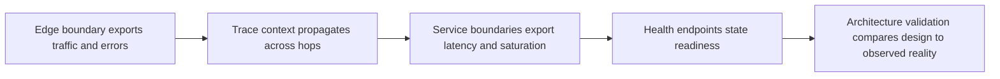

# Observability Architecture

> **Core skill:** The architect designs what is measured, traced, and logged at each architectural boundary, defines health endpoints as contracts, and uses observability to validate that the structure behaves as designed.

## Why This Matters

Observability is a property of the architecture. If the structure does not expose the right surfaces — per-boundary metrics, propagated trace context, structured events at transitions — then no tooling can answer the only question that matters during an incident: which part of the design is failing, and what is it taking down with it. A system observable only from inside individual services produces the familiar incident experience of five teams each saying their piece looks fine.

The design decisions are concrete. Which golden signals are exported at which boundary. How trace context propagates across service hops and through asynchronous steps. What is logged at edges and state transitions, with which fields, and what is deliberately not logged. Whether health endpoints answer liveness, readiness, or deep diagnostics — and which of them the orchestrator is allowed to act on. These are architecture contracts, and teams inherit them the way they inherit interfaces.

Observability also closes the loop on architecture itself. Boundary-level metrics reveal whether the structure works as designed: latency budgets met or silently exceeded, call paths that were never in the design showing up in traces, a service pulling traffic through a route the topology said was impossible. The observability view is how the architecture stays honest after the reviewers go home.

## Golden Signals at Architecture Boundaries

| Signal | What to Measure | Where It Belongs | Architecture Decision Behind It |
|--------|-----------------|------------------|--------------------------------|
| **Latency** | Distribution of response times per hop and end to end | Every service and dependency boundary | Latency budgets allocated per hop in quality scenarios |
| **Traffic** | Request and event rates per boundary and route | Edges, domain interfaces, queues | Capacity assumptions that the topology was sized against |
| **Errors** | Rates by class: client, server, dependency, business rejection | At each boundary, attributed to the far side | Error semantics defined in the interface contract |
| **Saturation** | Queue depth, pool usage, connection counts, worker occupancy | Shared resources between components | Bulkhead placement and hot-spot identification |

Measuring at boundaries rather than only inside services is what makes the data composable: per-hop numbers add up to end-to-end truth, and an unhealthy hop is visible as the diff between two neighbors.

## The Distributed Tracing Model

| Trace Concern | Architecture Decision | Failure Without the Decision |
|---------------|----------------------|------------------------------|
| Context propagation | Where the trace identifier is created and how it crosses each boundary, including async steps | Traces end at the first queue; async flows are invisible |
| Span granularity | Which operations are spanned: crossings, storage calls, external calls | Spans everywhere drown signal; spans nowhere hide the path |
| Sampling | What is sampled, where, and what is always kept for errors | Full sampling is unaffordable; no sampling blinds slow-path debugging |
| Ownership | Who instruments shared infrastructure versus services | Instrumentation drift; gaps exactly at the seams that matter |

## Structured Logging at Boundaries

Log at edges and transitions — requests entering, calls leaving, decisions made, state changed — not as a substitute for tracing and metrics. Every entry carries the fields that make it joinable: trace and correlation identifiers, the authenticated identity, the decision taken, and the outcome. Personal data is minimized by design, because logs are the dataset nobody classifies until an incident review asks where a value appeared. Log levels are interface semantics: an error level means an operator should look, and that meaning is enforced consistently across services.

## Health Endpoints as Architecture Contract

| Endpoint | Question It Answers | What It Must Not Do |
|----------|---------------------|---------------------|
| **Liveness** | Is the process itself functional? | Check dependencies; a dependency outage causing restarts is self-inflicted |
| **Readiness** | Can this instance serve traffic now? | Deep-check the whole dependency graph; readiness flaps under downstream noise |
| **Deep diagnostics** | Is the end-to-end capability healthy? | Get wired to the orchestrator; humans and dashboards consume it, not restart loops |

## The Observability View



## Observability for Architecture Validation

The boundary model makes architecture falsifiable. Latency per hop against the budget shows which interface is quietly over its allocation. Traces show call paths the topology never sanctioned — an accidental bypass, a direct database read, a deprecated route still taking traffic. Saturation data shows where a bulkhead is missing. Reviewing these against the deployment and component views is how erosion is caught early, and it turns the observability surface into the architecture's own feedback loop rather than an operations-only concern.

## Practical Applications

### Observability Architecture Checklist

- [ ] Golden signals are exported at every architectural boundary, not just inside services
- [ ] Trace context propagation is designed for every crossing, including asynchronous hops
- [ ] Log schema is standardized at boundaries with identity, correlation, decision, and outcome fields
- [ ] Health endpoints exist with clearly separated liveness, readiness, and diagnostic roles
- [ ] The observability view is used in architecture reviews to check design against observed reality

### Observability Contract

```markdown
## Observability Contract — <service or component>

| Element | Specification |
|---------|---------------|
| Metrics exported | Request rate, error rate, latency histogram, saturation of pools, queue depth |
| Trace spans | Inbound boundary, outbound dependencies, storage calls; context propagated via headers |
| Log fields | timestamp, trace_id, span_id, principal, decision, outcome, service, version |
| Health endpoints | /live for process; /ready for traffic; /diagnostics for capability checks |
| SLO reporting | Error rate and latency against objectives; dashboards linked from the service catalog |
| Owner | Service team owns instrumentation; platform owns collection |
```

## Common Pitfalls

| Pitfall | Why It Is a Problem | Better Approach |
|---------|---------------------|-----------------|
| **Metrics dump without a model** | Thousands of series, none answering whether the system is healthy | Define signals at boundaries; alert on the questions that matter |
| **Tracing without propagation design** | Traces die at the first queue or thread pool boundary | Design context propagation for sync and async hops explicitly |
| **Log everything** | Cost explodes; sensitive data lands in logs nobody classified | Structured, boundary-focused logging with minimization rules |
| **Health endpoints with side effects** | Liveness checks restart healthy processes during a dependency outage | Separate liveness, readiness, and diagnostics; keep checks proportionate |
| **Interior-only observability** | Each service looks fine; the system is broken at the seams | Measure at boundaries; make per-hop data composable |
| **No ownership of instrumentation** | Dashboards decay; new services ship without signals | Instrumentation is part of the definition of done, with a named owner |

## Success Indicators

- Incident responders identify the failing hop from dashboards and traces without interviewing teams
- Latency per hop is compared against budgets in architecture reviews
- Traces reveal call paths that contradict the topology, and the contradiction gets resolved
- Logs are structured, joinable, and free of unclassified personal data
- New components ship with their observability contract satisfied by default

## Related Topics

- [[01_Deployment_Architecture]]
- [[02_Resilience_Architecture]]
- [[career-path/02_Senior_Software_Engineer/05_Quality_Reliability_Security/03_Observability|Observability (Senior)]]
- [[career-path/07_SRE_and_Platform_Engineer/00_overview|SRE and Platform Engineer]]

## Summary

Observability architecture decides, at design time, what the structure will say about itself: golden signals at every boundary, trace context that survives every hop including asynchronous ones, structured logs at transitions with the fields that make them joinable, and health endpoints with separated liveness, readiness, and diagnostic duties. The same surfaces serve a second purpose — validating that the architecture behaves as designed, revealing budget overruns and unsanctioned call paths before they harden into reality.
