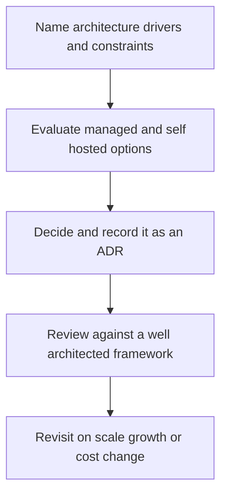

# Cloud and Infrastructure Architecture

> **Core skill:** The architect chooses and composes cloud services as architecture decisions — managed versus self-hosted, container versus serverless, single versus multi-cloud — and reviews the result against a well-architected framework with the decisions recorded as ADRs.

## Why This Matters

Infrastructure choices are architecture choices. A managed queue's delivery semantics, a region topology's latency profile, a serverless runtime's execution constraints, a database's replication behavior — each shapes component design as surely as any interface. Treating infrastructure as someone else's problem means the architecture is quietly redefined by defaults: whatever the platform happens to provide becomes the design.

The managed-versus-self-hosted question is a strategic trade. Managed services buy reduced operational burden and faster time to capability at the price of provider constraints, consumption-based cost, and exit friction. Self-hosting buys control and long-run cost predictability at the price of running the thing — expertise, on-call, upgrades, incidents. There is no universal answer; there is a decision per capability, and the honest version names what the organization will actually operate well.

Multi-cloud and hybrid decisions carry the same discipline. The real drivers — regulation, acquisition, negotiated leverage, disaster strategy — each imply different architectures, and the hidden costs are mostly in duplicated tooling and split expertise. Where multi-cloud is justified, an interoperability layer and a realistic exit path are part of the design; where it is fashion, it is an expensive way to avoid a decision. Reviewing the result against a well-architected framework keeps the trade-offs visible, and recording infrastructure decisions as ADRs keeps them reviewable when scale and prices move.

## Managed Services vs Self-Hosted

| Dimension | Managed Service | Self-Hosted | The Decision Question |
|-----------|-----------------|-------------|----------------------|
| **Control** | Configuration within the provider's model | Full depth including internals | Do we need to differentiate here, or is this a solved commodity? |
| **Operations burden** | Provider runs it; we integrate and monitor | We run it: upgrades, failures, capacity, on-call | What will this organization genuinely operate well at 03:00? |
| **Cost shape** | Consumption or tiered pricing | Fixed infrastructure plus labor | Which is honestly cheaper at our scale, including staff time? |
| **Limits** | Quotas, throughput caps, feature ceilings | Hardware and our own engineering | Will the provider's model still fit in eighteen months? |
| **Exit cost** | Migration effort plus behavioral lock-in | Lower by construction | What breaks, and how long, if we leave? |
| **Security split** | Shared responsibility; provider owns the platform layer | We own every layer | Which controls are ours to prove, and who holds the rest? |

## Compute Models

| Model | Scaling | Ops Attention | Fits | Avoid When |
|-------|---------|---------------|------|------------|
| **Virtual machines** | Groups and autoscaling policies | High; patching, images, lifecycle | Legacy runtimes, specialized or licensed software | A managed runtime would do the job |
| **Containers on managed orchestration** | Pod or replica counts | Medium; platform team owns the control plane | Most services; the default modern choice | Team lacks platform capability and the workload is simple |
| **Serverless functions** | Per-request concurrency | Low; limits and cold paths studied | Bursty traffic, glue, event handlers | Long-running stateful work or tight latency floors |
| **Managed batch and jobs** | Per-job scheduling and queues | Low | Data processing, scheduled work | Interactive latency-sensitive paths |

## Multi-Cloud and Hybrid Decisions

| Driver | Realistic Approach | Hidden Cost |
|--------|--------------------|-------------|
| **Regulation and residency** | Region topology within a provider is often sufficient; a second provider only if mandated | Duplicated control planes and governance |
| **Acquisition** | Pragmatic interoperability layer; merge over time | Double tooling and split identity during transition |
| **Vendor leverage** | Keep an exit path credible; negotiate from evidence | Engineering time spent proving optionality nobody exercises |
| **Disaster strategy** | Multi-zone and multi-region within one provider usually meets the objectives | Cross-provider recovery is rarely cheaper than regional redundancy |

## Infrastructure as an Architecture Driver

Infrastructure services shape boundaries, not just deployment. A durable queue with visibility timeouts produces different component designs than a partitioned replayable log. A database with cross-region replication lag forces read strategies and consistency decisions. A platform identity model determines how services authenticate to each other and to data. The architect chooses the medium the components live in, so the medium's properties are architecture properties.

## Infrastructure Decisions as ADRs



## Well-Architected Review

| Pillar | Review Question | Architecture Artifact |
|--------|-----------------|----------------------|
| **Operational excellence** | Can we deploy, observe, and recover this as designed? | Deployment view, observability contracts |
| **Security** | Are boundaries, identity, and data protection structural? | Threat model, security ADRs |
| **Reliability** | Are failure modes handled and objectives stated? | Resilience decisions, recovery plan |
| **Performance efficiency** | Are resources matched to load and scaling real? | Quality scenarios, capacity plan |
| **Cost optimization** | Is projected cost tracked against actual, with owners? | Cost projections, usage reviews |
| **Sustainability** | Is utilization sane and region choice deliberate? | Utilization data, region rationale |

## Practical Applications

### Cloud Architecture Checklist

- [ ] Every major infrastructure choice is recorded as an ADR with drivers, options, and exit path
- [ ] Managed versus self-hosted decisions state the operational ownership explicitly
- [ ] Region and availability topology is drawn on the deployment view and justified
- [ ] Multi-cloud, if adopted, names its driver, its interoperability layer, and its cost
- [ ] A well-architected review runs before launch and at a recurring cadence

### Infrastructure Decision Record

```markdown
## Infrastructure Decision — <capability>

| Field | Value |
|-------|-------|
| Capability | Order event streaming |
| Drivers | Throughput 20K events per second; replay for rebuilds; 3-year retention |
| Chosen approach | Managed partitioned log service |
| Alternatives rejected | Self-hosted log cluster due to staffing; managed queue due to no replay |
| Cost shape | Consumption-based; projected at current volume with 3x headroom |
| Exit path | Consumer abstraction plus standard protocol; periodic export to object storage |
| Review trigger | Volume doubling or provider pricing change |
```

## Common Pitfalls

| Pitfall | Why It Is a Problem | Better Approach |
|---------|---------------------|-----------------|
| **Cloud-native cargo cult** | Containers, serverless, and meshes adopted without matching drivers | Justify each choice against quality attributes and team capability |
| **Infrastructure as someone else's problem** | Defaults decide the architecture; nobody owns the consequences | Infrastructure choices are architecture decisions with named owners |
| **Lock-in ignored** | Exit costs surface during a negotiation or outage, at the worst time | Record exit paths at adoption; revisit on cadence |
| **Multi-cloud without a driver** | Duplicated tooling, split expertise, doubled failure surface | Name the driver; prefer region redundancy where it satisfies it |
| **Unprojected cost shape** | Consumption services surprise at scale; budgets chase usage | Project cost at design time; review against actual on a cadence |
| **One-time well-architected review** | The review lifecycle ends at launch; drift accumulates unexamined | Recurring reviews tied to architecture change and growth milestones |

## Success Indicators

- Infrastructure decisions trace to drivers and cite their exit paths
- The deployment view's region topology matches what runs, including failover behavior
- Cost projections are compared to actuals on a cadence, with owners for gaps
- Well-architected reviews surface findings that change the design, not just the paperwork
- Teams propose infrastructure changes as ADRs instead of silent console edits

## Related Topics

- [[01_Deployment_Architecture]]
- [[05_Network_Architecture_for_Applications]]
- [[06_Infrastructure_as_Code_Architecture]]
- [[career-path/02_Senior_Software_Engineer/08_Engineering_Economics_and_Trade_Offs/02_Build_vs_Buy_Decisions|Build vs Buy Decisions (Senior)]]

## Summary

Cloud and infrastructure architecture treats platform choices as architecture decisions: managed versus self-hosted weighed on control, operational honesty, cost shape, and exit cost; compute models matched to workload character; multi-cloud and hybrid adopted only for named drivers with their duplicated costs acknowledged. Infrastructure services are the medium components live in, so their properties — delivery semantics, replication lag, identity models — are design inputs, not details. Decisions are recorded as ADRs and reviewed against a well-architected framework before launch and as the system grows.
