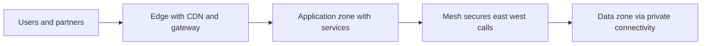

# Network Architecture for Applications

> **Core skill:** The architect designs the network layer as an architecture view — gateways, load balancers, service mesh, CDN, segmentation — and treats connectivity between services and environments as decisions that drive latency, reliability, and security.

## Why This Matters

The network is not the cable between components; it is where latency accumulates, where segmentation enforces trust, and where availability is won or lost. Application architects often delegate it and then discover its properties define the system: a synchronous call across regions adds a hundred milliseconds to every user journey, a flat network makes every boundary policy decorative, and a single peering link is a single point of failure for everything that depends on it.

The building blocks each carry semantics worth designing with. A gateway is an entry point and a policy choke point. A load balancer turns health checks into routing truth. A service mesh provides east-west identity, encryption, and policy without touching application code. A CDN absorbs load and shortens distance to content. Segmentation defines blast radius. Private connectivity keeps flows off public paths. Choosing and composing these blocks is application architecture wearing infrastructure clothes.

The architect's outputs are equally concrete: a network topology view drawn as part of the architecture description, a register of connectivity decisions between services and environments, and quality attribute scenarios that name the network's contribution to latency, reliability, security, and cost. Connectivity is an architecture decision because it constrains everything above it — and because changing it later means changing everything above it too.

## Network Building Blocks

| Block | Role | Architecture Question | Common Mistake |
|-------|------|----------------------|----------------|
| **API gateway** | Single entry point: routing, authentication, quotas, observability | Where does client traffic enter, and what is enforced there? | Skipping the gateway for services that are only internal until they are not |
| **Load balancer** | Distribution and health-based routing | How does unhealthy capacity leave the pool, and how fast? | Health checks that pass while the service is functionally broken |
| **Service mesh** | East-west identity, encryption, policy, telemetry | Which cross-service controls live in the mesh rather than each service? | Adopting a mesh without policy-as-code discipline over its rules |
| **CDN** | Edge caching and absorption of static and cacheable content | Which responses may be cached, and at what freshness? | Caching personalized responses, then patching with cache-busting parameters |
| **VPC and subnets** | Segmentation and blast-radius control | Which components may share a failure domain? | Flat networks where internal means trusted |
| **Private connectivity** | Keeping system-to-system flows off public paths | Which flows must never traverse the public internet? | Incidental public exposure of internal endpoints |

## Network Topology as an Architecture View

The topology view shows zones, entry points, and the flows between them with protocols, ports, and identities noted on the edges. It is maintained alongside the deployment view — the two are read together during security review, incident response, and cost analysis. A topology that exists only in the platform team's heads fails exactly when it is needed most.



## Connectivity Between Services and Environments

| Pattern | Network Requirement | Design Notes |
|---------|---------------------|--------------|
| Service to service, same zone | Mesh identity and policy; default deny | Cheapest hop; the natural place for fine-grained policy |
| Cross-zone | Private connectivity with healthy routing | Buys availability; costs a latency increment and transfer fees |
| Cross-region | Replication and failover paths | Latency budgets and residency both apply; measure before designing |
| To third parties | Egress control, allowlists, contractual limits | Residency implications; egress cost profiles are part of the decision |
| To on-premises and hybrid | Dedicated links, name resolution, route management | The complexity owner must be named; routes decay silently |

## The Network as a Quality Attribute Driver

| Attribute | Network Decision That Drives It | How It Is Kept Honest |
|-----------|--------------------------------|-----------------------|
| **Latency** | Topology distance, hop count, mesh and gateway overhead | Per-hop latency budgets in quality scenarios; measured against budgets |
| **Reliability** | Path redundancy, health check behavior, DNS failover | Failover exercises that actually move traffic |
| **Security** | Segmentation, private paths, policy enforcement points | Boundary register updated when the topology changes |
| **Cost** | Egress, cross-zone and cross-region transfer, CDN offload | Cost projections per topology choice; transfer patterns reviewed |

## Practical Applications

### Network Architecture Checklist

- [ ] The network topology view exists, is current, and shows zones, entry points, and flows
- [ ] Every flow in the connectivity register names its protocol, identity, and policy
- [ ] Gateway and mesh policies are versioned code, reviewed like application changes
- [ ] Latency budgets exist per hop and are measured, not assumed
- [ ] Egress and cross-boundary transfer are projected and attributed

### Connectivity Register

```markdown
## Connectivity Register

| Flow | From | To | Path | Protocol and Port | Identity | Policy | Owner |
|------|------|----|------|-------------------|----------|--------|-------|
| Client API | Internet | Storefront API | Gateway | HTTPS 443 | OAuth2 token | Scope and quota | Platform |
| Orders to payments | Orders zone | Payments zone | Mesh | Mutual TLS | Workload identity | Per-call authorization | Orders team |
| Analytics load | Application zone | Data zone | Private link | SQL over TLS | Service account | Read-only grants | Analytics |
| Partner feed | Partner network | Ingest gateway | Public with mTLS | HTTPS 443 | Client certificate | IP allowlist and schema | Integrations |
```

## Common Pitfalls

| Pitfall | Why It Is a Problem | Better Approach |
|---------|---------------------|-----------------|
| **Network as an implementation detail** | Topology decided after the architecture; latency and failure properties arrive unplanned | Network decisions are architecture decisions; draw the topology view |
| **East-west trust** | Flat internal networks treat position as identity | Segment by boundary; mesh identity and default-deny policy |
| **Health checks as ceremony** | A load balancer routes to instances that cannot actually serve | Health checks test serving capability, not process liveness only |
| **CDN misuse** | Personalized responses cached or invalidated by cache-busting chaos | Cache only what is cacheable; define freshness explicitly |
| **Unmanaged egress** | Services call the internet freely; cost and data exposure follow | Egress allowlists, proxies, and cost attribution per flow |
| **Stale topology** | Diagrams rot; incident routing and security review run on folklore | Topology is a maintained view with an owner, updated on change |

## Success Indicators

- Incidents are routed using the topology view, and the view survives contact with reality
- Per-hop latency budgets are measured; overruns trigger design conversations
- Security review reads the topology and the boundary register together
- Transfer and egress cost trends trace to specific topology decisions
- New services request connectivity from a register rather than improvising routes

## Related Topics

- [[01_Deployment_Architecture]]
- [[04_Cloud_and_Infrastructure_Architecture]]
- [[02_Resilience_Architecture]]
- [[career-path/07_SRE_and_Platform_Engineer/00_overview|SRE and Platform Engineer]]

## Summary

Network architecture for applications designs the topology as a first-class view: gateways as policy choke points, load balancers as health-driven routers, meshes for east-west identity and policy, CDNs for cacheable reach, segmentation for blast radius, and private connectivity for sensitive flows. Connectivity between services and environments is recorded in a register with protocols, identities, and owners, and the network's contribution to latency, reliability, security, and cost is expressed in scenarios and kept honest with measurement. The topology is drawn, reviewed, and maintained because everything above it inherits its properties.
