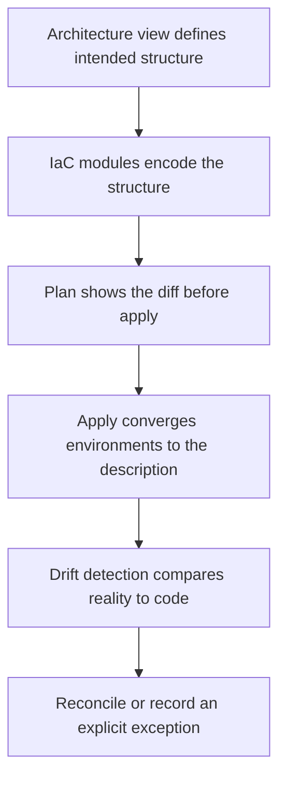

# Infrastructure as Code Architecture

> **Core skill:** The architect treats infrastructure code as the deployable description of the architecture — immutable, parity-preserving, modular — and holds it to the same review rigor as application code, with drift detection as an architecture erosion signal.

## Why This Matters

If the architecture description and the infrastructure code disagree, the code is the truth. Infrastructure as code is the architecture's executable form: environments, topology, network paths, identity bindings, and scaling rules defined as versioned artifacts that can be reviewed, diffed, and reproduced. That makes IaC an architecture concern. The architect who reviews diagrams but not modules is reviewing a sketch while the building goes up from different plans.

Immutable infrastructure and environment parity are the properties that make IaC worth the discipline. When changes are made by replacing artifacts rather than patching live systems, the running environment becomes reproducible, rollback becomes redeployment, and configuration becomes a fact rather than a folklore. When every environment is built from the same description, staging means something: differences are deliberate and visible instead of accumulated and unknown.

Drift detection closes the loop. Drift — console changes, hand-edited rules, emergency fixes that were never codified — is architecture erosion in its most literal form: reality diverging from the description while both continue to be cited. Detecting drift on a schedule, and having a disposition policy for what is found, keeps the executable architecture true; ignoring it means every later change is designed against a fiction.

## Infrastructure as the Executable Architecture

The chain is direct: an architecture view states the intended structure; IaC modules encode it; plans show the diff before anything changes; applies converge environments to the description; and drift detection reports where reality has moved away. The architect's role in that chain is to make sure the modules express the architecture — topology, boundaries, and connections — and to review infrastructure changes for their effect on the views, not only their syntax.

| Architecture Artifact | Its Infrastructure Counterpart |
|-----------------------|-------------------------------|
| Deployment view | Environment and compute definitions |
| Network topology view | Network, subnet, and routing modules |
| Trust boundary register | Identity bindings, policy attachments, firewall rules |
| Environment promotion path | Pipeline stages and environment compositions |
| Resilience decisions | Autoscaling, health checks, failover configuration |

## Immutable vs Mutable Infrastructure

| Dimension | Mutable — patch in place | Immutable — rebuild and replace |
|-----------|--------------------------|--------------------------------|
| Change mechanism | Updates applied to running systems | New artifact built; old one retired |
| Drift | Accumulates quietly from manual interventions | Surfaces as a diff between code and reality |
| Rollback | Undoing the change; often untested | Redeploying the previous artifact |
| Diagnosis | Each instance is unique; failures are hard to reproduce | Replicas are identical; behavior is reproducible |
| Operational fit | Legacy constraints; stateful systems with care | The cloud-native default for stateless services |

## IaC Structure Patterns

| Pattern | Structure | Strength | Weakness | Fit |
|---------|-----------|----------|----------|-----|
| **Monolithic stack** | One state and module tree for everything | Simple to start; single source | Slow plans; one change risks everything | Small systems, early stages |
| **Layered stacks** | Network, platform, and application layers in separate states | Blast radius bounded; explicit ordering | Layer interfaces need discipline | Most production systems |
| **Modular components** | Reusable modules per capability, versioned | Consistency; less duplication | Module versioning overhead | Platforms serving many teams |
| **Environment compositions** | Parameterized compositions per environment from shared modules | Parity with deliberate differences | More moving parts to govern | Multi-environment regulated setups |

## Drift Detection

| Drift Type | Typical Cause | Response |
|------------|---------------|----------|
| Manual hotfix | Emergency change applied directly under pressure | Codify within a bounded window; if it recurs, the pipeline is too slow |
| Console experiment | A change made to test behavior and never reverted | Reconcile automatically; challenge the workflow that allowed it |
| External mutation | Autoscaler or provider-side adjustments outside code | Classify as expected (exclude from drift) or as design gap |
| Stale stack | A layer no longer managed; code and reality both stale | Re-adopt or formally decommission; do not leave it floating |

## The Infrastructure Lifecycle



## Practical Applications

### IaC Architecture Checklist

- [ ] Every environment is built from versioned code; no console-built production
- [ ] IaC structure follows an explicit pattern with bounded blast radius per stack
- [ ] Infrastructure changes are reviewed like application changes, including architecture impact
- [ ] Drift detection runs on a schedule with a disposition policy and owners
- [ ] Secrets enter infrastructure through managed secret stores, never through code

### Infrastructure Review Template

```markdown
## Infrastructure Change Review — <change>

| Question | Answer |
|----------|--------|
| Which architecture views does this change affect? | <deployment view, topology view> |
| Does it alter any trust boundary or policy attachment? | <boundary register entry> |
| What is the blast radius of apply and of failure? | <stacks and services affected> |
| Is the change reversible by redeploying the previous artifact? | <yes or no with rationale> |
| Does it preserve environment parity, or is the difference deliberate? | <parity note> |
| Who owns the module and reviews it long term? | <team> |
```

## Common Pitfalls

| Pitfall | Why It Is a Problem | Better Approach |
|---------|---------------------|-----------------|
| **Console-first** | Production is built by hand; IaC is backfilled and always behind | Code-first from the start; console access read-only in production |
| **Environment snowflakes** | Each environment was built differently; staging tests those differences | Shared modules with parameterized, recorded differences |
| **Giant monolithic stack** | One plan touches everything; every change is high-stakes | Layered or modular stacks with explicit interfaces |
| **No drift detection** | Reality diverges from code; both are cited as truth | Scheduled drift reports with a disposition policy and owners |
| **Infrastructure code unreviewed** | Modules merge without architecture eyes; boundaries erode silently | Review infrastructure changes for architecture impact, not just syntax |
| **Secrets in code** | Credentials live in version history forever | Managed secret stores; references only in code |

## Success Indicators

- A destroyed environment can be rebuilt from code to a working state
- Drift reports are empty or explain every finding with a decision
- Infrastructure changes are reviewed against architecture views, and the views stay true
- Rollbacks work because redeploying the previous artifact is routine
- New environments are created by composition in hours, not weeks of manual assembly

## Related Topics

- [[01_Deployment_Architecture]]
- [[04_Cloud_and_Infrastructure_Architecture]]
- [[career-path/05_Tech_Lead/04_Team_Delivery_and_Execution_Leadership/06_Release_and_Deployment_Leadership|Release and Deployment Leadership (Tech Lead)]]
- [[career-path/07_SRE_and_Platform_Engineer/00_overview|SRE and Platform Engineer]]

## Summary

Infrastructure as code is the architecture's executable form: versioned modules encode the deployment, network, identity, and policy structure that the views describe. Immutability makes environments reproducible and rollbacks routine; parity makes staging meaningful; modular structure bounds blast radius; and drift detection reports where reality has walked away from the description. The architect's obligation is to review infrastructure changes for their architecture impact and to keep the code and the views telling the same story — because when they diverge, the code wins.
