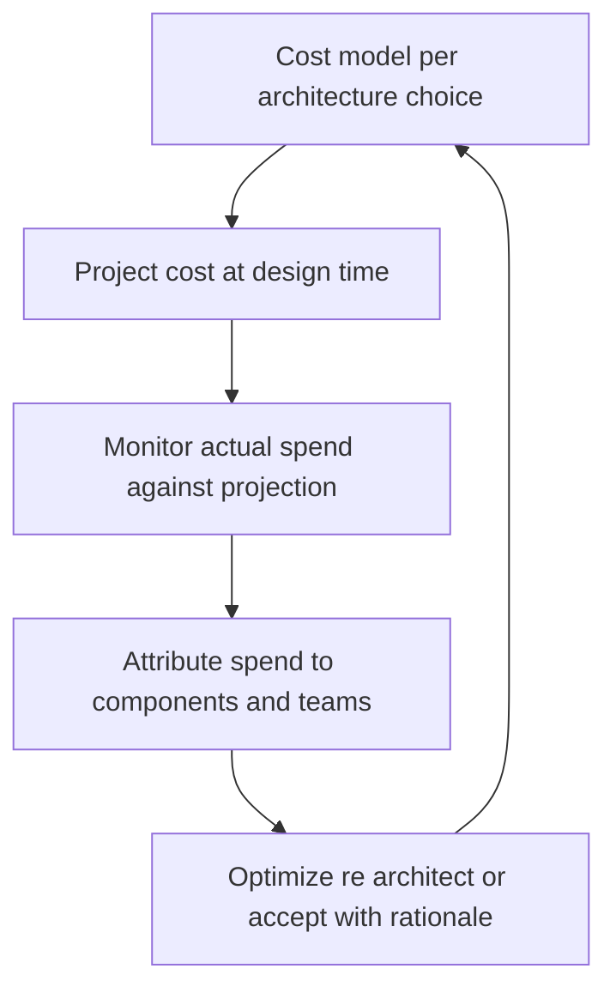

# Cost and Capacity Architecture

> **Core skill:** The architect treats cost as a design driver — elastic versus reserved capacity, pay-per-use versus fixed cost models, deliberate storage tiering — and bounds capacity with projections instead of discovering both in the invoice.

## Why This Matters

Every structural choice carries a cost shape. Serverless moves cost from idle capacity to per-invocation usage; reserved capacity is a bet on a baseline that might not hold; replication and retention multiply storage silently; egress charges follow topology wherever data travels. These are design properties, and a design that ignores them gets optimized by finance after the fact — through cuts that respect no architecture reasoning at all.

Capacity planning at architecture level is a chain of decisions: demand assumptions, a capacity model that turns those into resource requirements, a scaling strategy that follows the load's shape, and a cost projection that survives being compared with actuals. The architect sets the shape — elastic or reserved, pooled or partitioned, buffered or rejected — and operational FinOps practices refine within it. Getting the shape wrong is not fixable by dashboard discipline.

Surprise bills are architecture failure, not billing failure. A service that chatters across availability zones for data it could hold locally, a log pipeline that ingests everything at premium retention, a chatty synchronous design that turns one user action into fifty billable calls — each was a design decision that nobody costed. Projecting cost at design time, and attributing actual spend back to the components and decisions that cause it, is how the architecture stays accountable for its economics.

## Cost Models

| Model | Cost Shape | Wins When | Risk |
|-------|------------|-----------|------|
| **On-demand elastic** | Consumption at premium unit rates, scales to zero | Load is spiky or unproven; new products | Unit cost compounds at steady scale if never revisited |
| **Reserved or committed** | Discounted rate against a commitment | A stable baseline demonstrably exists | Over-commitment if growth stalls; exit friction |
| **Pay-per-use serverless** | Per-invocation, per-millisecond | Bursty traffic, low duty cycles, glue logic | Costly per unit at sustained high load; cold-path latency workarounds |
| **Fixed or self-hosted** | Floor cost plus operations labor | High steady utilization; licensing synergy | Capacity ceilings; operational burden is real cost |
| **Tiered storage** | Price falls as access latency rises | Large history with rare reads | Retrieval surprises; latency floors for restore paths |

## Capacity Planning at Architecture Level

| Driver | Planning Question | Architecture Lever |
|--------|-------------------|--------------------|
| **Traffic growth** | What is the realistic doubling horizon, and does the model hold across it? | Scaling model, partitioning strategy, cache placement |
| **Burst profile** | What is the peak-to-average ratio, and how fast does it swing? | Elasticity choice, queue buffering, load shedding design |
| **Data growth** | What do retention and replication multiply storage into? | Lifecycle policy, tiering, partitioning |
| **Dependency limits** | Where do quotas and per-tenant fairness bind? | Bulkheads, quota design, dedicated pools for critical tenants |
| **Recovery needs** | How much standby capacity must exist, warm or cold? | Warm versus cold standby; reserved recovery capacity |

## Storage Tiering for Cost

Data age and access frequency map to storage classes: hot tiers for active data, warm for occasional reads, cold archive for compliance-held history. The tiering policy follows the retention schedule, and the retrieval path is designed and tested before the first byte is archived — an archive whose restore latency was never measured is a deletion plan with extra steps. Cost per gigabyte is only half the equation; retrieval cost, request pricing, and minimum storage durations decide the real total.

## Cost Projection for Architecture Decisions

```markdown
## Cost Projection — <architecture change>

| Field | Value |
|-------|-------|
| Unit drivers | Requests per second; GB ingested per day; cross-zone calls per request |
| Growth assumption | 40 percent quarterly for four quarters; plateau thereafter |
| Projection | Month 1 baseline; month 6 at 3x; month 12 at 5x with tiering applied |
| Sensitivity | Plus or minus 30 percent volume; reserved versus on-demand mix |
| Attribution | Component and team mapping for monthly actuals |
| Owner and review | Architect projects; platform reviews actuals monthly |
| Decision trigger | Actual exceeds projection by 20 percent or growth pattern changes |
```

## FinOps as Architecture Governance



## Cost Anti-Patterns

| Anti-Pattern | How It Arises | Architectural Fix |
|--------------|---------------|-------------------|
| **Over-provisioning** | Capacity sized for fear; fixed pools built for peak | Elastic scaling plus load shedding; right-size from measured data |
| **Under-utilization** | Reserved capacity outlives the growth that justified it | Review commitments against actual utilization on a cadence |
| **Surprise bills** | Uncosted topology: cross-zone chatter, log firehose, egress paths | Cost projection as part of design; budgets attached to boundaries |
| **Chatty architecture** | Many small synchronous calls across expensive boundaries | Co-locate, batch, or make the flow asynchronous |
| **Retention hoarding** | Keep-everything defaults with premium storage | Lifecycle policy from the data architecture; tier by age and access |
| **Environment sprawl** | Every environment scaled like production, running forever | Ephemeral environments on demand; shrink non-production tiers |

## Practical Applications

### Cost and Capacity Checklist

- [ ] Every significant architecture decision carries a cost projection with unit drivers named
- [ ] Capacity assumptions are stated, tied to demand data, and revisited on growth
- [ ] Storage tiering follows the retention schedule with tested retrieval paths
- [ ] Actual spend is attributed to components and teams, and compared with projections
- [ ] Cost anti-patterns are reviewed at architecture checkpoints, not only at budget time

### Capacity Model Template

```markdown
## Capacity Model — <capability>

| Element | Value |
|---------|-------|
| Current load | 1.2K requests per second peak; 300 average |
| Growth assumption | Doubling within 12 months per product forecast |
| Capacity model | 6 service instances at peak with 60 percent headroom; queue buffering for bursts |
| Scaling strategy | Elastic to 12 instances; shedding at 90 percent saturation |
| Cost at scale | Projected month 12 with reserved baseline plus elastic overflow |
| Recovery capacity | Warm standby in second zone at 50 percent capacity |
```

## Common Pitfalls

| Pitfall | Why It Is a Problem | Better Approach |
|---------|---------------------|-----------------|
| **Cost as finance's problem** | Architects design; finance discovers; recriminations follow | Cost is a design driver with projections and owners from the start |
| **Projection once, never revised** | The model silently detaches from reality as the system grows | Revisit projections on growth, architectural change, and pricing shifts |
| **Unit economics unknown** | Nobody can say what a transaction or tenant costs to serve | Define unit drivers, measure them, and track them over time |
| **Elasticity assumed free** | Elastic designs buy responsiveness and pay unit premiums at steady state | Match elasticity to burst profile; reserve the stable baseline |
| **Invisible transfer costs** | Cross-zone and egress charges hide inside topology decisions | Cost topology alternatives explicitly; prefer locality when it is free |
| **Optimizing noise, not structure** | Penny-level instance tuning while the chatty topology burns the budget | Fix structural cost drivers first; tune instances second |

## Success Indicators

- Every significant design review includes a cost projection and a stated cost owner
- Monthly actuals are compared with projections; deviations trigger design conversations
- Cost per unit of business value — order, tenant, session — is known and tracked
- Storage costs follow retention policy, and retrieval paths are tested
- Cost optimization proposals reference architecture structure, not just provider discounts

## Related Topics

- [[01_Deployment_Architecture]]
- [[04_Cloud_and_Infrastructure_Architecture]]
- [[career-path/02_Senior_Software_Engineer/08_Engineering_Economics_and_Trade_Offs/02_Build_vs_Buy_Decisions|Build vs Buy Decisions (Senior)]]
- [[career-path/03_Staff_Engineer/06_Technical_Risk_and_Judgment/00_overview|Technical Risk and Judgment (Staff)]]

## Summary

Cost and capacity architecture makes economics a design property: cost models chosen per capability — elastic, reserved, pay-per-use, fixed, tiered — against the load's real shape; capacity models that connect demand assumptions to scaling strategy and recovery needs; storage tiering that follows retention with tested retrieval. Projections at design time and attribution of actuals to components keep cost accountable to the architecture, and the anti-patterns — over-provisioning, under-utilization, surprise bills from uncosted topology — are treated for what they are: design failures, not billing mysteries.
