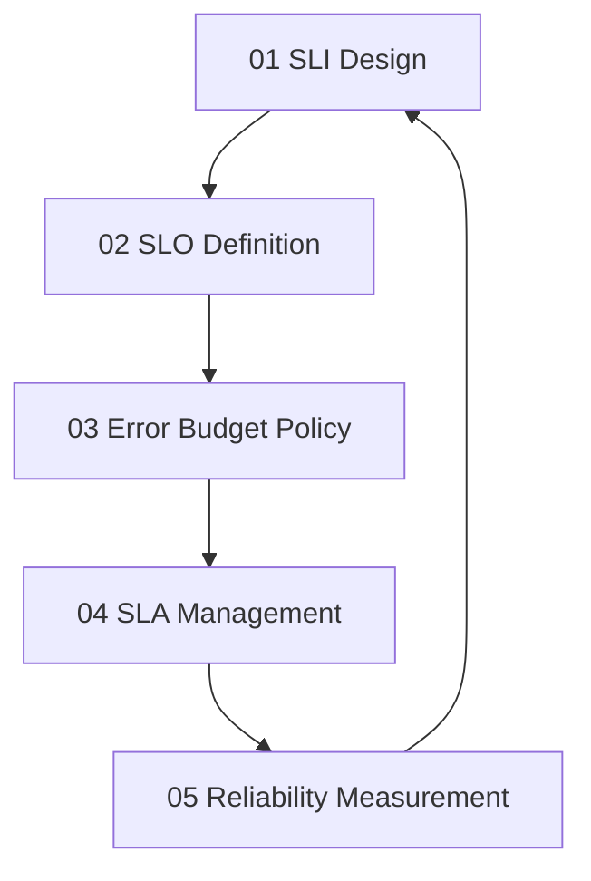

# Service Objectives

> **Core idea:** Defining reliability quantitatively with SLIs, SLOs, and error budgets so that teams can make explicit trade-offs between feature velocity and system dependability.

## What Service Objectives Mean at Specialist Level

A senior software engineer may use SLOs defined by others. An SRE or platform engineer **defines, negotiates, and enforces** service objectives across the organization.

Service objectives are the foundation of reliability engineering because they turn vague promises into measurable commitments. Without SLIs and SLOs, reliability is undefined, incidents are debated rather than measured, and feature-vs-reliability trade-offs are emotional rather than data-driven.

## Topic Notes

| # | Topic | Focus | Status | File |
|---|---|---|---|---|
| 01 | SLI Design | Choosing the right indicators for service health | ✅ Done | `01_SLI_Design.md` |
| 02 | SLO Definition | Setting realistic and meaningful reliability targets | ✅ Done | `02_SLO_Definition.md` |
| 03 | Error Budget Policy | Using error budgets as decision-making tools | ✅ Done | `03_Error_Budget_Policy.md` |
| 04 | SLA Management | Translating SLOs into contractual commitments | ✅ Done | `04_SLA_Management.md` |
| 05 | Reliability Measurement | Tracking and reporting reliability over time | ✅ Done | `05_Reliability_Measurement.md` |

**Completion:** 5/5 : 100%

## How the Topics Connect

**Reading order:** Start with SLI Design to understand what to measure. Then SLO Definition to set targets. Error Budget Policy shows how to use budgets for decisions. SLA Management translates internal targets into external commitments. Reliability Measurement closes the loop with reporting and improvement.

## Existing Vault Anchors

These topic notes **do not duplicate** the existing knowledge base. They layer specialist-level application on top of it:

| Specialist topic | Existing foundation notes |
|---|---|
| SLI Design | [[software-engineering-note/02_Software_Architecture/Microservice/05 Observability/054 SLOs & Error Budgets]] |
| SLO Definition | [[software-engineering-note/02_Software_Architecture/Microservice/05 Observability/054 SLOs & Error Budgets]] |
| Error Budget Policy | [[career-path/02_Senior_Software_Engineer/05_Quality_Reliability_Security/02_SRE_Principles]] |
| SLA Management | [[software-engineering-note/06_Software_Engineering_Operations/08_Service_Operations_and_Support]] |
| Reliability Measurement | [[software-engineering-note/06_Software_Engineering_Operations/09_Operations_Standards_and_Practices]] |

## Self-Assessment Checklist

Use this to gauge your current mastery of service objectives:

- [ ] I can name the SLIs for every service I own
- [ ] I have documented SLOs with clear measurement windows
- [ ] I have an error budget policy that my team follows
- [ ] I can explain the difference between SLO and SLA to a product manager
- [ ] I track error budget consumption over time and report it
- [ ] I have used error budget exhaustion to delay a feature release
- [ ] I can design SLIs for non-HTTP services (batch, streaming, data pipelines)

## Related

- [[00_overview|SRE and Platform Engineer Overview]]
- [[02_Observability/00_overview|Observability]] : observability is required to measure SLIs
- [[career-path/02_Senior_Software_Engineer/05_Quality_Reliability_Security/02_SRE_Principles|SRE Principles]] : SRE foundations from the Senior SWE path
