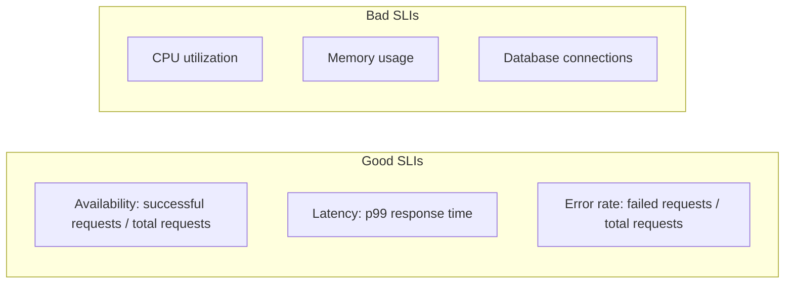

# SLI Design

> **One-line definition:** Choosing the right Service Level Indicators to measure what users actually experience, not just what infrastructure reports.

## Why This Is a Specialist Skill

A senior software engineer may monitor basic metrics. An SRE or platform engineer **designs SLIs that align with user experience**, **covers all critical user journeys**, and **distinguishes between symptom-based and cause-based indicators**.

The difference is not technical complexity. It is **measurement philosophy**: measuring what matters to users, not what is easy to instrument.

## What Makes a Good SLI

| Characteristic | Description | Example |
|---|---|---|
| **User-centric** | Measures what users experience, not internal state | "Percentage of successful requests" not "CPU utilization" |
| **Quantitative** | Expressed as a number with clear units | "99.5% of requests succeed" |
| **Measurable** | Can be calculated from available data | Request logs, metrics, traces |
| **Actionable** | When it degrades, you know what to investigate | High error rate → check error logs |
| **Stable** | Does not fluctuate due to noise or sampling | Use ratios, not raw counts |

## Common SLI Patterns

### Request-response services

| Service type | Primary SLI | Secondary SLI | How to measure |
|---|---|---|---|
| **HTTP API** | Availability: `200 OK / total requests` | Latency: `p99 response time` | Access logs, APM tools |
| **Background job** | Success rate: `completed / attempted` | Freshness: `time since last success` | Job queue metrics, logs |
| **Data pipeline** | Completeness: `records processed / expected` | Latency: `time from source to destination` | Pipeline metrics, data quality checks |
| **Streaming service** | Availability: `healthy streams / total streams` | Latency: `end-to-end delay` | Stream health checks, timestamps |

### Non-HTTP services

| Service type | SLI | How to measure |
|---|---|---|
| **Database** | Query success rate, query latency | Query logs, connection pool metrics |
| **Message queue** | Message delivery rate, message latency | Queue metrics, consumer lag |
| **Batch processing** | Job completion rate, job duration | Job scheduler metrics, logs |
| **Storage** | Read/write success rate, read/write latency | Storage metrics, client-side instrumentation |

## SLI Design Process

1. **Identify critical user journeys:** What do users do with your service? (login, search, purchase, upload)
2. **Define success for each journey:** What does "working" look like? (page loads, search returns results, purchase completes)
3. **Choose the measurement point:** Where do you measure? (client-side, server-side, synthetic probe)
4. **Select the SLI formula:** What ratio or metric captures success? (success/total, percentile latency)
5. **Validate with data:** Can you actually measure this? Do you have the instrumentation?

## SLI Anti-Patterns

| Anti-pattern | Problem | What to do instead |
|---|---|---|
| **Measuring infrastructure** | CPU, memory don't tell you if users are happy | Measure user-facing outcomes |
| **Too many SLIs** | Noise, confusion, alert fatigue | Focus on 2-3 critical SLIs per service |
| **No SLI for critical paths** | Blind spots in reliability | Map all user journeys, define SLI for each |
| **SLI without measurement** | Can't track or alert | Ensure instrumentation exists before defining SLI |
| **Raw counts instead of ratios** | Fluctuate with traffic, hard to set targets | Use ratios (success/total) |

## Practical Exercise

**For a service you own:**

1. **List the top 3 user journeys** for your service.
2. **For each journey, define:**
   - What does "success" look like?
   - What SLI captures success?
   - How will you measure it?
3. **Review your current monitoring:**
   - Do you have SLIs for all critical journeys?
   - Are your SLIs symptom-based or cause-based?
4. **Identify gaps:** Where are you measuring infrastructure instead of user experience?

**Bonus:** Pick a recent incident. Would your current SLIs have detected it? If not, what SLI would have?

## Knowledge Connections

- [[02_SLO_Definition]] : SLIs are the foundation for SLOs
- [[05_Reliability_Measurement]] : SLIs feed reliability dashboards
- [[02_Observability/01_Metrics_and_Dashboards]] : metrics are the data source for SLIs
- [[software-engineering-note/02_Software_Architecture/Microservice/05 Observability/054 SLOs & Error Budgets]] : SLI/SLO foundations
- [[career-path/02_Senior_Software_Engineer/05_Quality_Reliability_Security/02_SRE_Principles]] : SRE principles from Senior SWE path

## Key Takeaways

- SLIs must measure what users experience, not what infrastructure reports
- Use ratios (success/total) not raw counts for stable, targetable SLIs
- Every critical user journey needs at least one SLI
- Symptom-based SLIs (error rate) are better than cause-based SLIs (CPU)
- Validate that you can actually measure an SLI before defining it
