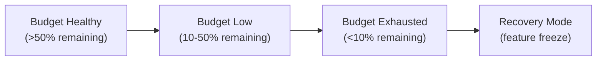

# Error Budget Policy

> **One-line definition:** Using error budgets as explicit decision-making tools to balance feature velocity with reliability investment.

## Why This Is a Specialist Skill

A senior software engineer may track error budgets. An SRE or platform engineer **defines error budget policies that the organization enforces**, **negotiates consequences when budgets are exhausted**, and **uses budget data to drive engineering priorities**.

Error budget policies transform reliability from a vague aspiration into a concrete governance mechanism. Without a policy, error budgets are just numbers on a dashboard.

## The Error Budget Formula

```
Error Budget = 1 - SLO

Example:
SLO = 99.9% availability
Error Budget = 1 - 0.999 = 0.001 = 0.1%

In a 30-day month:
Allowed downtime = 30 days × 24 hours × 60 minutes × 0.001 = 43.2 minutes
```

## Error Budget Policy Tiers



| Budget status | Threshold | Allowed activity | Required action |
|---|---|---|---|
| **Healthy** | >50% remaining | Feature work at full velocity | Monitor; no special action |
| **Low** | 10-50% remaining | Feature work with reliability investment | Dedicate 30-50% of sprint to reliability |
| **Exhausted** | <10% remaining | Feature freeze; reliability work only | Halt feature releases; focus on reliability until budget recovers |

## Policy Enforcement

### The feature freeze conversation

When error budget is exhausted, the policy requires a feature freeze. This is not optional.

**Conversation template:**

```
To: Product Manager, Engineering Manager
Subject: Error Budget Exhausted - Feature Freeze Required

Our [service name] error budget is at [X]% remaining. Per our error budget policy,
we must halt feature releases and focus on reliability work until the budget recovers.

Estimated recovery time: [X days/weeks]
Reliability work planned:
- [Action 1]
- [Action 2]
- [Action 3]

We will resume feature releases when error budget exceeds 50%.
```

**Why this works:** The policy removes emotion from the decision. It is not engineering vs product. It is a shared, objective metric that both sides agreed to in advance.

### Escalation paths

| Situation | Escalation | Outcome |
|---|---|---|
| Team ignores policy | Escalate to engineering director | Enforce policy; review why team bypassed it |
| Policy too rigid | Quarterly review with stakeholders | Adjust thresholds or SLO targets |
| Chronic budget exhaustion | Capacity or reliability investment | Hire, automate, or improve system design |
| Budget always healthy | SLO may be too loose | Tighten SLO or increase feature velocity |

## Error Budget Burn Rate

Burn rate measures how quickly you are consuming your error budget:

```
Burn Rate = (Error rate in window) / (Error budget per window)

Example:
- SLO: 99.9% (error budget: 0.1%)
- 30-day window: error budget = 0.1% × 30 days = 43.2 minutes
- Current error rate: 0.3% over last 7 days
- Burn rate: 0.3% / (0.1% × 7/30) = 12.9x

Interpretation: consuming budget 12.9x faster than sustainable
```

### Burn rate alerting

| Burn rate | Severity | Response |
|---|---|---|
| 1-2x | Info | Monitor; budget will be exhausted by end of window |
| 2-5x | Warning | Investigate; budget will be exhausted in ~15 days |
| 5-10x | Critical | Act immediately; budget will be exhausted in ~6 days |
| >10x | Page | Emergency response; budget will be exhausted in ~3 days |

## Error Budget as Investment Tool

Error budgets are not just about preventing failures. They are about **investing in reliability**:

| Investment | How it uses error budget | Example |
|---|---|---|
| **Chaos engineering** | Intentionally consume budget to test resilience | Inject failures; measure recovery |
| **Load testing** | Consume budget to find capacity limits | Stress test at 2x expected load |
| **Deployment risk** | Consume budget during risky changes | Canary releases; progressive rollouts |
| **Technical debt** | Consume budget to pay down debt | Refactor brittle components |

**Key insight:** If your error budget is always healthy (>80%), you may be under-investing in reliability improvements or your SLO is too loose.

## Policy Template

```markdown
## Error Budget Policy: [Service Name]

**SLO:** [e.g., 99.9% availability over rolling 30 days]
**Error budget:** [e.g., 0.1% = 43.2 minutes per month]

### Budget tiers:
- **Healthy (>50%):** Feature work at full velocity
- **Low (10-50%):** Dedicate 30-50% of sprint to reliability
- **Exhausted (<10%):** Feature freeze; reliability work only

### Enforcement:
- Budget status reviewed in daily standup
- Feature freeze communicated to product manager within 1 hour
- Recovery plan documented and tracked

### Escalation:
- Team ignores policy: escalate to engineering director
- Chronic exhaustion: capacity or reliability investment required
- Policy too rigid: quarterly review with stakeholders

### Review cadence:
- Quarterly review with product, engineering, and SRE
- Adjust thresholds or SLO targets as needed
```

## Error Budget Anti-Patterns

| Anti-pattern | Problem | What to do instead |
|---|---|---|
| **No policy** | Error budgets ignored; feature work continues despite poor reliability | Define and enforce a policy |
| **Policy without enforcement** | Policy exists but teams bypass it | Escalate violations; review why teams bypass |
| **Thresholds too rigid** | Frequent feature freezes; team frustration | Adjust thresholds or improve system reliability |
| **No burn rate alerting** | Budget exhausted before team notices | Implement burn rate alerts at multiple severities |
| **Budget always healthy** | SLO too loose or under-investing in reliability | Tighten SLO or increase reliability investment |

## Practical Exercise

**For a service you own:**

1. **Calculate your current error budget:**
   - What is your SLO?
   - How much error budget do you have per month?
   - How much have you consumed in the last 30 days?

2. **Define your policy:**
   - Use the Policy Template above.
   - Share with your product manager and engineering manager.

3. **Implement burn rate alerting:**
   - Set up alerts at 2x, 5x, and 10x burn rates.
   - Test that alerts reach the right people.

4. **Review a recent incident:**
   - How much error budget did it consume?
   - Would your policy have triggered earlier action?

**Bonus:** Think of a planned feature release. What is the risk to error budget? Should you delay it?

## Knowledge Connections

- [[02_SLO_Definition]] : SLOs define the error budget
- [[04_SLA_Management]] : error budgets inform SLA risk
- [[05_Reliability_Measurement]] : burn rate is a key reliability metric
- [[03_Incident_Response/02_Incident_Management]] : incidents consume error budget
- [[05_Capacity_and_Resilience/04_Chaos_Engineering]] : chaos engineering intentionally consumes error budget

## Key Takeaways

- Error budget policies transform reliability from aspiration to governance
- Define clear tiers (healthy, low, exhausted) with enforced consequences
- Feature freezes are not optional when budget is exhausted
- Burn rate alerting catches budget exhaustion before it happens
- Error budgets are investment tools: use them for chaos engineering, load testing, and debt paydown
- Review policies quarterly with product, engineering, and SRE stakeholders
