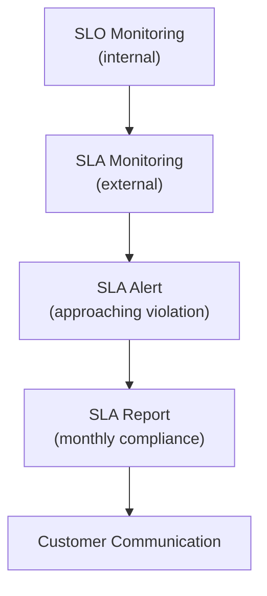

# SLA Management

> **One-line definition:** Translating internal SLOs into external contractual commitments with defined consequences for violations.

## Why This Is a Specialist Skill

A senior software engineer works within SLAs defined by others. An SRE or platform engineer **designs SLAs that balance customer expectations with engineering reality**, **negotiates terms with business and legal stakeholders**, and **manages SLA compliance across the organization**.

SLAs are not engineering metrics. They are **business contracts** with financial or operational consequences. Getting them wrong can cost the company money or damage customer relationships.

## SLO vs SLA: The Critical Difference

| Aspect | SLO | SLA |
|---|---|---|
| **Audience** | Internal (engineering, product) | External (customers, partners) |
| **Enforcement** | Engineering policy | Legal contract |
| **Consequence** | Feature freeze, reliability work | Financial penalty, service credits |
| **Target** | Tighter (99.95%) | Looser (99.9%) |
| **Flexibility** | Can adjust quarterly | Requires contract amendment |

**Key rule:** Your SLA should always be **looser** than your SLO. The gap is your safety margin.

## SLA Structure

### Typical SLA components

| Component | Description | Example |
|---|---|---|
| **Metric** | What is measured | Availability, latency, throughput |
| **Target** | Minimum acceptable performance | 99.9% availability |
| **Measurement period** | Time window for compliance | Monthly, quarterly |
| **Exclusions** | What doesn't count | Scheduled maintenance, force majeure |
| **Remedy** | Consequence for violation | Service credits, refunds |

### Common SLA metrics

| Service type | Typical SLA metric | Target range |
|---|---|---|
| **SaaS API** | Availability (uptime) | 99.9% - 99.99% |
| **SaaS API** | Latency (p95 or p99) | <500ms |
| **Data service** | Data freshness | <1 hour |
| **Support** | Response time | <4 hours (business hours) |
| **Batch processing** | Job completion | 99% within SLA window |

## SLA Risk Management

### The SLA risk matrix

| Risk | Likelihood | Impact | Mitigation |
|---|---|---|---|
| **SLA too aggressive** | High | Financial penalty | Set SLA looser than SLO; test with load |
| **SLA too loose** | Medium | Customer dissatisfaction | Benchmark against competitors |
| **Measurement dispute** | High | Legal conflict | Define measurement methodology in contract |
| **Exclusions too broad** | Medium | Customer distrust | Limit exclusions to scheduled maintenance |
| **No monitoring** | High | Undetected violations | Implement SLA-specific monitoring |

### SLA monitoring

Track SLA compliance separately from SLO compliance:

## SLA Negotiation

### Questions to ask before signing an SLA

1. **Can we measure it?** Do we have instrumentation to prove compliance?
2. **Can we meet it?** Has our system historically met this target?
3. **What's the cost?** What engineering investment is required?
4. **What's the penalty?** Is the remedy proportional to the violation?
5. **What are the exclusions?** Are maintenance windows, force majeure, and customer-caused issues excluded?

### SLA negotiation checklist

- [ ] SLA target is looser than internal SLO
- [ ] Measurement methodology is defined and agreed
- [ ] Exclusions are clearly listed
- [ ] Remedy is proportional and capped
- [ ] Reporting frequency is agreed (monthly, quarterly)
- [ ] Escalation path is defined for disputes

## SLA Anti-Patterns

| Anti-pattern | Problem | What to do instead |
|---|---|---|
| **SLA = SLO** | No safety margin; frequent violations | Set SLA looser than SLO |
| **No measurement** | Can't prove compliance; disputes | Implement SLA-specific monitoring |
| **100% availability SLA** | Impossible; guaranteed violations | Set realistic target (99.9%) |
| **Unlimited penalties** | Financial risk unbounded | Cap remedies (e.g., max 30% credit) |
| **Vague exclusions** | Disputes over what counts | Define exclusions explicitly |

## Practical Exercise

**For a service with customer-facing SLAs:**

1. **Review current SLAs:**
   - Are they looser than your internal SLOs?
   - Can you measure compliance?
   - What are the penalties for violation?

2. **Calculate SLA risk:**
   - How close have you come to violating an SLA in the last 6 months?
   - What would the financial impact be?

3. **Draft an SLA for a new service:**
   - Use the SLA components table above.
   - Share with legal and product for review.

**Bonus:** Review a competitor's SLA. How does yours compare? Are you over- or under-committing?

## Knowledge Connections

- [[02_SLO_Definition]] : SLOs inform SLA targets
- [[03_Error_Budget_Policy]] : error budgets help manage SLA risk
- [[05_Reliability_Measurement]] : SLA compliance is a key reliability metric
- [[software-engineering-note/06_Software_Engineering_Operations/08_Service_Operations_and_Support]] : service operations and SLA management

## Key Takeaways

- SLAs are business contracts with financial consequences, not engineering metrics
- Always set SLAs looser than SLOs to provide a safety margin
- Define measurement methodology, exclusions, and remedies explicitly
- Monitor SLA compliance separately from SLO compliance
- Negotiate SLAs with engineering, product, and legal stakeholders
- Cap penalties to bound financial risk
