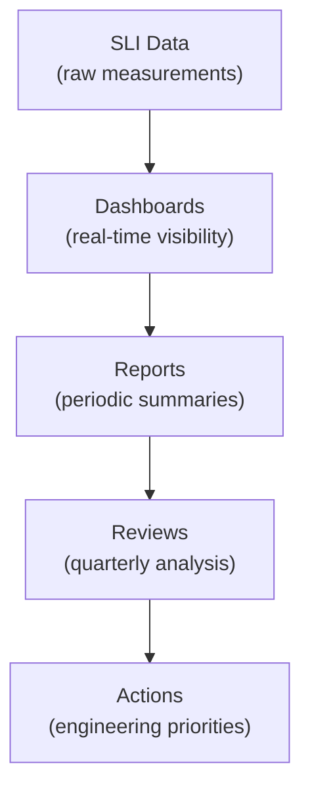

# Reliability Measurement

> **One-line definition:** Tracking, reporting, and acting on reliability data to drive continuous improvement and demonstrate system health to stakeholders.

## Why This Is a Specialist Skill

A senior software engineer may check dashboards. An SRE or platform engineer **designs reliability reporting systems**, **identifies trends before they become incidents**, and **uses reliability data to drive engineering priorities and business decisions**.

Reliability measurement is not just dashboards. It is **closing the loop** between defining objectives (SLIs/SLOs) and improving systems based on what the data shows.

## The Reliability Reporting Hierarchy



## Reliability Dashboards

### Dashboard layers

| Layer | Audience | Content | Refresh rate |
|---|---|---|---|
| **Operational** | On-call engineers | Real-time SLIs, error budget burn rate, active alerts | Real-time |
| **Tactical** | Engineering managers | Weekly SLO compliance, incident counts, toil hours | Daily/weekly |
| **Strategic** | Directors, VPs | Quarterly reliability trends, SLA compliance, investment ROI | Monthly/quarterly |

### Operational dashboard: the on-call view

| Widget | Purpose |
|---|---|
| **Current SLI values** | Are we meeting SLOs right now? |
| **Error budget remaining** | How much budget do we have left? |
| **Burn rate** | Are we consuming budget too fast? |
| **Active alerts** | What needs attention now? |
| **Recent incidents** | What broke in the last 24 hours? |

### Tactical dashboard: the team view

| Widget | Purpose |
|---|---|
| **SLO compliance (weekly)** | Are we meeting targets this week? |
| **Incident frequency trend** | Are incidents increasing or decreasing? |
| **Toil hours** | How much time is spent on manual operations? |
| **Deployment frequency** | Are we shipping safely and frequently? |
| **Change failure rate** | What percentage of deployments cause incidents? |

### Strategic dashboard: the leadership view

| Widget | Purpose |
|---|---|
| **Quarterly reliability trend** | Are we getting more or less reliable? |
| **SLA compliance** | Are we meeting customer commitments? |
| **Error budget utilization** | Are we investing enough in reliability? |
| **MTTR trend** | Are we recovering faster from incidents? |
| **Reliability investment ROI** | Did reliability work reduce incidents? |

## Reliability Metrics

### DORA metrics for reliability

| Metric | Definition | Target |
|---|---|---|
| **Deployment frequency** | How often you deploy | Multiple per day (elite) |
| **Lead time for changes** | Time from commit to production | <1 hour (elite) |
| **Change failure rate** | Percentage of deployments causing incidents | <5% (elite) |
| **Mean time to recovery (MTTR)** | Time from incident start to resolution | <1 hour (elite) |

### Custom reliability metrics

| Metric | What it measures | How to calculate |
|---|---|---|
| **Incident frequency** | How often things break | Incidents per week/month |
| **Toil ratio** | Time spent on manual operations | Toil hours / total work hours |
| **Error budget consumption** | How much reliability you've used | (Actual errors / error budget) × 100% |
| **MTTD (Mean Time to Detect)** | How fast you notice problems | Average time from incident start to detection |
| **MTTR (Mean Time to Recovery)** | How fast you fix problems | Average time from detection to resolution |

## Reliability Reviews

### Quarterly reliability review template

```markdown
## Quarterly Reliability Review: [Service/Team Name]
## Period: [Q1/Q2/Q3/Q4 YYYY]

### SLO Compliance
| SLO | Target | Actual | Status |
|---|---|---|---|
| [SLO 1] | 99.9% | 99.95% | ✅ Met |
| [SLO 2] | 99.9% | 99.8% | ❌ Missed |

### Incident Summary
- Total incidents: [X]
- Severity breakdown: [X critical, Y major, Z minor]
- Top 3 incidents by impact: [list]
- MTTR trend: [improving/stable/degrading]

### Error Budget Analysis
- Budget consumed: [X%]
- Budget wasted on incidents: [Y%]
- Budget invested in reliability work: [Z%]

### Reliability Investments
- [Investment 1]: [outcome]
- [Investment 2]: [outcome]

### Recommendations
1. [Action 1]
2. [Action 2]
3. [Action 3]
```

## Reliability Measurement Anti-Patterns

| Anti-pattern | Problem | What to do instead |
|---|---|---|
| **Dashboard without action** | Data collected but not used | Tie dashboards to review cadence and actions |
| **Only operational dashboards** | No strategic view; leadership blind | Build layered dashboards for each audience |
| **No trend analysis** | Can't see if things are getting better or worse | Track metrics over time; review quarterly |
| **Vanity metrics** | Numbers that look good but don't matter | Focus on user-facing SLIs and error budgets |
| **No incident correlation** | Can't tell if reliability work reduced incidents | Correlate reliability investments with incident trends |

## Practical Exercise

**For a service you own:**

1. **Audit your current dashboards:**
   - Do you have operational, tactical, and strategic views?
   - What metrics are missing?

2. **Build a reliability report:**
   - Use the quarterly review template above.
   - Fill it with data from the last quarter.

3. **Identify one reliability investment:**
   - Based on the data, what should you invest in next quarter?
   - How will you measure the ROI?

**Bonus:** Share your quarterly reliability review with your engineering manager. What questions do they ask?

## Knowledge Connections

- [[01_SLI_Design]] : SLIs are the data source for reliability measurement
- [[02_SLO_Definition]] : SLOs define the targets for reliability
- [[03_Error_Budget_Policy]] : error budget consumption is a key reliability metric
- [[02_Observability/01_Metrics_and_Dashboards]] : dashboards are the visibility layer
- [[03_Incident_Response/03_Blameless_Postmortems]] : incident data feeds reliability reviews

## Key Takeaways

- Reliability measurement closes the loop between defining objectives and improving systems
- Build layered dashboards: operational (on-call), tactical (team), strategic (leadership)
- Track DORA metrics and custom reliability metrics (incident frequency, toil ratio, MTTR)
- Conduct quarterly reliability reviews with data-driven recommendations
- Correlate reliability investments with incident trends to demonstrate ROI
