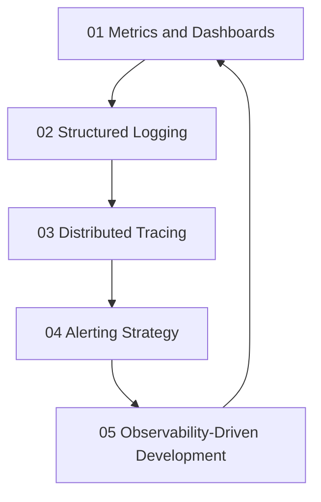

# Observability

> **Core idea:** Building systems that are observable from the start : using metrics, logs, traces, and events to understand production behavior, diagnose issues, and make data-driven decisions.

## What Observability Means at Specialist Level

A senior software engineer may use existing dashboards and logs. An SRE or platform engineer **designs observability systems that the organization relies on**, **establishes standards for instrumentation**, and **uses observability data to drive reliability improvements**.

Observability is not monitoring. Monitoring tells you the system is broken. Observability tells you **why** it is broken and **how** to fix it.

## Topic Notes

| # | Topic | Focus | Status | File |
|---|---|---|---|---|
| 01 | Metrics and Dashboards | Building effective metrics and dashboard design | ✅ Done | `01_Metrics_and_Dashboards.md` |
| 02 | Structured Logging | Designing logs for queryability and analysis | ✅ Done | `02_Structured_Logging.md` |
| 03 | Distributed Tracing | Tracing requests across service boundaries | ✅ Done | `03_Distributed_Tracing.md` |
| 04 | Alerting Strategy | Designing alerts that are actionable, not noisy | ✅ Done | `04_Alerting_Strategy.md` |
| 05 | Observability-Driven Development | Building observability into the development process | ✅ Done | `05_Observability_Driven_Development.md` |

**Completion:** 5/5 : 100%

## How the Topics Connect

**Reading order:** Start with Metrics and Dashboards to understand what to measure. Structured Logging adds context. Distributed Tracing shows request flow. Alerting Strategy turns data into action. Observability-Driven Development embeds observability into the development lifecycle.

## Existing Vault Anchors

These topic notes **do not duplicate** the existing knowledge base. They layer specialist-level application on top of it:

| Specialist topic | Existing foundation notes |
|---|---|
| Metrics and Dashboards | [[software-engineering-note/02_Software_Architecture/Microservice/05 Observability/051 Logging & Monitoring]] |
| Structured Logging | [[software-engineering-note/02_Software_Architecture/Microservice/05 Observability/051 Logging & Monitoring]] |
| Distributed Tracing | [[software-engineering-note/02_Software_Architecture/Microservice/05 Observability/052 Distributed Tracing]] |
| Alerting Strategy | [[career-path/02_Senior_Software_Engineer/05_Quality_Reliability_Security/03_Observability]] |
| Observability-Driven Development | [[software-engineering-note/06_Software_Engineering_Operations/04_Amplifying_Feedback]] |

## Self-Assessment Checklist

Use this to gauge your current mastery of observability:

- [ ] I have a golden signals dashboard for every service I own
- [ ] My logs are structured (JSON) and queryable
- [ ] I have distributed tracing for critical user journeys
- [ ] My alerts are symptom-based, not cause-based
- [ ] I can diagnose a production issue in <15 minutes using observability tools
- [ ] I include observability requirements in design documents
- [ ] I review observability gaps in post-incident reviews

## Related

- [[00_overview|SRE and Platform Engineer Overview]]
- [[01_Service_Objectives/00_overview|Service Objectives]] : observability is required to measure SLIs
- [[03_Incident_Response/00_overview|Incident Response]] : observability data is critical for incident diagnosis
- [[career-path/02_Senior_Software_Engineer/05_Quality_Reliability_Security/03_Observability|Observability]] : observability foundations from the Senior SWE path
