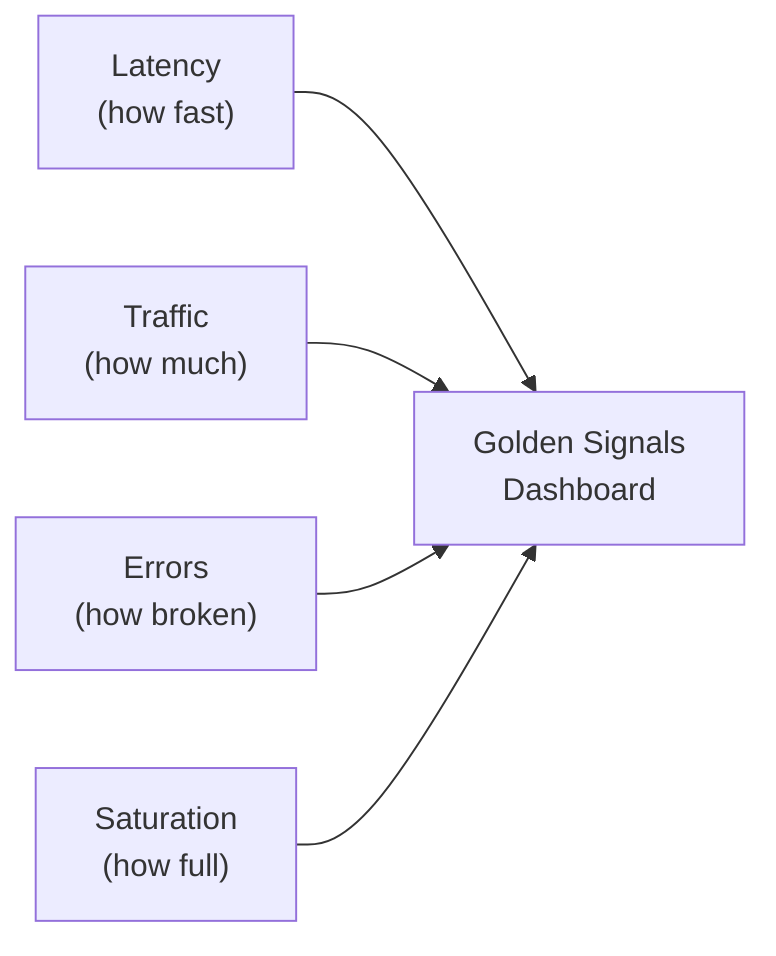

# Metrics and Dashboards

> **One-line definition:** Designing metrics and dashboards that provide actionable visibility into system health, performance, and user experience.

## Why This Is a Specialist Skill

A senior software engineer may add metrics to their code. An SRE or platform engineer **designs metric systems that the organization relies on**, **establishes naming conventions and standards**, and **builds dashboards that drive decisions at multiple levels**.

The difference is not technical complexity. It is **measurement philosophy**: metrics should answer questions, not just collect data.

## Metric Types

| Type | Definition | Example | Use when |
|---|---|---|---|
| **Counter** | Monotonically increasing value | Total requests served | Counting events |
| **Gauge** | Value that can go up or down | Current CPU usage | Measuring state |
| **Histogram** | Distribution of values | Request latency distribution | Measuring distributions |
| **Summary** | Quantiles of a distribution | p50, p95, p99 latency | Pre-calculated percentiles |

## The RED Method (Service Metrics)

A framework for service-level metrics:

| Metric | Definition | Why it matters |
|---|---|---|
| **Rate** | Requests per second | How much traffic are we handling? |
| **Errors** | Failed requests per second | How many requests are failing? |
| **Duration** | Time per request (p50, p95, p99) | How fast are we responding? |

**Example dashboard:**
```
Service: user-api
- Rate: 1,200 req/s
- Errors: 12 req/s (1% error rate)
- Duration: p50=45ms, p95=120ms, p99=350ms
```

## The USE Method (Infrastructure Metrics)

A framework for infrastructure-level metrics:

| Metric | Definition | Why it matters |
|---|---|---|
| **Utilization** | % of resource in use | Are we running out of capacity? |
| **Saturation** | Queue length or wait time | Is the resource overloaded? |
| **Errors** | Error count | Is the resource failing? |

**Example:**
```
Database server:
- Utilization: CPU 75%, Memory 60%
- Saturation: CPU run queue = 2, Disk I/O wait = 10ms
- Errors: 0 disk errors, 2 connection timeouts
```

## Golden Signals Dashboard

The four golden signals provide a universal view of service health:

| Signal | Metric | Alert threshold |
|---|---|---|
| **Latency** | p99 latency | >500ms for 5 minutes |
| **Traffic** | requests per second | >2000 req/s (capacity planning) |
| **Errors** | Error rate | >1% for 5 minutes |
| **Saturation** | CPU, memory, disk | >80% utilization |



## Dashboard Design Principles

### Dashboard layers

| Layer | Audience | Purpose | Refresh rate |
|---|---|---|---|
| **Operational** | On-call engineers | Real-time incident diagnosis | Real-time |
| **Tactical** | Engineering managers | Weekly trends and team health | Daily/weekly |
| **Strategic** | Directors, VPs | Quarterly reliability and investment | Monthly/quarterly |

### Dashboard anti-patterns

| Anti-pattern | Problem | What to do instead |
|---|---|---|
| **Too many metrics** | Noise; hard to find signal | Focus on 5-10 key metrics per dashboard |
| **No context** | Numbers without meaning | Add SLO lines, annotations, comparisons |
| **Only infrastructure** | CPU, memory don't show user impact | Include user-facing metrics (latency, errors) |
| **Stale dashboards** | Not updated; misleading | Automate dashboard updates; review quarterly |
| **No drill-down** | Can't investigate issues | Link to detailed views and logs |

## Metric Naming Conventions

Establish standards for metric names across the organization:

```
{namespace}_{subsystem}_{metric_name}_{unit}

Examples:
- api_requests_total
- api_request_duration_seconds
- database_connections_active
- cache_hit_ratio
```

### Naming rules

| Rule | Example | Why |
|---|---|---|
| **Use snake_case** | `request_duration_seconds` | Consistency across tools |
| **Include unit** | `_seconds`, `_bytes`, `_ratio` | Avoid confusion |
| **Use plural for counters** | `requests_total` | Indicates cumulative count |
| **Use singular for gauges** | `cpu_utilization_ratio` | Indicates current state |
| **Add labels for dimensions** | `service`, `method`, `status` | Enable filtering and aggregation |

## Practical Exercise

**For a service you own:**

1. **Audit your current metrics:**
   - Do you have RED metrics (Rate, Errors, Duration)?
   - Do you have USE metrics for infrastructure?
   - Are metric names consistent?

2. **Build a golden signals dashboard:**
   - Latency (p50, p95, p99)
   - Traffic (requests per second)
   - Errors (error rate)
   - Saturation (CPU, memory)

3. **Review dashboard usability:**
   - Can an on-call engineer diagnose an issue in <5 minutes?
   - Are there links to drill down into details?
   - Are SLO targets visible?

**Bonus:** Pick a recent incident. Could you have diagnosed it with your current dashboards? What's missing?

## Knowledge Connections

- [[02_Structured_Logging]] : logs provide context for metrics
- [[03_Distributed_Tracing]] : traces show request flow across services
- [[04_Alerting_Strategy]] : alerts are based on metrics
- [[01_Service_Objectives/01_SLI_Design]] : SLIs are built from metrics
- [[software-engineering-note/02_Software_Architecture/Microservice/05 Observability/051 Logging & Monitoring]] : logging and monitoring foundations

## Key Takeaways

- Metrics should answer questions, not just collect data
- Use RED method for service metrics (Rate, Errors, Duration)
- Use USE method for infrastructure metrics (Utilization, Saturation, Errors)
- Build golden signals dashboards: latency, traffic, errors, saturation
- Design dashboards for different audiences: operational, tactical, strategic
- Establish metric naming conventions for consistency across the organization
