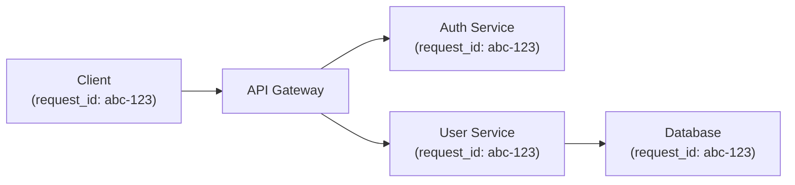

# Structured Logging

> **One-line definition:** Designing logs as structured, queryable data that enables fast investigation and analysis at scale.

## Why This Is a Specialist Skill

A senior software engineer may add log statements when debugging. An SRE or platform engineer **establishes logging standards across the organization**, **designs log schemas that enable correlation and analysis**, and **builds log management systems that scale**.

The difference is not technical complexity. It is **treating logs as data, not text**.

## Unstructured vs Structured Logs

### Unstructured logging

```
2026-01-15 10:23:45 INFO User 123 logged in from 192.168.1.10
2026-01-15 10:23:46 ERROR Failed to send email: connection timeout
2026-01-15 10:23:47 WARN Slow query detected: SELECT * FROM users (1.2s)
```

**Problems:**
- Hard to query (regex parsing)
- Hard to aggregate (no consistent fields)
- Hard to correlate (no request IDs)
- Expensive to process (text parsing)

### Structured logging

```json
{
  "timestamp": "2026-01-15T10:23:45Z",
  "level": "INFO",
  "message": "User logged in",
  "user_id": 123,
  "ip_address": "192.168.1.10",
  "service": "auth-service",
  "request_id": "req-abc-123"
}
```

**Benefits:**
- Easy to query (filter by `user_id`, `service`, `level`)
- Easy to aggregate (count errors by service)
- Easy to correlate (join logs by `request_id`)
- Machine-readable (can be processed by log analysis tools)

## Log Levels

| Level | When to use | Example |
|---|---|---|
| **DEBUG** | Detailed information for debugging | "User ID: 123, Query: SELECT * FROM users" |
| **INFO** | Normal operational events | "User logged in", "Order created" |
| **WARN** | Potential issues that don't stop operation | "Slow query detected (>1s)", "Retry attempt 2" |
| **ERROR** | Errors that affect a request but not the system | "Failed to send email", "Database connection timeout" |
| **FATAL** | Critical errors that stop the system | "Out of memory", "Database unreachable" |

**Rule of thumb:**
- DEBUG: only in development or when debugging
- INFO: normal operation; high volume but useful
- WARN: something unusual but recoverable
- ERROR: something broken that needs attention
- FATAL: system is down; page immediately

## Log Schema Design

### Standard fields

Every log entry should include:

| Field | Type | Purpose | Example |
|---|---|---|---|
| `timestamp` | ISO 8601 | When the event occurred | `2026-01-15T10:23:45.123Z` |
| `level` | String | Severity level | `INFO`, `ERROR` |
| `message` | String | Human-readable description | "User logged in" |
| `service` | String | Which service emitted the log | `auth-service` |
| `request_id` | String | Correlate logs across services | `req-abc-123` |

### Context fields

Add fields relevant to your domain:

| Field | Type | When to use |
|---|---|---|
| `user_id` | Integer/String | User-specific actions |
| `session_id` | String | Session tracking |
| `ip_address` | String | Security, geolocation |
| `method` | String | HTTP method (GET, POST) |
| `path` | String | Request path |
| `status_code` | Integer | HTTP response code |
| `duration_ms` | Integer | Request duration |

### Example schema

```json
{
  "timestamp": "2026-01-15T10:23:45.123Z",
  "level": "INFO",
  "message": "User logged in",
  "service": "auth-service",
  "request_id": "req-abc-123",
  "user_id": 123,
  "ip_address": "192.168.1.10",
  "method": "POST",
  "path": "/api/login",
  "status_code": 200,
  "duration_ms": 45
}
```

## Log Correlation

### The request_id pattern

Use a unique `request_id` to track a request across multiple services:



**How it works:**
1. Client or API gateway generates `request_id`
2. Pass `request_id` in headers (e.g., `X-Request-ID`)
3. Every service includes `request_id` in logs
4. Query all logs by `request_id` to see full request flow

### Implementation

```python
import logging
import uuid

logger = logging.getLogger(__name__)

def handle_request(request):
    request_id = request.headers.get('X-Request-ID', str(uuid.uuid4()))
    
    logger.info("Request started", extra={
        "request_id": request_id,
        "method": request.method,
        "path": request.path
    })
    
    # Pass request_id to downstream services
    headers = {'X-Request-ID': request_id}
    response = call_downstream_service(headers=headers)
    
    logger.info("Request completed", extra={
        "request_id": request_id,
        "status_code": response.status_code,
        "duration_ms": response.duration_ms
    })
```

## Log Management Best Practices

| Practice | Why it matters |
|---|---|
| **Log at boundaries** | Entry/exit of services, functions, and workflows |
| **Include context** | Request ID, user ID, session ID for correlation |
| **Avoid sensitive data** | Never log passwords, tokens, PII |
| **Set retention policy** | Keep logs for 30-90 days; archive older logs |
| **Use correlation IDs** | Track a request across multiple services |
| **Sample high-volume logs** | Reduce cost for verbose logs (e.g., 10% sampling) |
| **Index key fields** | Speed up queries on `request_id`, `user_id`, `level` |

## Log Query Patterns

### Common queries

```sql
-- Find all errors for a specific user in the last hour
SELECT * FROM logs
WHERE user_id = 123
  AND level = 'ERROR'
  AND timestamp > NOW() - INTERVAL '1 hour'

-- Find all requests with high latency
SELECT * FROM logs
WHERE duration_ms > 1000
  AND timestamp > NOW() - INTERVAL '1 day'

-- Correlate logs across services for a request
SELECT * FROM logs
WHERE request_id = 'req-abc-123'
ORDER BY timestamp
```

### Log analysis tools

| Tool | Strengths | Use when |
|---|---|---|
| **ELK Stack** (Elasticsearch, Logstash, Kibana) | Powerful search, visualization | Self-hosted; full control |
| **Grafana Loki** | Simple, cost-effective | Kubernetes; Prometheus ecosystem |
| **Splunk** | Enterprise features, ML | Large organizations; compliance |
| **Datadog** | Unified observability | Full-stack monitoring |

## Logging Anti-Patterns

| Anti-pattern | Problem | What to do instead |
|---|---|---|
| **Unstructured logs** | Hard to query and analyze | Use structured logging (JSON) |
| **No correlation IDs** | Can't track requests across services | Use `request_id` pattern |
| **Logging sensitive data** | Security risk; compliance violations | Never log passwords, tokens, PII |
| **Too much logging** | High cost; hard to find signal | Sample high-volume logs; use appropriate levels |
| **No retention policy** | Logs grow indefinitely; expensive | Set retention (30-90 days); archive old logs |
| **Logging in hot paths** | Performance impact | Use async logging; sample if needed |

## Practical Exercise

**For a service you own:**

1. **Audit your current logs:**
   - Are they structured (JSON)?
   - Do they include standard fields (timestamp, level, service, request_id)?
   - Can you correlate logs across services?

2. **Define a log schema:**
   - List standard fields for all logs
   - List context fields for your domain
   - Share with your team for consistency

3. **Practice log queries:**
   - Find all errors for a specific user in the last hour
   - Correlate logs for a specific request across services
   - Identify the slowest requests in the last day

**Bonus:** Pick a recent incident. Could you diagnose it with your current logs? What's missing?

## Knowledge Connections

- [[01_Metrics_and_Dashboards]] : metrics provide the "what", logs provide the "why"
- [[03_Distributed_Tracing]] : traces show request flow; logs provide details
- [[04_Alerting_Strategy]] : alerts can include log snippets for context
- [[03_Incident_Response/02_Incident_Management]] : logs are critical for incident diagnosis
- [[software-engineering-note/02_Software_Architecture/Microservice/05 Observability/051 Logging & Monitoring]] : logging foundations

## Key Takeaways

- Treat logs as structured data (JSON), not unstructured text
- Use standard fields: timestamp, level, message, service, request_id
- Correlate logs across services using request_id pattern
- Never log sensitive data (passwords, tokens, PII)
- Set retention policies (30-90 days) to manage cost
- Sample high-volume logs to reduce cost while maintaining signal
