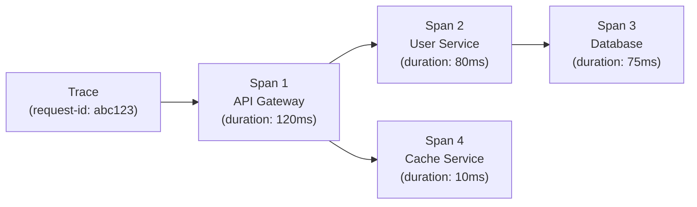
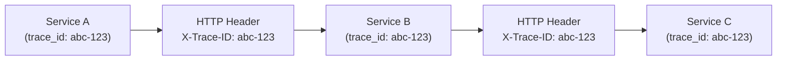

# Distributed Tracing

> **One-line definition:** Tracing requests across service boundaries to understand end-to-end flow, identify bottlenecks, and diagnose distributed system issues.

## Why This Is a Specialist Skill

A senior software engineer may use traces to debug a single service. An SRE or platform engineer **designs tracing systems that span the entire organization**, **establishes instrumentation standards**, and **uses traces to optimize system-wide performance**.

In microservices architectures, a single user request may touch 10+ services. Without distributed tracing, you cannot understand where time is spent or where failures occur.

## What Is a Trace?

A trace represents the end-to-end journey of a request through a distributed system:



### Trace components

| Component | Definition | Example |
|---|---|---|
| **Trace** | End-to-end request journey | User login request |
| **Span** | Single operation within a trace | Database query, HTTP call |
| **Parent span** | Span that calls another span | User Service calling Database |
| **Child span** | Span called by a parent | Database query called by User Service |
| **Trace ID** | Unique identifier for the trace | `abc-123` |
| **Span ID** | Unique identifier for the span | `span-456` |

### Span attributes

Each span includes:

| Attribute | Purpose | Example |
|---|---|---|
| `operation_name` | What the span does | `SELECT * FROM users` |
| `service_name` | Which service | `user-service` |
| `start_time` | When it started | `2026-01-15T10:23:45.123Z` |
| `duration` | How long it took | `75ms` |
| `tags` | Key-value metadata | `{"db.type": "postgresql", "db.statement": "SELECT..."}` |
| `logs` | Events within the span | `{"event": "cache_miss", "key": "user_123"}` |

## When to Use Tracing

| Scenario | How tracing helps |
|---|---|
| **High latency** | Identify which service or database query is slow |
| **Error diagnosis** | See which service failed and why |
| **Dependency mapping** | Understand service-to-service communication |
| **Performance optimization** | Find bottlenecks in request flow |
| **Capacity planning** | See which services handle the most traffic |

## Tracing Tools

| Tool | Strengths | Use when |
|---|---|---|
| **Jaeger** | Open source; Kubernetes-native | Self-hosted; CNCF ecosystem |
| **Zipkin** | Simple; Twitter heritage | Small to medium systems |
| **Tempo** (Grafana) | Integrates with Loki, Prometheus | Grafana ecosystem |
| **Datadog APM** | Full-stack; ML-powered | Commercial; unified observability |
| **New Relic** | Enterprise features | Large organizations |

## Instrumentation

### Manual instrumentation

```python
from opentelemetry import trace

tracer = trace.get_tracer(__name__)

def get_user(user_id):
    with tracer.start_as_current_span("get_user") as span:
        span.set_attribute("user.id", user_id)
        
        user = database.query("SELECT * FROM users WHERE id = ?", user_id)
        
        span.set_attribute("db.rows_returned", len(user))
        return user
```

### Automatic instrumentation

Many frameworks provide automatic instrumentation:

```python
from opentelemetry.instrumentation.flask import FlaskInstrumentor
from opentelemetry.instrumentation.requests import RequestsInstrumentor

# Automatically instrument Flask and HTTP requests
FlaskInstrumentor().instrument()
RequestsInstrumentor().instrument()
```

**Recommendation:** Use automatic instrumentation for common frameworks. Add manual instrumentation for business-critical operations.

## Trace Context Propagation

To trace across services, you must propagate trace context:



### Propagation standards

| Standard | Description | Use when |
|---|---|---|
| **W3C Trace Context** | Industry standard | Multi-vendor environments |
| **B3 (Zipkin)** | Zipkin's format | Zipkin ecosystem |
| **Jaeger** | Jaeger's format | Jaeger ecosystem |

**Recommendation:** Use W3C Trace Context for maximum interoperability.

## Trace Analysis Patterns

### Finding bottlenecks

Look for spans with disproportionately long durations:

```
Trace: user-login (total: 500ms)
├─ API Gateway (10ms)
├─ Auth Service (450ms) ← BOTTLENECK
│  ├─ Validate token (50ms)
│  └─ Query database (400ms) ← ROOT CAUSE
└─ User Service (40ms)
```

### Identifying cascading failures

Look for error spans that propagate through services:

```
Trace: create-order (total: 2000ms)
├─ Order Service (ERROR: timeout)
│  ├─ Payment Service (ERROR: timeout)
│  │  └─ Payment Gateway (ERROR: connection refused) ← ROOT CAUSE
│  └─ Inventory Service (OK)
└─ Notification Service (OK)
```

## Tracing Anti-Patterns

| Anti-pattern | Problem | What to do instead |
|---|---|---|
| **No tracing** | Can't diagnose distributed issues | Instrument critical paths |
| **Only manual tracing** | Misses important spans | Use automatic instrumentation for frameworks |
| **No context propagation** | Traces break at service boundaries | Propagate trace context in headers |
| **100% sampling** | High cost; storage issues | Sample 1-10% of traces; 100% for errors |
| **Tracing in hot paths** | Performance overhead | Use async exporters; sample appropriately |

## Practical Exercise

**For a service you own:**

1. **Audit your current tracing:**
   - Do you have distributed tracing?
   - Are traces propagated across service boundaries?
   - What percentage of requests are sampled?

2. **Instrument a critical user journey:**
   - Choose a high-value flow (e.g., user login, checkout)
   - Add automatic instrumentation for frameworks
   - Add manual instrumentation for business logic
   - Verify traces appear in your tracing tool

3. **Analyze a trace:**
   - Pick a slow request from the last week
   - Identify the bottleneck (which span took the longest?)
   - Identify the root cause (why was that span slow?)

**Bonus:** Create a service dependency map from traces. Which services have the most dependencies? Which are single points of failure?

## Knowledge Connections

- [[01_Metrics_and_Dashboards]] : metrics show "what", traces show "how"
- [[02_Structured_Logging]] : logs provide details; traces provide flow
- [[04_Alerting_Strategy]] : alerts can link to traces for fast diagnosis
- [[03_Incident_Response/02_Incident_Management]] : traces are critical for incident diagnosis
- [[software-engineering-note/02_Software_Architecture/Microservice/05 Observability/052 Distributed Tracing]] : distributed tracing foundations

## Key Takeaways

- Distributed tracing shows end-to-end request flow across services
- Use traces to find bottlenecks, diagnose errors, and map dependencies
- Propagate trace context across service boundaries (W3C Trace Context)
- Use automatic instrumentation for frameworks; manual for business logic
- Sample traces to manage cost (1-10% normal; 100% errors)
- Analyze traces to identify bottlenecks and cascading failures
