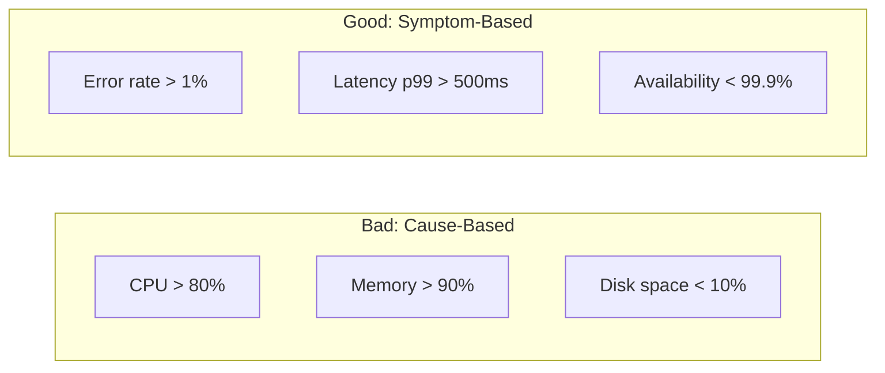
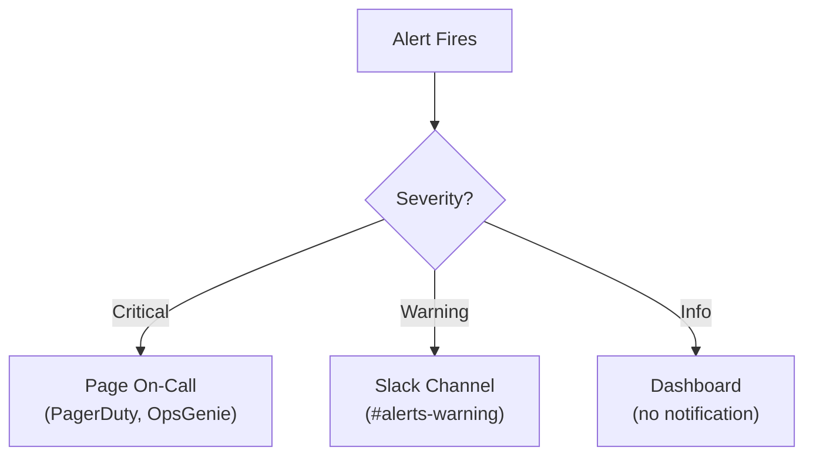

# Alerting Strategy

> **One-line definition:** Designing alerts that are actionable, not noisy, so that the right people are notified when action is required.

## Why This Is a Specialist Skill

A senior software engineer may set up basic alerts. An SRE or platform engineer **designs alerting systems that the organization relies on**, **prevents alert fatigue**, and **ensures alerts drive effective incident response**.

The difference is not technical complexity. It is **alerting philosophy**: alert on symptoms that require human action, not causes that may self-resolve.

## Alert Design Principles

### The three questions

Before creating an alert, ask:

1. **Does this require human action?** If not, don't alert.
2. **Is this urgent?** If not, don't page at 3 AM.
3. **Can the responder act on it?** If not, don't alert that team.

If the answer to all three is "yes", create the alert.

### Symptom-based vs cause-based alerts



| Alert type | Example | Problem | Better alternative |
|---|---|---|---|
| **Cause-based** | "CPU > 80%" | May self-resolve; not actionable | "Error rate > 1%" |
| **Symptom-based** | "Error rate > 1%" | Indicates user impact; actionable | ✓ Use this |

**Key insight:** High CPU is not a problem unless it causes user-visible symptoms. Alert on the symptom (error rate), not the cause (CPU).

## Alert Severity Levels

| Severity | Response | Example | When to use |
|---|---|---|---|
| **Critical** | Page on-call immediately; respond within 15 minutes | Service down; error rate > 5% | User-impacting issues requiring immediate action |
| **Warning** | Notify on Slack; respond within 1 hour | Error rate > 1%; latency > 500ms | Issues that may become critical |
| **Info** | Log to dashboard; review in next business day | Disk usage > 70%; certificate expiring in 30 days | Awareness; no immediate action needed |

### Alert routing



## Alert Best Practices

### Make alerts actionable

Every alert should include:

| Component | Purpose | Example |
|---|---|---|
| **What's broken** | Clear symptom description | "Error rate is 2.3% (threshold: 1%)" |
| **Impact** | Who or what is affected | "Users cannot complete checkout" |
| **Runbook link** | How to investigate and fix | "See: https://runbooks/checkout-errors" |
| **Dashboard link** | Where to see more details | "See: https://grafana/checkout-service" |
| **Escalation path** | Who to contact if stuck | "Escalate to: @platform-team" |

### Avoid alert fatigue

| Anti-pattern | Problem | Solution |
|---|---|---|
| **Too many alerts** | Important alerts get lost | Only alert on actionable symptoms |
| **Flapping alerts** | Repeated pages; responder fatigue | Add hysteresis (e.g., alert if > 1% for 5 minutes) |
| **No runbook** | Responder doesn't know what to do | Link to runbook in every alert |
| **Wrong team paged** | Responder can't fix the issue | Route alerts to the team that owns the service |
| **Stale alerts** | Alert on issues that self-resolve | Add delay (e.g., wait 2 minutes before paging) |

### Alert hysteresis

Prevent flapping alerts by requiring sustained violations:

```
Alert condition: error_rate > 1% for 5 minutes
Recovery condition: error_rate < 0.5% for 5 minutes
```

**Why this works:** Short spikes may self-resolve. Sustained violations require human action.

## Alert Testing

### Regular alert tests

Test alerts regularly to ensure they work:

| Test | Frequency | How |
|---|---|---|
| **Alert fires** | Monthly | Inject test data to trigger alert |
| **Alert reaches on-call** | Monthly | Verify page is received |
| **Runbook is accurate** | Quarterly | Follow runbook; update if outdated |
| **Escalation works** | Quarterly | Test escalation path |

### Game days

Conduct "game days" to test alerting and incident response:

1. **Inject failures** (e.g., kill a service, saturate CPU)
2. **Verify alerts fire** and reach the right people
3. **Time the response** (detection to resolution)
4. **Review the runbook** (was it accurate and complete?)
5. **Identify gaps** (missing alerts, outdated runbooks)

## Alert Anti-Patterns

| Anti-pattern | Problem | What to do instead |
|---|---|---|
| **Alert on causes** | CPU, memory may self-resolve | Alert on symptoms (error rate, latency) |
| **No runbook** | Responder doesn't know what to do | Link to runbook in every alert |
| **Alert fatigue** | Important alerts get lost | Only alert on actionable symptoms |
| **No hysteresis** | Flapping alerts; responder fatigue | Add sustained violation requirement |
| **Wrong team paged** | Responder can't fix the issue | Route alerts to service owners |
| **No testing** | Alerts don't work when needed | Test alerts monthly; conduct game days |

## Practical Exercise

**For a service you own:**

1. **Audit your current alerts:**
   - How many alerts fired in the last month?
   - How many were actionable (required human intervention)?
   - How many were cause-based vs symptom-based?

2. **Improve alert quality:**
   - Convert cause-based alerts to symptom-based
   - Add runbook links to all alerts
   - Add hysteresis to prevent flapping

3. **Test your alerts:**
   - Inject a failure (e.g., kill a dependency)
   - Verify the alert fires and reaches the on-call
   - Time the response (detection to resolution)
   - Review the runbook (was it accurate?)

**Bonus:** Conduct a game day with your team. Inject multiple failures and test the entire incident response process.

## Knowledge Connections

- [[01_Metrics_and_Dashboards]] : alerts are based on metrics
- [[02_Structured_Logging]] : logs provide context for alerts
- [[03_Distributed_Tracing]] : traces help diagnose alerted issues
- [[03_Incident_Response/02_Incident_Management]] : alerts trigger incident response
- [[01_Service_Objectives/03_Error_Budget_Policy]] : error budget burn rate alerts
- [[career-path/02_Senior_Software_Engineer/05_Quality_Reliability_Security/03_Observability]] : observability foundations

## Key Takeaways

- Alert on symptoms that require human action, not causes that may self-resolve
- Use three severity levels: Critical (page), Warning (Slack), Info (dashboard)
- Make alerts actionable: include what's broken, impact, runbook link, and escalation path
- Prevent alert fatigue: only alert on actionable symptoms; add hysteresis
- Test alerts regularly: verify they fire, reach on-call, and runbooks are accurate
- Conduct game days to test the entire incident response process
