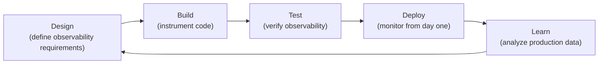

# Observability-Driven Development

> **One-line definition:** Building observability into the development process so that systems are observable from day one, not retrofitted after deployment.

## Why This Is a Specialist Skill

A senior software engineer may add observability after building a feature. An SRE or platform engineer **establishes observability as a development standard**, **reviews observability in design documents**, and **ensures systems are observable before they reach production**.

The difference is not technical complexity. It is **treating observability as a first-class requirement, not an afterthought**.

## The Observability-Driven Development Process



## Observability Requirements in Design Documents

### Design document template

Add an observability section to every design document:

```markdown
## Observability Requirements

### Metrics
- [Metric 1]: [what it measures, how to calculate]
- [Metric 2]: [what it measures, how to calculate]

### Logs
- [Log 1]: [when to log, what fields to include]
- [Log 2]: [when to log, what fields to include]

### Traces
- [Trace 1]: [which user journey to trace]
- [Trace 2]: [which user journey to trace]

### Alerts
- [Alert 1]: [symptom, severity, runbook]
- [Alert 2]: [symptom, severity, runbook]

### Dashboards
- [Dashboard 1]: [what it shows, who it's for]
- [Dashboard 2]: [what it shows, who it's for]
```

### Example: user authentication service

```markdown
## Observability Requirements

### Metrics
- authentication_attempts_total: counter of login attempts
- authentication_errors_total: counter of failed logins
- authentication_duration_seconds: histogram of login latency

### Logs
- User login attempt: {user_id, ip_address, success, duration_ms}
- Failed login: {user_id, ip_address, error_reason}

### Traces
- User login flow: API Gateway → Auth Service → Database

### Alerts
- Critical: error_rate > 5% for 5 minutes (page on-call)
- Warning: p99 latency > 500ms for 5 minutes (Slack)

### Dashboards
- Golden signals: latency, traffic, errors, saturation
- Security: failed login attempts by IP (detect brute force)
```

## Observability Code Reviews

### Observability checklist

Add observability to your code review checklist:

- [ ] **Metrics:** Are key operations instrumented with metrics?
- [ ] **Logs:** Are important events logged with structured data?
- [ ] **Traces:** Are critical user journeys traced?
- [ ] **Correlation IDs:** Are request IDs propagated across services?
- [ ] **Error handling:** Are errors logged with context (not just stack traces)?
- [ ] **Performance:** Are slow operations logged or traced?
- [ ] **Security:** Is sensitive data excluded from logs?

### Code review example

**Bad (missing observability):**

```python
def create_order(user_id, items):
    order = Order(user_id=user_id, items=items)
    db.save(order)
    return order
```

**Good (with observability):**

```python
import logging
from opentelemetry import trace

logger = logging.getLogger(__name__)
tracer = trace.get_tracer(__name__)

def create_order(user_id, items):
    with tracer.start_as_current_span("create_order") as span:
        span.set_attribute("user.id", user_id)
        span.set_attribute("order.items_count", len(items))
        
        logger.info("Creating order", extra={
            "user_id": user_id,
            "items_count": len(items)
        })
        
        order = Order(user_id=user_id, items=items)
        db.save(order)
        
        span.set_attribute("order.id", order.id)
        logger.info("Order created", extra={
            "order_id": order.id,
            "user_id": user_id
        })
        
        return order
```

## Observability Testing

### Testing observability before deployment

Before deploying to production, verify observability:

| Test | How to verify |
|---|---|
| **Metrics are emitted** | Check metrics endpoint or monitoring tool |
| **Logs are structured** | Query logs; verify JSON format |
| **Traces are captured** | Trigger a request; verify trace appears |
| **Alerts fire** | Inject a failure; verify alert is triggered |
| **Dashboards work** | Open dashboard; verify data appears |

### Pre-deployment checklist

- [ ] Metrics are visible in monitoring tool
- [ ] Logs are queryable and structured
- [ ] Traces show end-to-end flow
- [ ] Alerts are configured and tested
- [ ] Dashboards show expected data
- [ ] Runbooks are written for new alerts

## Observability Standards

### Organization-wide standards

Establish standards for consistency:

| Standard | Example |
|---|---|
| **Metric naming** | `{namespace}_{subsystem}_{metric}_{unit}` |
| **Log format** | JSON with standard fields (timestamp, level, service, request_id) |
| **Trace propagation** | W3C Trace Context in HTTP headers |
| **Alert severity** | Critical (page), Warning (Slack), Info (dashboard) |
| **Dashboard naming** | `{service}-{type}` (e.g., `user-api-golden-signals`) |

### Enforcing standards

- **Linters:** Check metric names, log formats in CI
- **Code reviews:** Verify observability in pull requests
- **Production readiness:** Block deployment if observability is missing
- **Training:** Teach teams how to instrument code

## Observability-Driven Development Anti-Patterns

| Anti-pattern | Problem | What to do instead |
|---|---|---|
| **Observability as afterthought** | Retrofitting is expensive; gaps remain | Define observability requirements in design |
| **No standards** | Inconsistent observability across services | Establish organization-wide standards |
| **No testing** | Observability doesn't work in production | Test observability before deployment |
| **No code reviews** | Observability gaps slip through | Add observability to code review checklist |
| **No training** | Teams don't know how to instrument | Provide training and examples |

## Practical Exercise

**For a feature you're building:**

1. **Define observability requirements:**
   - Use the design document template above
   - List metrics, logs, traces, alerts, and dashboards

2. **Instrument the code:**
   - Add metrics for key operations
   - Add structured logs for important events
   - Add traces for critical user journeys

3. **Test observability:**
   - Deploy to staging
   - Verify metrics, logs, traces, alerts, and dashboards work
   - Use the pre-deployment checklist

4. **Review with your team:**
   - Share the observability design in code review
   - Get feedback on metrics, logs, and alerts

**Bonus:** Pick an existing service. Conduct an observability audit. What's missing? Create a plan to add it.

## Knowledge Connections

- [[01_Metrics_and_Dashboards]] : metrics are a core observability signal
- [[02_Structured_Logging]] : logs provide context and details
- [[03_Distributed_Tracing]] : traces show request flow
- [[04_Alerting_Strategy]] : alerts turn observability data into action
- [[06_Developer_Platform/03_Golden_Paths]] : golden paths include observability standards
- [[software-engineering-note/06_Software_Engineering_Operations/04_Amplifying_Feedback]] : feedback loops in DevOps

## Key Takeaways

- Treat observability as a first-class requirement, not an afterthought
- Define observability requirements in design documents (metrics, logs, traces, alerts, dashboards)
- Add observability to code review checklists
- Test observability before deployment (metrics, logs, traces, alerts, dashboards)
- Establish organization-wide standards for consistency
- Provide training and examples to help teams instrument code
