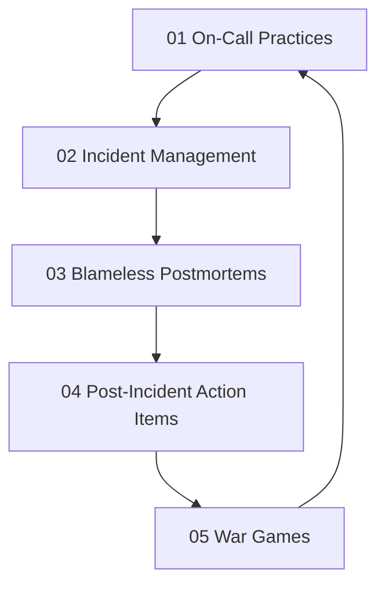

# Incident Response

> **Core idea:** Coordinating effective response to production incidents, conducting blameless postmortems, and turning incidents into organizational learning.

## What Incident Response Means at Specialist Level

A senior software engineer may participate in incident response. An SRE or platform engineer **designs incident response processes**, **leads incident coordination**, **conducts postmortems that drive systemic improvements**, and **builds a culture of learning from failure**.

Incidents are inevitable. The goal is not to prevent all incidents, but to **respond effectively, recover quickly, and learn systematically**.

## Topic Notes

| # | Topic | Focus | Status | File |
|---|---|---|---|---|
| 01 | On-Call Practices | Designing sustainable on-call rotations and compensation | ✅ Done | `01_On_Call_Practices.md` |
| 02 | Incident Management | Coordinating response, communication, and recovery | ✅ Done | `02_Incident_Management.md` |
| 03 | Blameless Postmortems | Learning from incidents without blame | ✅ Done | `03_Blameless_Postmortems.md` |
| 04 | Post-Incident Action Items | Tracking and completing corrective actions | ✅ Done | `04_Post_Incident_Action_Items.md` |
| 05 | War Games | Practicing incident response through simulations | ✅ Done | `05_War_Games.md` |

**Completion:** 5/5 : 100%

## How the Topics Connect

**Reading order:** Start with On-Call Practices to understand sustainable rotations. Incident Management shows how to coordinate response. Blameless Postmortems teaches how to learn from incidents. Post-Incident Action Items ensures corrective work is completed. War Games practices the entire process through simulations.

## Existing Vault Anchors

These topic notes **do not duplicate** the existing knowledge base. They layer specialist-level application on top of it:

| Specialist topic | Existing foundation notes |
|---|---|
| On-Call Practices | [[career-path/02_Senior_Software_Engineer/05_Quality_Reliability_Security/04_Incident_Response]] |
| Incident Management | [[software-engineering-note/06_Software_Engineering_Operations/08_Service_Operations_and_Support]] |
| Blameless Postmortems | [[career-path/02_Senior_Software_Engineer/05_Quality_Reliability_Security/04_Incident_Response]] |
| Post-Incident Action Items | [[software-engineering-note/06_Software_Engineering_Operations/05_Continual_Learning]] |
| War Games | [[career-path/02_Senior_Software_Engineer/05_Quality_Reliability_Security/07_Chaos_Engineering]] |

## Self-Assessment Checklist

Use this to gauge your current mastery of incident response:

- [ ] I participate in a sustainable on-call rotation with fair compensation
- [ ] I have led incident response for at least one production incident
- [ ] I can coordinate a multi-team incident with clear roles and communication
- [ ] I have written at least one blameless postmortem
- [ ] I track post-incident action items and ensure they are completed
- [ ] I have participated in or led a war game or game day
- [ ] I can explain the difference between blame and accountability

## Related

- [[00_overview|SRE and Platform Engineer Overview]]
- [[01_Service_Objectives/00_overview|Service Objectives]] : incidents consume error budget
- [[02_Observability/00_overview|Observability]] : observability data is critical for incident diagnosis
- [[05_Capacity_and_Resilience/00_overview|Capacity and Resilience]] : resilience reduces incident frequency
- [[career-path/02_Senior_Software_Engineer/05_Quality_Reliability_Security/04_Incident_Response|Incident Response]] : incident response foundations from the Senior SWE path
