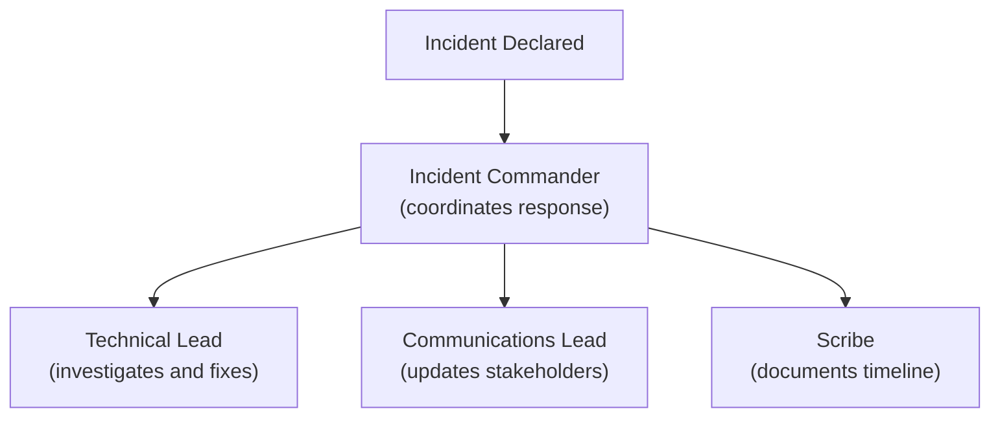
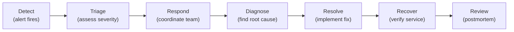

# Incident Management

> **One-line definition:** Coordinating structured response to production incidents with clear roles, communication, and recovery procedures.

## Why This Is a Specialist Skill

A senior software engineer may fix issues during incidents. An SRE or platform engineer **leads incident coordination**, **manages communication across teams**, and **ensures incidents are resolved efficiently while minimizing business impact**.

The difference is not technical skill alone. It is **coordination and communication**: managing the incident process while others focus on technical resolution.

## Incident Severity Levels

| Severity | Definition | Response time | Example |
|---|---|---|---|
| **SEV-1 (Critical)** | Major user impact; revenue loss; data loss | Immediate (page on-call) | Service down; payment processing broken |
| **SEV-2 (Major)** | Significant user impact; degraded service | 15 minutes | High error rate; slow performance |
| **SEV-3 (Minor)** | Limited user impact; workaround available | 1 hour | Feature broken; non-critical service down |
| **SEV-4 (Low)** | No user impact; internal issue | Next business day | Internal tool broken; cosmetic issue |

### Severity determination

Ask these questions to determine severity:

1. **Who is affected?** (All users, some users, internal only)
2. **What is the impact?** (Complete outage, degraded service, inconvenience)
3. **Is there a workaround?** (No workaround = higher severity)
4. **What is the business impact?** (Revenue loss, data loss, compliance violation)

## Incident Roles

### Core roles

| Role | Responsibility | Who |
|---|---|---|
| **Incident Commander (IC)** | Coordinates response; makes decisions; manages communication | On-call engineer or designated IC |
| **Technical Lead** | Investigates root cause; implements fixes | Subject matter expert |
| **Communications Lead** | Updates stakeholders; manages external communication | Engineering manager or product manager |
| **Scribe** | Documents timeline; captures decisions and actions | Any available engineer |

### Role assignments



## Incident Response Process

### The incident lifecycle



### Step-by-step response

#### 1. Detect (alert fires)

- Alert triggers on-call notification
- On-call acknowledges alert within 5 minutes
- Begin initial investigation

#### 2. Triage (assess severity)

- Determine incident severity (SEV-1, SEV-2, SEV-3, SEV-4)
- Identify affected services and users
- Decide if incident commander is needed

**Triage checklist:**
- [ ] What service is affected?
- [ ] Who is impacted (users, internal teams)?
- [ ] What is the symptom (error rate, latency, outage)?
- [ ] Is there a workaround?
- [ ] What is the business impact?

#### 3. Respond (coordinate team)

- Declare incident (create incident channel, bridge)
- Assign roles (IC, technical lead, communications, scribe)
- Notify relevant teams and stakeholders

**Incident declaration template:**

```
INCIDENT DECLARED: [Service Name] - [Brief Description]

Severity: SEV-1/2/3/4
Impact: [Who is affected and how]
Incident Commander: [@name]
Technical Lead: [@name]
Communications Lead: [@name]
Incident Channel: #incident-[service]-[date]
Bridge: [Zoom/Meet link]

Current Status: [What we know so far]
Next Steps: [Immediate actions being taken]
```

#### 4. Diagnose (find root cause)

- Investigate logs, metrics, traces
- Identify when the issue started
- Look for recent changes (deployments, config changes)
- Form hypotheses and test them

**Diagnosis questions:**
- When did the issue start?
- What changed recently (deployments, config, dependencies)?
- What do the logs show?
- What do the metrics show?
- What do the traces show?

#### 5. Resolve (implement fix)

- Implement fix (rollback, config change, code fix)
- Verify fix resolves the issue
- Monitor for recurrence

**Resolution options:**

| Option | When to use | Risk |
|---|---|---|
| **Rollback** | Recent deployment caused issue | Low (reverts to known good state) |
| **Config change** | Configuration error | Medium (may have unintended effects) |
| **Code fix** | Bug in code | High (requires testing, deployment) |
| **Scaling** | Capacity issue | Low (adds resources) |
| **Dependency failover** | Dependency failure | Medium (may have side effects) |

#### 6. Recover (verify service)

- Verify service is fully operational
- Check all affected components
- Monitor for recurrence
- Communicate resolution to stakeholders

**Recovery checklist:**
- [ ] Service is responding normally
- [ ] Error rate is back to baseline
- [ ] Latency is back to baseline
- [ ] All affected components are healthy
- [ ] No recurrence for 30 minutes
- [ ] Stakeholders notified of resolution

#### 7. Review (postmortem)

- Schedule postmortem within 48 hours
- Document incident timeline
- Identify root cause and contributing factors
- Define action items to prevent recurrence

## Incident Communication

### Internal communication

| Audience | Channel | Frequency | Content |
|---|---|---|---|
| **Incident team** | Incident channel (Slack) | Real-time | Technical details, decisions, actions |
| **Engineering managers** | Incident channel + direct message | Every 15-30 minutes | Status, impact, ETA |
| **Product managers** | Incident channel + direct message | Every 30 minutes | User impact, workaround, ETA |
| **Executive leadership** | Direct message from communications lead | Every hour (SEV-1) | Business impact, resolution status |

### External communication

| Audience | Channel | Frequency | Content |
|---|---|---|---|
| **Customers** | Status page, email, in-app notification | Every 30 minutes (SEV-1) | Impact, workaround, ETA |
| **Public** | Status page, social media | Every hour (SEV-1) | High-level status |

### Communication templates

**Status update (internal):**

```
INCIDENT UPDATE: [Service Name] - [Time]

Status: Investigating / Identified / Monitoring / Resolved
Impact: [Current impact]
Root Cause: [If identified]
ETA: [Estimated resolution time]
Next Update: [When next update will be provided]
```

**Status update (external):**

```
We are currently investigating an issue affecting [service/feature].
Impact: [What users are experiencing]
Workaround: [If available]
We will provide updates every [X minutes/hours].
```

## Incident Tools

### Incident management platforms

| Tool | Strengths | Use when |
|---|---|---|
| **PagerDuty** | Alerting, on-call, incident tracking | Most organizations |
| **Incident.io** | Slack-native; simple workflow | Slack-based teams |
| **FireHydrant** | Incident management, postmortems | Full incident lifecycle |
| **Jira Service Management** | IT service management | IT organizations |

### Communication tools

| Tool | Use when |
|---|---|
| **Slack incident channel** | Real-time coordination |
| **Zoom/Meet bridge** | Voice communication for complex incidents |
| **Status page (Statuspage, Cachet)** | External communication |
| **Email** | Formal updates to stakeholders |

## Incident Management Anti-Patterns

| Anti-pattern | Problem | What to do instead |
|---|---|---|
| **No incident commander** | Chaos; unclear who is coordinating | Assign IC for SEV-1 and SEV-2 incidents |
| **Too many people on bridge** | Noise; slow decision making | Limit bridge to essential roles |
| **No communication** | Stakeholders in the dark; panic | Provide regular updates (every 15-30 minutes) |
| **Blame during incident** | People hide mistakes; no learning | Focus on resolution; blame comes later (never) |
| **No documentation** | Can't learn from incident | Assign scribe to document timeline |
| **Skipping postmortem** | Same issues recur | Always conduct postmortem for SEV-1 and SEV-2 |

## Practical Exercise

**For a recent incident:**

1. **Review the response:**
   - Was an incident commander assigned?
   - Were roles clear (IC, technical lead, communications)?
   - Was communication regular and clear?

2. **Identify gaps:**
   - What was confusing during the incident?
   - What information was missing?
   - What took too long?

3. **Improve the process:**
   - Create or update incident response documentation
   - Define clear severity levels and response times
   - Create communication templates

**Bonus:** Conduct a tabletop exercise where your team walks through a hypothetical incident. Assign roles, practice communication, identify gaps.

## Knowledge Connections

- [[01_On_Call_Practices]] : on-call is the first step in incident response
- [[03_Blameless_Postmortems]] : postmortems learn from incidents
- [[04_Post_Incident_Action_Items]] : action items prevent recurrence
- [[02_Observability/04_Alerting_Strategy]] : alerts trigger incident response
- [[career-path/02_Senior_Software_Engineer/05_Quality_Reliability_Security/04_Incident_Response]] : incident response foundations

## Key Takeaways

- Use clear severity levels (SEV-1 through SEV-4) with defined response times
- Assign clear roles: incident commander, technical lead, communications lead, scribe
- Follow a structured process: detect, triage, respond, diagnose, resolve, recover, review
- Communicate regularly: every 15-30 minutes for SEV-1, both internally and externally
- Use incident management tools (PagerDuty, Incident.io) to coordinate response
- Always conduct postmortems for SEV-1 and SEV-2 incidents
