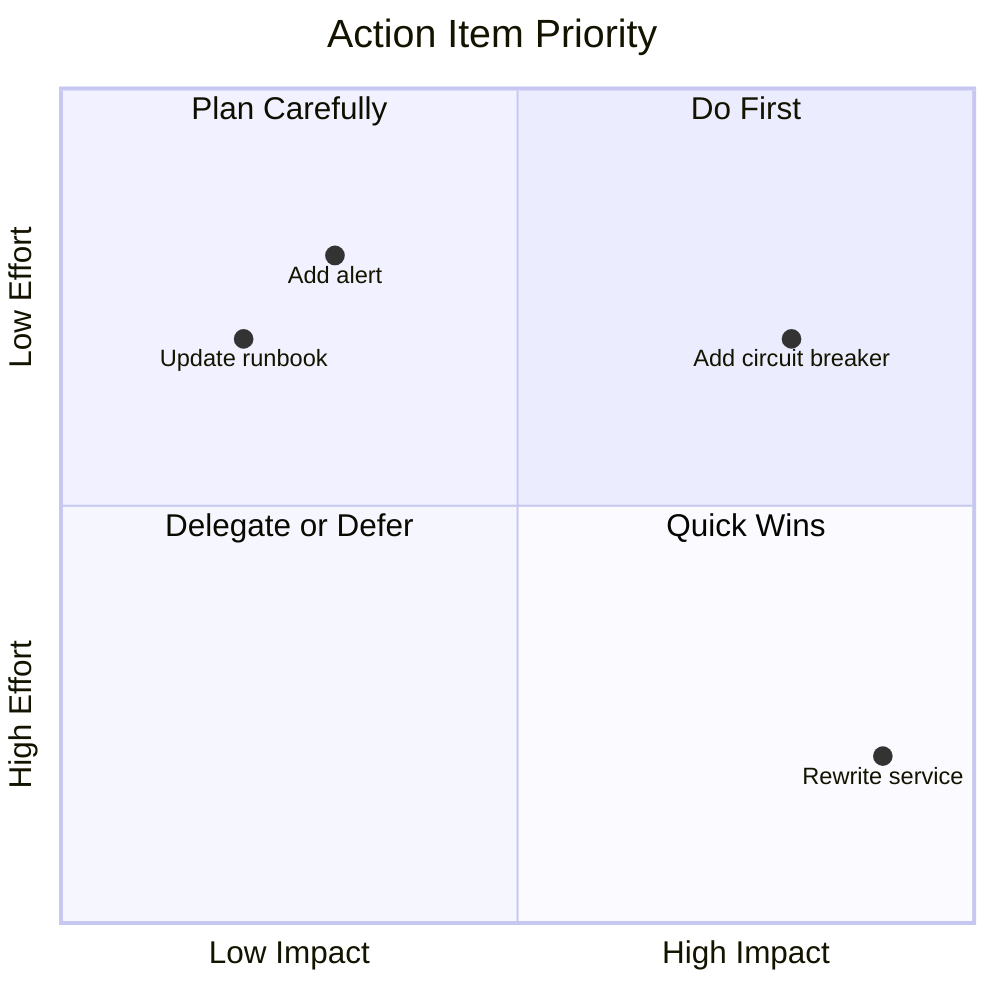

# Post-Incident Action Items

> **One-line definition:** Tracking and completing corrective actions identified in postmortems to prevent incident recurrence.

## Why This Is a Specialist Skill

A senior software engineer may complete assigned action items. An SRE or platform engineer **ensures action items are well-defined, prioritized, tracked, and completed**, **advocates for reliability investment**, and **verifies that action items actually prevent recurrence**.

The difference is not technical skill. It is **follow-through**: ensuring that lessons learned translate into systemic improvements.

## Action Item Categories

### Types of action items

| Category | Purpose | Example |
|---|---|---|
| **Prevention** | Prevent this incident from recurring | Add automated load testing to CI/CD |
| **Detection** | Detect this incident faster | Add alert for error rate > 1% |
| **Mitigation** | Reduce impact when this incident occurs | Add circuit breaker for dependency |
| **Process** | Improve incident response process | Update runbook for this scenario |
| **Documentation** | Improve knowledge sharing | Write runbook for this failure mode |

### Action item quality

**Good action items are:**

| Quality | Example |
|---|---|
| **Specific** | "Add index to users.email column" not "Improve database performance" |
| **Measurable** | "Reduce p99 latency from 500ms to 200ms" not "Make it faster" |
| **Achievable** | "Add alert for error rate" not "Eliminate all errors" |
| **Relevant** | Directly addresses root cause or contributing factor |
| **Time-bound** | "Complete by March 15" not "Complete soon" |

**Bad action items:**

| Problem | Example | Better version |
|---|---|---|
| Vague | "Improve monitoring" | "Add dashboard showing error rate by service" |
| No owner | "Fix the bug" | "@alice: Fix null pointer in user service by March 15" |
| No deadline | "Add tests" | "@bob: Add integration tests for payment flow by April 1" |
| Not actionable | "Be more careful" | "Add validation for user input before database insert" |
| Wrong scope | "Rewrite the entire service" | "Add circuit breaker for external API calls" |

## Prioritizing Action Items

### Priority levels

| Priority | Definition | Timeline | Example |
|---|---|---|---|
| **P0 (Critical)** | Prevents SEV-1 recurrence | Within 1 week | Add rollback protection for config deployments |
| **P1 (High)** | Prevents SEV-2 recurrence | Within 1 month | Add automated load testing |
| **P2 (Medium)** | Improves detection or mitigation | Within 1 quarter | Add alert for error rate |
| **P3 (Low)** | Improves process or documentation | Within 2 quarters | Update runbook |

### Prioritization framework

Ask these questions to prioritize:

1. **Severity:** Would this prevent a SEV-1 or SEV-2 incident? (Higher priority)
2. **Likelihood:** How likely is this incident to recur? (Higher likelihood = higher priority)
3. **Impact:** How much would this reduce impact? (Greater reduction = higher priority)
4. **Effort:** How much work is required? (Lower effort = higher priority, all else equal)
5. **Dependencies:** Does this block other action items? (Blocking items = higher priority)

### Priority matrix



## Tracking Action Items

### Tracking tools

| Tool | Strengths | Use when |
|---|---|---|
| **Jira** | Full project management; reporting | Large organizations; complex tracking |
| **GitHub Issues** | Code-centric; simple | Engineering teams; GitHub workflow |
| **Trello** | Visual; simple | Small teams; lightweight tracking |
| **Spreadsheet** | Flexible; familiar | Quick start; small number of items |

### Tracking template

```markdown
## Post-Incident Action Items: [Incident Title]

**Incident Date:** [YYYY-MM-DD]
**Postmortem Date:** [YYYY-MM-DD]

| ID | Action Item | Owner | Priority | Due Date | Status | Completed |
|---|---|---|---|---|---|---|
| 1 | Add index to users.email | @alice | P1 | March 15 | In Progress | |
| 2 | Add alert for error rate > 1% | @bob | P2 | April 1 | Not Started | |
| 3 | Update runbook for database failures | @carol | P3 | May 1 | Completed | ✅ |

**Completion Rate:** 1/3 (33%)
```

### Review cadence

| Review | Frequency | Who |
|---|---|---|
| **Team review** | Weekly standup | Engineering team |
| **Manager review** | Monthly 1:1 | Engineering manager |
| **Leadership review** | Quarterly | Engineering director |

## Ensuring Completion

### Common barriers to completion

| Barrier | Solution |
|---|---|
| **No time** | Allocate dedicated reliability time (20% of sprint) |
| **Competing priorities** | Make reliability work visible; track in sprint planning |
| **Unclear scope** | Break large action items into smaller, specific tasks |
| **No owner** | Assign a named owner to every action item |
| **Forgotten** | Review action items in weekly standup; track in Jira |

### Making time for reliability work

**The 20% rule:** Dedicate 20% of sprint capacity to reliability work (action items, toil reduction, observability improvements).

**Why this works:**
- Explicit allocation prevents feature work from consuming all capacity
- Visible in sprint planning; managers can see the investment
- Sustainable long-term; not a one-time "reliability sprint"

### Escalation

If action items are not being completed:

| Situation | Escalation |
|---|---|
| Action item overdue by 1 week | Remind owner in standup |
| Action item overdue by 1 month | Escalate to engineering manager |
| Action item overdue by 1 quarter | Escalate to engineering director |
| Repeated non-completion | Review team capacity; adjust priorities |

## Verifying Effectiveness

### Did the action item work?

After completing an action item, verify it prevents recurrence:

| Verification | How |
|---|---|
| **Test the fix** | Inject the failure; verify the fix works |
| **Monitor metrics** | Track relevant metrics; verify improvement |
| **Wait and observe** | Monitor for 30-90 days; verify no recurrence |
| **Game day** | Test in a controlled environment |

### Example verification

**Action item:** Add automated load testing to CI/CD pipeline

**Verification:**
1. Run load test on staging environment
2. Verify load test catches performance regression
3. Monitor for 30 days; verify no performance-related incidents
4. Review load test results; verify they catch issues before production

## Action Item Anti-Patterns

| Anti-pattern | Problem | What to do instead |
|---|---|---|
| **No tracking** | Action items forgotten | Track in Jira, GitHub Issues, or spreadsheet |
| **No owner** | No one responsible | Assign a named owner to every action item |
| **No deadline** | No urgency | Set due dates; review weekly |
| **Vague action items** | Unclear what to do | Make action items specific and measurable |
| **No verification** | Don't know if fix worked | Test the fix; monitor for recurrence |
| **No time allocated** | Feature work consumes all capacity | Dedicate 20% of sprint to reliability work |

## Practical Exercise

**For a recent postmortem:**

1. **Review action items:**
   - Are they specific and measurable?
   - Do they have owners and due dates?
   - Are they prioritized correctly?

2. **Track action items:**
   - Add them to your tracking tool (Jira, GitHub Issues)
   - Review them in your next team standup
   - Set a calendar reminder to review monthly

3. **Verify effectiveness:**
   - For completed action items, verify they work
   - Test the fix in staging or through a game day
   - Monitor for recurrence over 30-90 days

**Bonus:** Review action items from a postmortem 6 months ago. Were they completed? Did the incident recur? What does this tell you about your process?

## Knowledge Connections

- [[03_Blameless_Postmortems]] : action items are the output of postmortems
- [[05_War_Games]] : war games test whether action items are effective
- [[01_Service_Objectives/03_Error_Budget_Policy]] : reliability work uses error budget
- [[06_Developer_Platform/03_Golden_Paths]] : golden paths include reliability standards
- [[career-path/02_Senior_Software_Engineer/05_Quality_Reliability_Security/04_Incident_Response]] : incident response foundations

## Key Takeaways

- Action items must be specific, measurable, and have owners and due dates
- Prioritize by severity and likelihood: P0 prevents SEV-1, P1 prevents SEV-2
- Track action items in Jira, GitHub Issues, or a spreadsheet; review weekly
- Dedicate 20% of sprint capacity to reliability work (action items, toil reduction)
- Verify action items work: test the fix, monitor for recurrence
- Escalate overdue action items: 1 week (standup), 1 month (manager), 1 quarter (director)
