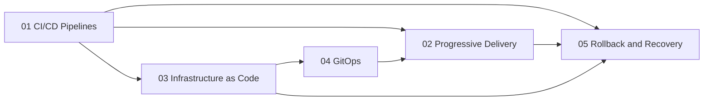

# Delivery Automation

## Core Idea

Delivery Automation is the discipline of making software delivery **safe, fast, and repeatable** through declarative pipelines, automated infrastructure, and progressive rollout strategies. It bridges the gap between a developer's commit and production traffic — ensuring every change flows through a controlled, observable, and reversible path.

## What It Means at Specialist Level

A specialist in Delivery Automation does not merely configure CI tools — they **design the entire delivery fabric** of an organization:

- **Architect pipelines** that scale from 10 to 10,000 deployments per day without human intervention
- **Choose and enforce deployment strategies** — canary, blue-green, feature flags — based on risk profiles
- **Treat infrastructure as software** — versioned, tested, reviewed, and rolled back like application code
- **Make Git the single source of truth** for both infrastructure state and deployment intent
- **Build automated rollback and recovery** so failures self-heal within seconds, not hours
- **Measure delivery performance** using DORA metrics and continuously optimize the path to production

## Topics in This Capability Area

| # | Topic | Focus | Status |
|---|-------|-------|--------|
| 01 | [[01_CI_CD_Pipelines]] | Continuous integration and deployment automation | ✅ Done |
| 02 | [[02_Progressive_Delivery]] | Canary releases, feature flags, blue-green deployments | ✅ Done |
| 03 | [[03_Infrastructure_as_Code]] | Terraform, Pulumi, declarative infrastructure | ✅ Done |
| 04 | [[04_GitOps]] | Git as source of truth for infrastructure and deployments | ✅ Done |
| 05 | [[05_Rollback_and_Recovery]] | Automated rollback strategies and disaster recovery | ✅ Done |

## How These Topics Connect

**Flow explanation:**

- **CI/CD Pipelines** are the backbone — they build, test, and push artifacts that feed into everything else.
- **Infrastructure as Code** provides the declarative foundation that GitOps orchestrates and CI/CD provisions.
- **GitOps** unifies Git as the single source of truth, connecting IaC state with deployment pipelines.
- **Progressive Delivery** sits at the intersection — it uses pipeline outputs and GitOps triggers to roll changes out safely.
- **Rollback and Recovery** wraps all layers — pipelines trigger rollbacks, GitOps reverts state, and progressive strategies limit blast radius.

## Existing Vault Anchors

| Existing Note | Relevance |
|---------------|-----------|
| [[software-engineering-note/06_Software_Engineering_Operations/Fundamental/13 CI CD Pipelines]] | Foundational CI/CD concepts, pipeline stages, tooling |
| [[software-engineering-note/02_Software_Architecture/Microservice/07 Deployment/074 GitOps and CI-CD Pipelines]] | GitOps patterns, ArgoCD, Flux integration with CI |
| [[software-engineering-note/02_Software_Architecture/Microservice/07 Deployment/072 Deployment Strategies]] | Blue-green, canary, rolling update strategies |
| [[software-engineering-note/06_Software_Engineering_Operations/01_The_Three_Ways]] | DevOps principles — flow, feedback, continuous learning |

## Self-Assessment Checklist

Use this to gauge your depth in Delivery Automation. A specialist should confidently answer **yes** to all 7:

- [ ] I can design a CI/CD pipeline from commit to production that includes security scanning, artifact signing, and multi-environment promotion
- [ ] I have implemented at least two progressive delivery strategies in production and can explain when to use each
- [ ] I manage infrastructure declaratively with Terraform or Pulumi, including state management, modules, and drift detection
- [ ] I have set up a GitOps workflow where Git is the authoritative source for cluster state and application deployments
- [ ] I have built automated rollback mechanisms that trigger within minutes of detecting a regression
- [ ] I can measure and improve DORA metrics — deployment frequency, lead time, change failure rate, and MTTR
- [ ] I have designed and tested a disaster recovery plan that meets defined RPO and RTO targets

## Related Capability Areas

- [[00_overview|07_SRE_and_Platform_Engineer Overview]] — parent capability area
- [[../03_Observability_and_Monitoring/00_overview|Observability and Monitoring]] — pipelines produce metrics that observability consumes
- [[../02_Reliability_Engineering/00_overview|Reliability Engineering]] — delivery automation enables reliability through safe, reversible changes
