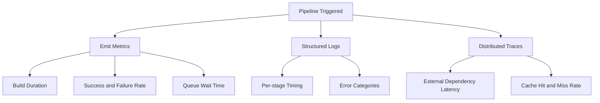
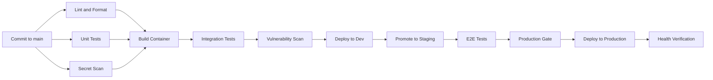

# CI/CD Pipelines

> **Continuous Integration and Continuous Deployment pipelines automate the journey from source code commit to production traffic — building, testing, securing, and releasing software with minimal human intervention.**

## Why This Is a Specialist Skill

Anyone can configure a basic build-and-deploy pipeline. A **specialist** designs pipelines that:

- Scale to hundreds of concurrent builds without queue congestion
- Enforce quality gates — security scans, license checks, SBOM generation — as non-negotiable stages
- Promote immutable artifacts across environments without rebuilding
- Integrate with progressive delivery controllers for safe rollouts
- Provide full traceability from production incident back to the exact commit and test result

Specialists treat pipelines as **products**, not scripts — they have SLAs, observability, and continuous improvement cycles.

## Core Concepts

### Pipeline Architecture

### Key Pipeline Stages

| Stage | Purpose | Tools | Failure Action |
|-------|---------|-------|----------------|
| **Source** | Detect changes, trigger pipeline | GitHub Actions, GitLab CI | N/A — this is the trigger |
| **Build** | Compile, bundle, containerize | Docker BuildKit, Bazel, Nix | Fail fast, notify author |
| **Unit Test** | Validate logic in isolation | Jest, pytest, Go test | Block artifact promotion |
| **Integration Test** | Validate component interactions | Testcontainers, Kind clusters | Block artifact promotion |
| **Security Scan** | Detect vulnerabilities and secrets | Trivy, Snyk, Gitleaks | Block or warn based on severity |
| **Artifact Publish** | Store immutable, versioned artifact | OCI registry, S3, Artifactory | Retry, then fail |
| **Deploy** | Promote artifact to target environment | Helm, Kustomize, ArgoCD | Trigger rollback |
| **Verify** | Confirm health post-deploy | Smoke tests, SLO checks | Auto-rollback |

### Pipeline as Code vs. Pipeline as Configuration

| Aspect | Pipeline as Code | Pipeline as Configuration |
|--------|-----------------|--------------------------|
| **Definition** | Pipeline logic in general-purpose language | Pipeline defined in YAML/config DSL |
| **Flexibility** | Full programming constructs — loops, conditionals, functions | Limited to what the DSL supports |
| **Examples** | Tekton, Dagger, Pulumi Pipelines | GitHub Actions YAML, GitLab CI YAML |
| **Testing** | Can unit-test pipeline logic | Hard to test without running |
| **Complexity** | Higher learning curve | Lower barrier to entry |
| **Best for** | Complex, multi-stage, reusable pipelines | Simple build-test-deploy workflows |

### Pipeline Observability

A specialist monitors pipelines with the same rigor as production services — tracking DORA metrics, identifying flaky tests, and optimizing critical paths.

## Anti-Patterns

| Anti-Pattern | Why It Hurts | Better Approach |
|-------------|-------------|-----------------|
| **Rebuilding per environment** | Inconsistent artifacts, wasted compute | Build once, promote immutable artifact |
| **Skipping tests for hotfixes** | Regressions slip through under pressure | Emergency pipeline still runs critical tests |
| **Monolithic pipeline** | One slow stage blocks everything | Parallel stages, independent promotion paths |
| **Manual approval gates everywhere** | Bottlenecks, deployment delays | Automated quality gates, human approval only for high-risk changes |
| **No pipeline observability** | Cannot diagnose slow or flaky builds | Instrument every stage with metrics and logs |
| **Secrets in pipeline config** | Credential leaks in version control | External secret managers — Vault, sealed-secrets |
| **Ignoring flaky tests** | Erodes trust in the pipeline, developers skip stages | Quarantine flaky tests, track and fix systematically |

## Practical Exercise

### Design a Multi-Stage Pipeline for a Microservice

**Scenario:** You have a Go microservice that needs to deploy to 3 environments — dev, staging, production — with increasing quality gates.

**Your task:**

1. **Define stages** — List every stage from commit to production, including parallel paths
2. **Specify quality gates** — What must pass before promotion to each environment?
3. **Add security** — Where do you scan for vulnerabilities, secrets, and license compliance?
4. **Design for speed** — How do you parallelize stages? What do you cache?
5. **Plan failure handling** — What happens when each stage fails?

**Sketch your pipeline:**

**Reflection questions:**
- Where is the critical path? Can you shorten it?
- What happens if the vulnerability scan finds a critical CVE — does it block or warn?
- How do you handle a failed health verification in production?

## Knowledge Connections

- [[software-engineering-note/06_Software_Engineering_Operations/Fundamental/13 CI CD Pipelines]] — foundational CI/CD concepts
- [[software-engineering-note/02_Software_Architecture/Microservice/07 Deployment/074 GitOps and CI-CD Pipelines]] — GitOps integration patterns
- [[02_Progressive_Delivery]] — pipelines feed artifacts into progressive rollout controllers
- [[04_GitOps]] — GitOps extends CI/CD with declarative state reconciliation
- [[05_Rollback_and_Recovery]] — pipelines trigger automated rollbacks on verification failure

## Key Takeaways

- **Build once, promote everywhere** — immutable artifacts eliminate environment-specific builds and ensure consistency
- **Pipelines are products** — they need SLAs, monitoring, and continuous improvement just like the services they deploy
- **Quality gates are non-negotiable** — security, license, and reliability checks must run even under time pressure
- **Parallelize aggressively** — independent stages should run concurrently to minimize lead time
- **Observe your pipeline** — track build duration, queue time, flaky test rate, and success rate as first-class metrics
- **Fail fast, recover gracefully** — catch issues as early as possible, and automate rollback when production verification fails
- **Treat pipeline definitions as code** — version, review, test, and lint your pipeline configurations
