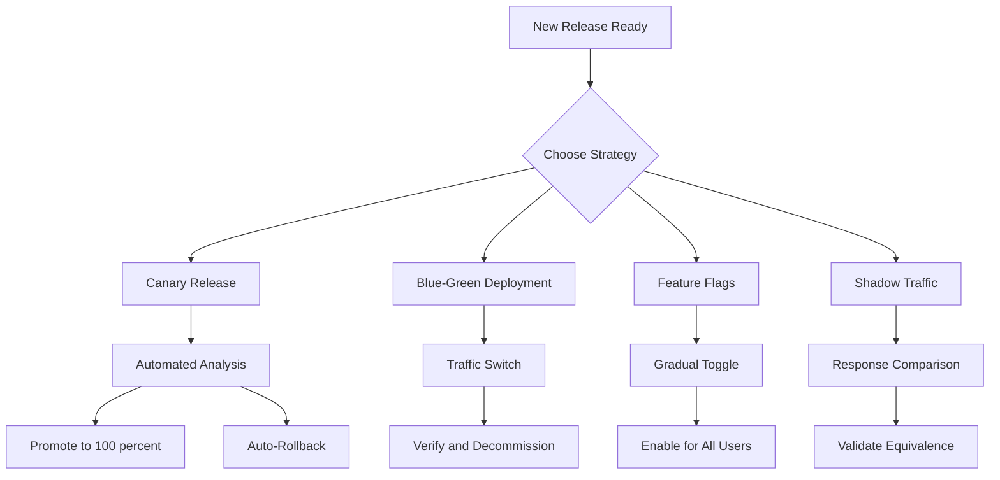
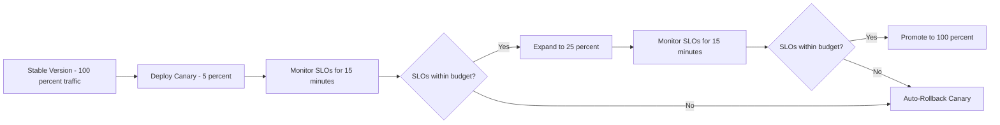
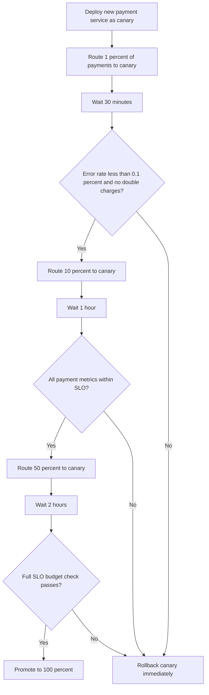

# Progressive Delivery

> **Progressive Delivery is the practice of releasing changes to a small subset of users or traffic first, then gradually expanding — using automated analysis to decide whether to proceed, pause, or roll back.**

## Why This Is a Specialist Skill

A basic deployment puts new code in front of all users at once. A **specialist** designs delivery strategies that:

- Limit blast radius to a small percentage of traffic while validating behavior
- Use real-time metrics and SLO budgets to automate promotion or rollback decisions
- Combine multiple strategies — canary + feature flags + shadow traffic — for layered risk reduction
- Understand the trade-offs between speed, safety, and operational complexity for each strategy
- Integrate progressive delivery with observability so that every rollout is a controlled experiment

## Core Concepts

### Progressive Delivery Strategies Overview

### Strategy Comparison

| Strategy | Blast Radius | Rollback Speed | Complexity | Best For |
|----------|-------------|----------------|------------|----------|
| **Rolling Update** | Gradual — replaces pods incrementally | Minutes — roll back to previous ReplicaSet | Low | Low-risk changes, internal services |
| **Blue-Green** | Zero until switch, then 100 percent | Seconds — flip traffic back to old version | Medium | Database migrations, large stateful changes |
| **Canary** | Starts at 1-5 percent, grows gradually | Minutes — shift traffic back to stable | Medium-High | High-traffic services, user-facing changes |
| **Feature Flags** | Zero until flag enabled, then configurable | Instant — toggle flag off | Medium | Decoupling deploy from release, A/B testing |
| **Shadow Traffic** | Zero — production traffic mirrored, not served | N/A — no real impact | High | Validating rewrites, new implementations |

### Canary Release Flow

### Feature Flag Maturity Levels

| Level | Pattern | Use Case |
|-------|---------|----------|
| **Release Toggle** | Binary on/off, short-lived | Gradual rollout of a new feature |
| **Experiment Toggle** | A/B variant assignment, measured | Data-driven feature validation |
| **Ops Toggle** | Kill switch, instant disable | Emergency disable without redeploy |
| **Permission Toggle** | User/role-based access | Premium features, beta programs |
| **Long-lived Toggle** | Permanent configuration switch | Multi-tenant feature customization |

### Analysis Automation

A specialist does not rely on humans watching dashboards during rollouts. Automated analysis:

| Signal | What It Detects | Tool Example |
|--------|----------------|--------------|
| **Error rate spike** | New bugs, integration failures | Prometheus + Alertmanager |
| **Latency regression** | Performance degradation | Prometheus histograms |
| **SLO budget burn** | Reliability impact exceeding threshold | Sloth, OpenSLO |
| **Log anomaly** | New error patterns, unexpected stack traces | Loki, Datadog |
| **Business metric drop** | Revenue, signups, engagement decline | Custom metrics pipeline |

Tools like **Flagger**, **Kayenta**, and **Argo Rollouts** automate the analysis-promote-rollback loop without human intervention.

## Anti-Patterns

| Anti-Pattern | Why It Hurts | Better Approach |
|-------------|-------------|-----------------|
| **Canary with no analysis** | Traffic shifts without validation — just a slower big-bang | Automate metric checks between each canary step |
| **Blue-green without database migration plan** | Old and new versions share a DB — schema changes break the old version | Use expand-and-contract migrations, feature-compatible schemas |
| **Feature flags everywhere, never cleaned up** | Code becomes a tangled web of conditionals | Flag lifecycle management — auto-expire, periodic cleanup sprints |
| **100 percent canary step** | Last step jumps from 50 percent to 100 percent — no safety net | Use smaller increments at higher percentages — 50, 75, 90, 100 |
| **Shadow traffic compared manually** | Human review does not scale, misses subtle differences | Automated diff tools with tolerance thresholds |
| **Rollback requires human approval** | MTTR increases while waiting for on-call to respond | Automate rollback on SLO breach, notify after the fact |

## Practical Exercise

### Design a Progressive Delivery Strategy for a Payment Service

**Scenario:** You are deploying a new version of a payment processing service that handles $2M in daily transactions. A bug could cause failed payments or double charges.

**Your task:**

1. **Choose a strategy** — Which progressive delivery approach fits this risk profile?
2. **Define canary steps** — What traffic percentages and durations would you use?
3. **Specify analysis criteria** — What metrics determine success or failure at each step?
4. **Plan the database migration** — How do you handle schema changes between old and new versions?
5. **Design the rollback** — How fast must rollback happen? What triggers it automatically?

**Sample strategy sketch:**

**Reflection questions:**
- Why start at 1 percent instead of 5 percent for a payment service?
- How do you verify there are no double charges in the canary?
- What happens to in-flight transactions during a rollback?

## Knowledge Connections

- [[software-engineering-note/02_Software_Architecture/Microservice/07 Deployment/072 Deployment Strategies]] — deployment strategy fundamentals
- [[01_CI_CD_Pipelines]] — pipelines produce the artifacts that progressive delivery controllers consume
- [[04_GitOps]] — GitOps controllers like Argo Rollouts integrate progressive delivery with declarative state
- [[05_Rollback_and_Recovery]] — progressive delivery limits blast radius; rollback recovers from what slips through
- [[../03_Observability_and_Monitoring/00_overview|Observability and Monitoring]] — analysis automation depends on rich, real-time observability data

## Key Takeaways

- **Progressive delivery is controlled experimentation** — every rollout is a hypothesis tested against real traffic with automated verdicts
- **Choose strategy based on risk** — high-risk changes need smaller canary steps and longer observation windows
- **Automate the analysis loop** — humans watching dashboards is not a delivery strategy; use tools like Flagger or Argo Rollouts
- **Feature flags decouple deploy from release** — ship code to production without exposing it to users until you are ready
- **Database migrations need special care** — blue-green and canary both require backward-compatible schemas during transition
- **Clean up your flags** — accumulated feature flags become technical debt that slows development and increases bug surface
- **Rollback must be faster than the blast radius grows** — if your canary step takes 15 minutes, rollback must complete in under 5
