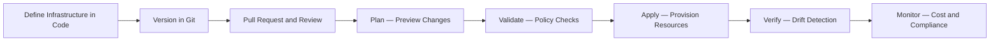
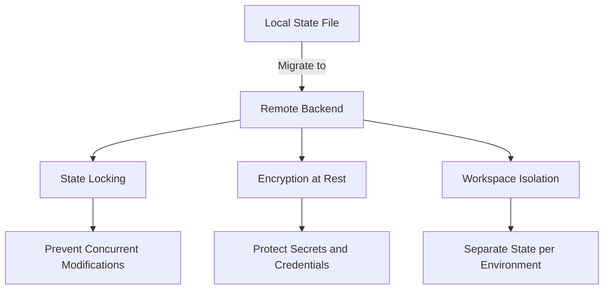
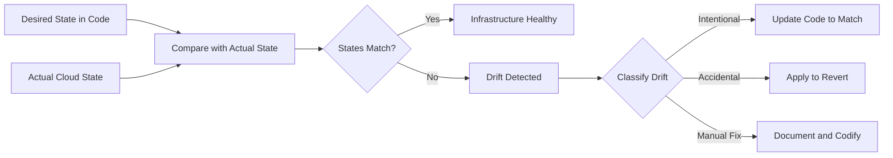
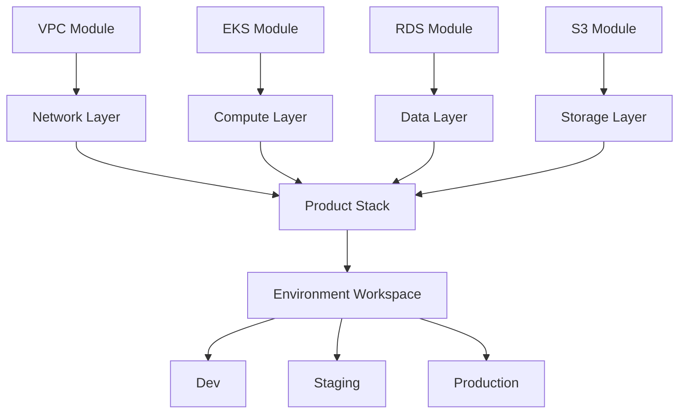

# Infrastructure as Code

> **Infrastructure as Code is the practice of defining, provisioning, and managing infrastructure through declarative or programmatic definitions that are versioned, tested, and deployed like application code.**

## Why This Is a Specialist Skill

A junior engineer writes Terraform to spin up a VM. A **specialist** designs infrastructure systems that:

- Scale from one environment to hundreds with reusable modules and workspaces
- Detect and remediate drift between declared state and actual cloud resources
- Manage state safely — remote backends, locking, encryption, and state isolation
- Integrate infrastructure changes into CI/CD pipelines with plan-review-apply workflows
- Treat infrastructure changes with the same rigor as code — pull requests, reviews, tests, and rollbacks

## Core Concepts

### IaC Workflow

### Tool Comparison

| Aspect | Terraform | Pulumi | CloudFormation | CDK |
|--------|-----------|--------|----------------|-----|
| **Language** | HCL — declarative DSL | General-purpose — Python, Go, TypeScript | JSON/YAML — AWS-specific | TypeScript, Python — AWS-specific |
| **State Management** | Remote backends — S3, Consul, Terraform Cloud | Pulumi Service or self-managed | AWS-managed, no explicit state | CloudFormation-managed |
| **Cloud Support** | Multi-cloud — AWS, GCP, Azure, and 3000+ providers | Multi-cloud — same providers as Terraform | AWS only | AWS only |
| **Abstraction** | Modules, workspaces | Components, stacks | Nested stacks | Constructs, patterns |
| **Testing** | terraform plan, tflint, checkov | Unit tests with language-native frameworks | cfn-lint, taskcat | assertions library |
| **Learning Curve** | Moderate — HCL is simple but limited | Higher — full programming language | Moderate — verbose YAML | Moderate — AWS concepts required |
| **Best For** | Multi-cloud, team standardization | Developers who want full language power | AWS-only shops with deep AWS investment | AWS-native teams wanting code over config |

### State Management

**State management rules for specialists:**

| Rule | Why It Matters |
|------|---------------|
| **Never use local state in teams** | State file conflicts, lost state, no audit trail |
| **Always enable locking** | Concurrent applies corrupt state and orphan resources |
| **Encrypt state at rest** | State files contain sensitive data — passwords, keys, IDs |
| **Isolate state per environment** | A dev mistake should not touch production state |
| **Version state with Git** | State file history enables rollback and audit |
| **Use remote backends** | S3+DynamoDB, Terraform Cloud, or Pulumi Service |

### Module Design Principles

| Principle | Description | Example |
|-----------|-------------|---------|
| **Single responsibility** | Each module does one thing well | A VPC module, not a VPC+EKS+RDS module |
| **Composable** | Modules combine to build larger systems | VPC module + EKS module + RDS module |
| **Versioned** | Modules have semantic versions | `source = "git::...?ref=v2.1.0"` |
| **Tested** | Modules have integration tests | Kitchen-Terraform, Terratest |
| **Documented** | Inputs, outputs, and examples are clear | terraform-docs generates README |
| **Policy-compliant** | Modules enforce organizational standards | Sentinel, OPA, Checkov policies |

### Drift Detection and Remediation

## Anti-Patterns

| Anti-Pattern | Why It Hurts | Better Approach |
|-------------|-------------|-----------------|
| **Giant monolithic state** | One state file for everything — slow plans, risky applies, no isolation | Split state by environment, component, and team boundary |
| **ClickOps alongside IaC** | Manual console changes create invisible drift | Enforce IaC-only changes via SCPs and policy |
| **Ignoring state file security** | State contains secrets in plaintext | Encrypt backends, restrict access, use secret managers for sensitive values |
| **No plan review** | Apply without seeing what changes — surprises in production | Require `terraform plan` output in PRs, use Atlantis or Spacelift |
| **Hardcoded values everywhere** | Cannot reuse across environments or regions | Use variables, locals, and data sources for all environment-specific values |
| **Skipping import for existing resources** | Recreating resources that already exist causes downtime | Use `terraform import` to adopt existing resources into state |
| **No testing** | Untested modules break in unexpected ways | Terratest, checkov, and plan-based validation in CI |

## Practical Exercise

### Design a Modular Infrastructure Platform

**Scenario:** Your organization runs 3 products across dev, staging, and production environments on AWS. Each product needs a VPC, EKS cluster, RDS database, and S3 buckets.

**Your task:**

1. **Design the module structure** — What modules do you create? How do they compose?
2. **Plan state isolation** — How do you separate state across environments and products?
3. **Define the CI/CD workflow** — How do infrastructure changes flow from PR to apply?
4. **Add policy enforcement** — What policies prevent dangerous or non-compliant changes?
5. **Handle drift** — How do you detect and remediate drift automatically?

**Module composition sketch:**

**Reflection questions:**
- How do you handle a VPC change that affects all 3 products?
- What happens if a `terraform apply` partially fails?
- How do you roll back an infrastructure change that broke production?

## Knowledge Connections

- [[04_GitOps]] — GitOps uses IaC as its declarative foundation and Git as the reconciliation source
- [[01_CI_CD_Pipelines]] — CI/CD pipelines run plan, validate, and apply stages for infrastructure changes
- [[05_Rollback_and_Recovery]] — IaC state history enables infrastructure rollback alongside application rollback
- [[../01_Platform_Engineering_Fundamentals/00_overview|Platform Engineering Fundamentals]] — IaC is the backbone of internal developer platforms

## Key Takeaways

- **Infrastructure is code, not configuration** — version it, review it, test it, and roll it back like any other codebase
- **State management is the hardest part** — remote backends, locking, encryption, and isolation are non-negotiable
- **Modules are your API** — design them with single responsibility, composability, and semantic versioning
- **Drift is inevitable** — detect it automatically, classify it, and remediate through code changes, not manual fixes
- **Plan before you apply** — every infrastructure change should produce a plan that is reviewed before execution
- **Policy as code** — enforce organizational standards with OPA, Sentinel, or Checkov in the pipeline, not in documentation
- **Split state early** — monolithic state files are the number one scalability bottleneck in IaC adoption
