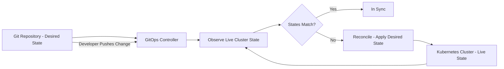
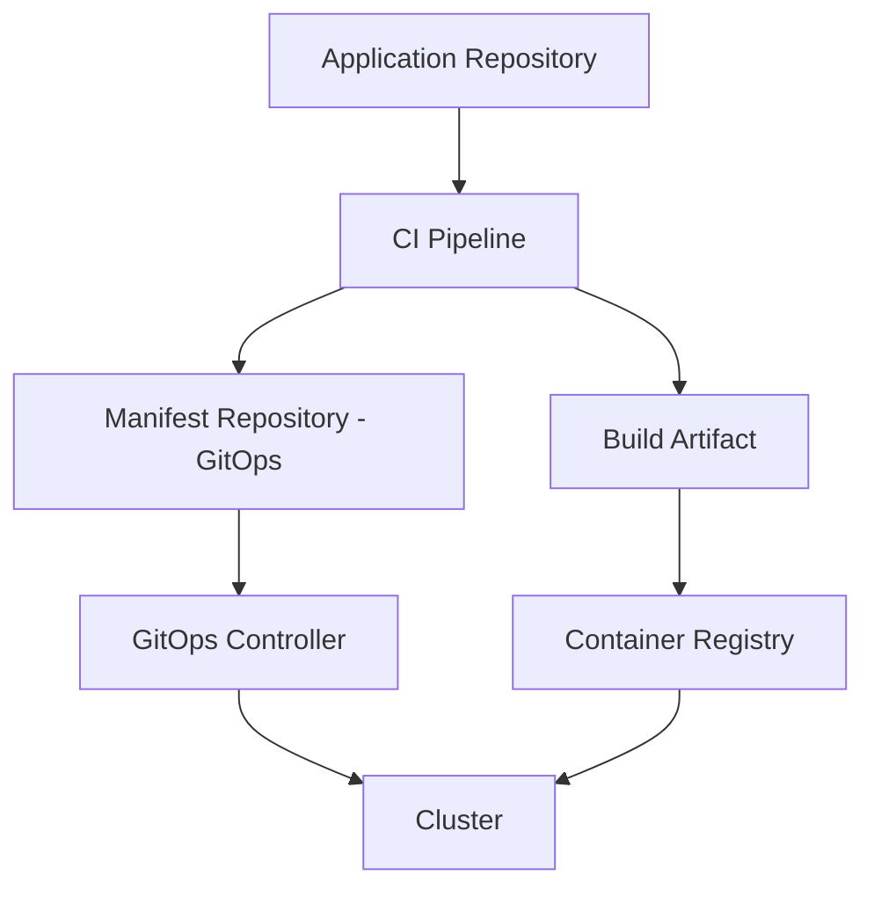
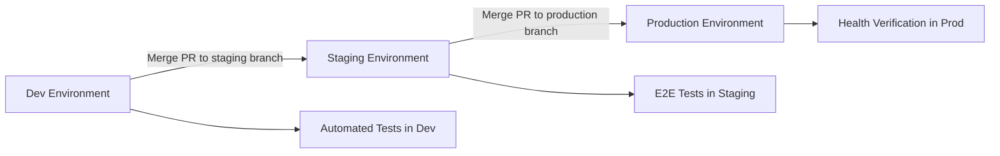
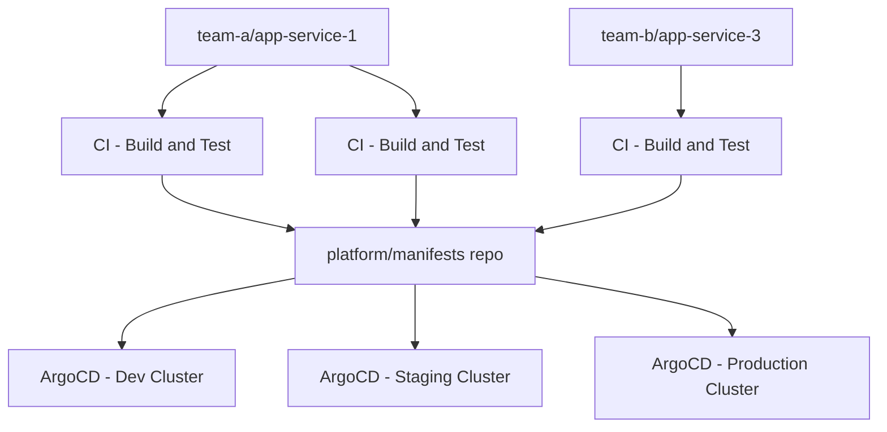

# GitOps

> **GitOps is an operational framework where Git is the single source of truth for declarative infrastructure and applications — a controller continuously reconciles the live state of the system to match what is declared in Git.**

## Why This Is a Specialist Skill

A basic GitOps setup pushes Helm charts to a repo and lets ArgoCD sync them. A **specialist** designs GitOps systems that:

- Manage hundreds of applications across dozens of clusters with consistent patterns
- Handle multi-tenancy — teams own their app repos while platform teams own cluster configuration
- Implement promotion flows — dev to staging to production — through Git-based triggers
- Secure the reconciliation loop — signed commits, sealed secrets, RBAC on Git paths
- Recover from drift, cluster failures, and Git history rewrites without losing state

## Core Concepts

### GitOps Reconciliation Loop

### Push vs. Pull Model

| Aspect | Push Model | Pull Model |
|--------|-----------|------------|
| **How it works** | CI pipeline pushes changes to the cluster | Controller inside the cluster pulls from Git |
| **Agent location** | Runs in CI system — external to cluster | Runs inside the cluster — ArgoCD or Flux |
| **Security** | CI needs cluster credentials | Cluster pulls — no external credentials needed |
| **Drift detection** | Only on next push | Continuous — detects drift immediately |
| **Failure mode** | If CI is down, no deployments | Controller keeps reconciling even if CI is down |
| **Examples** | kubectl apply in CI, Jenkins deploy step | ArgoCD, Flux CD |
| **Preferred for** | Simple setups, single cluster | Production, multi-cluster, security-sensitive |

**Specialists prefer the pull model** for production — it is more secure, more resilient, and provides continuous drift detection.

### ArgoCD vs. Flux

| Aspect | ArgoCD | Flux |
|--------|--------|------|
| **Architecture** | Centralized controller with UI | Modular — source, kustomize, helm, notification controllers |
| **UI** | Rich web UI with visual diff and sync controls | No built-in UI — CLI and Git-driven |
| **Multi-cluster** | ApplicationSet for templating across clusters | Native multi-tenancy with Kustomizations |
| **Helm support** | First-class — renders and applies Helm charts | Helm controller with HelmRelease CRD |
| **Image automation** | ArgoCD Image Updater — separate component | Built-in image-reflector and image-automation controllers |
| **Progressive delivery** | Argo Rollouts integration | Flagger integration |
| **Best for** | Teams that want visibility and manual override | Teams that want pure Git-driven automation |

### Repository Structure Patterns

**Two-repo pattern** — the specialist standard:

| Repository | Contents | Who Writes |
|-----------|----------|------------|
| **Application repo** | Source code, tests, Dockerfile | Developers |
| **Manifest repo** | Kubernetes manifests, Helm values, Kustomize overlays | CI pipeline — automated |

This separation ensures that developers own the code, but the deployment state is managed by automation — no human edits to manifests after CI produces them.

### GitOps Promotion Flow

### Security in GitOps

| Concern | Solution |
|---------|----------|
| **Secrets in Git** | Sealed Secrets, External Secrets Operator, SOPS with age/KMS |
| **Who can deploy what** | RBAC on Git paths — team A owns `/apps/team-a/` |
| **Unsigned commits** | Require signed commits, verify signatures in controller |
| **Image provenance** | Cosign verification in admission controller, Kyverno policies |
| **Cluster credentials** | Pull model eliminates external credential storage |

## Anti-Patterns

| Anti-Pattern | Why It Hurts | Better Approach |
|-------------|-------------|-----------------|
| **Manual edits to cluster** | Bypasses Git — creates untracked drift | Disable kubectl write access, enforce GitOps-only changes |
| **Single repo for everything** | Merge conflicts, slow syncs, no team isolation | Separate app repos and manifest repos per team or domain |
| **Auto-sync without guards** | Bad changes deploy immediately with no review | Require manual sync for production, auto-sync only for dev |
| **Storing secrets in Git plaintext** | Credential exposure, compliance violations | Sealed Secrets, External Secrets Operator, or Vault integration |
| **Ignoring sync failures** | Broken state accumulates, drift grows silently | Alert on sync failures, treat them as incidents |
| **GitOps for stateful workloads only** | Missing the benefits for config, policies, and CRDs | GitOps everything — RBAC, network policies, monitoring configs |
| **No promotion flow** | All environments read from the same Git path | Branch-based or directory-based promotion with PR gates |

## Practical Exercise

### Design a GitOps Platform for a Multi-Team Organization

**Scenario:** Your organization has 5 teams, each owning 2-3 microservices. You need to deploy across 3 environments — dev, staging, production — on separate Kubernetes clusters.

**Your task:**

1. **Design the repository structure** — How many repos? What goes in each?
2. **Choose a controller** — ArgoCD or Flux? Justify your choice for this organization
3. **Define the promotion flow** — How do changes move from dev to staging to production?
4. **Plan secret management** — How do teams use secrets without putting them in Git?
5. **Handle multi-tenancy** — How do you isolate team access while sharing cluster infrastructure?

**Repository structure sketch:**

**Reflection questions:**
- How do you prevent Team A from accidentally modifying Team B's manifests?
- What happens when the GitOps controller loses connectivity to Git?
- How do you handle a hotfix that needs to skip staging and go straight to production?

## Knowledge Connections

- [[software-engineering-note/02_Software_Architecture/Microservice/07 Deployment/074 GitOps and CI-CD Pipelines]] — GitOps and CI integration patterns
- [[03_Infrastructure_as_Code]] — GitOps requires declarative infrastructure as its foundation
- [[01_CI_CD_Pipelines]] — CI pipelines produce the manifests that GitOps controllers reconcile
- [[02_Progressive_Delivery]] — Argo Rollouts and Flagger integrate progressive delivery into GitOps flows
- [[05_Rollback_and_Recovery]] — Git revert is the primary rollback mechanism in GitOps

## Key Takeaways

- **Git is the source of truth** — not the cluster, not the CI pipeline, not a dashboard. If it is not in Git, it does not exist
- **Pull over push** — controllers inside the cluster pull from Git, eliminating external credential exposure and enabling continuous reconciliation
- **Two-repo pattern is the standard** — application code and deployment manifests live in separate repositories with automated promotion between them
- **Automate the promotion flow** — dev to staging to production should be a Git-driven process with PR gates, not manual kubectl commands
- **Secrets never touch Git** — use Sealed Secrets, External Secrets Operator, or Vault to inject secrets at runtime
- **Alert on sync failures** — a broken GitOps sync is an incident, not a warning. Treat it with the same urgency as a production alert
- **GitOps everything** — not just application deployments, but RBAC, network policies, monitoring configs, and CRDs should all be managed through Git
