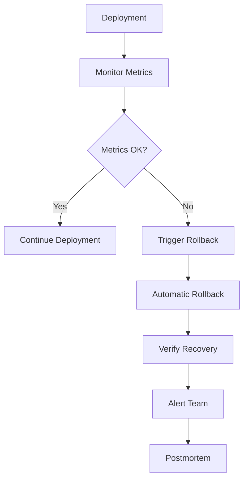
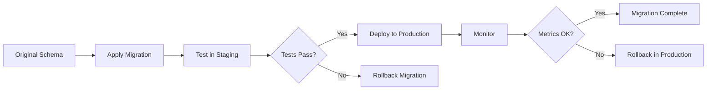
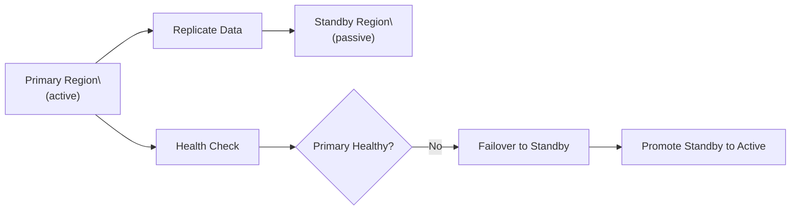
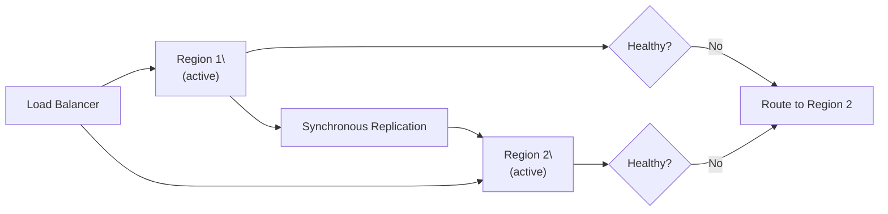
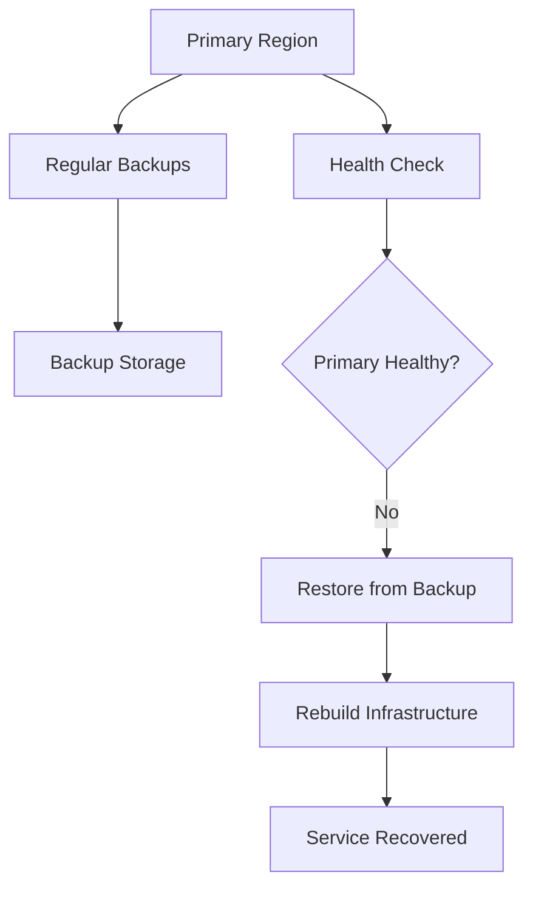

# Rollback and Recovery

> **One-line definition:** Implementing automated rollback strategies and disaster recovery procedures to minimize service disruption and data loss.

## Why This Is a Specialist Skill

A senior software engineer may manually roll back deployments. An SRE or platform engineer **designs automated rollback systems**, **defines RTO/RPO targets**, **implements database rollback strategies**, and **conducts disaster recovery drills** to ensure the organization can recover from failures.

The difference is not technical skill. It is **resilience engineering**: building systems that recover automatically from failures, minimizing mean time to recovery (MTTR).

## Automated Rollback

### Rollback triggers

| Trigger | Detection method | Action |
|---|---|---|
| **Error rate spike** | Monitoring alert: error rate > 5% | Automatic rollback |
| **Latency increase** | Monitoring alert: p99 latency > 1s | Automatic rollback |
| **Health check failure** | Kubernetes liveness probe fails | Automatic rollback |
| **Canary failure** | Canary analysis: metrics worse than baseline | Automatic rollback |
| **Manual trigger** | Engineer initiates rollback | Manual rollback |

### Rollback strategies

| Strategy | Description | Use when | Trade-offs |
|---|---|---|---|
| **Version rollback** | Deploy previous version | Code deployment failure | Fast; may lose data if schema changed |
| **Feature flag disable** | Turn off new feature | Feature-specific issues | Fastest; no deployment needed |
| **Blue-green switch** | Route traffic to old version | Blue-green deployment | Instant; requires double infrastructure |
| **Canary rollback** | Stop canary; route to stable | Canary deployment failure | Fast; minimal blast radius |
| **Database rollback** | Restore from backup or apply reverse migration | Schema migration failure | Slow; potential data loss |

### Automated rollback flow



### Implementation example: Kubernetes rollout

```yaml
apiVersion: argoproj.io/v1alpha1
kind: Rollout
metadata:
  name: my-service
spec:
  strategy:
    canary:
      steps:
        - setWeight: 10
        - pause: {duration: 5m}
        - setWeight: 50
        - pause: {duration: 5m}
        - setWeight: 100
      analysis:
        templates:
          - templateName: error-rate-check
        startingStep: 1
      abortScaleDownDelaySeconds: 300
```

## RTO and RPO Framework

### Definitions

| Metric | Definition | Example |
|---|---|---|
| **RTO (Recovery Time Objective)** | Maximum acceptable downtime | RTO = 1 hour (service must recover within 1 hour) |
| **RPO (Recovery Point Objective)** | Maximum acceptable data loss | RPO = 5 minutes (lose at most 5 minutes of data) |

### RTO/RPO tiers

| Tier | RTO | RPO | Use case | Cost |
|---|---|---|---|---|
| **Tier 1 (Mission Critical)** | < 15 minutes | < 1 minute | Payment processing, authentication | Very high |
| **Tier 2 (Business Critical)** | < 1 hour | < 5 minutes | Order processing, user management | High |
| **Tier 3 (Important)** | < 4 hours | < 15 minutes | Analytics, reporting | Medium |
| **Tier 4 (Standard)** | < 24 hours | < 1 hour | Internal tools, batch jobs | Low |

### RTO/RPO trade-offs

```mermaid
quadrantChart
    title RTO and RPO Trade-offs
    x-axis High Cost --> Low Cost
    y-axis Low RTO and RPO --> High RTO and RPO
    quadrant-1 Tier 1: Mission Critical
    quadrant-2 Tier 2: Business Critical
    quadrant-3 Tier 4: Standard
    quadrant-4 Tier 3: Important
    "Payment Service": [0.2, 0.1]
    "User Service": [0.3, 0.2]
    "Analytics": [0.6, 0.5]
    "Internal Tool": [0.8, 0.8]
```

**Key insight:** Lower RTO/RPO = higher cost. Choose tiers based on business impact, not technical preference.

## Database Rollback Strategies

### Schema migration rollback

| Strategy | Description | Use when | Risk |
|---|---|---|---|
| **Reverse migration** | Apply rollback script (e.g., `DROP COLUMN`) | Simple schema changes | Data loss if column dropped |
| **Backup restore** | Restore database from backup | Complex changes; data corruption | Data loss since backup |
| **Point-in-time recovery** | Restore to specific timestamp | Accidental data deletion | Data loss since timestamp |
| **Blue-green database** | Switch to old database | Zero-downtime rollback | Double infrastructure cost |

### Data migration rollback



### Example: safe column rename

**Unsafe approach:**
```sql
-- Direct rename (breaks application)
ALTER TABLE users RENAME COLUMN email TO email_address;
```

**Safe approach:**
```sql
-- Step 1: Add new column
ALTER TABLE users ADD COLUMN email_address VARCHAR(255);

-- Step 2: Copy data
UPDATE users SET email_address = email;

-- Step 3: Deploy application that writes to both columns
-- (dual-write period)

-- Step 4: Deploy application that reads from new column
-- (read migration)

-- Step 5: Drop old column (after verification)
ALTER TABLE users DROP COLUMN email;
```

## Disaster Recovery Architectures

### Active-passive (warm standby)



**Characteristics:**
- RTO: 15-60 minutes (manual or automated failover)
- RPO: 1-5 minutes (asynchronous replication lag)
- Cost: Medium (standby infrastructure, but scaled down)

### Active-active (multi-region)



**Characteristics:**
- RTO: < 1 minute (automatic failover)
- RPO: 0 (synchronous replication; no data loss)
- Cost: High (double infrastructure; synchronous replication latency)

### Backup and restore (cold standby)



**Characteristics:**
- RTO: 4-24 hours (restore and rebuild)
- RPO: 1-24 hours (backup frequency)
- Cost: Low (only backup storage)

## Disaster Recovery Drills

### Drill frequency

| Tier | Drill frequency | Scope |
|---|---|---|
| **Tier 1 (Mission Critical)** | Quarterly | Full failover; production-like |
| **Tier 2 (Business Critical)** | Semi-annually | Partial failover; staging |
| **Tier 3 (Important)** | Annually | Tabletop exercise |
| **Tier 4 (Standard)** | As needed | Ad-hoc testing |

### Drill checklist

**Before the drill:**
- [ ] Define success criteria (RTO met, RPO met, no data loss)
- [ ] Notify stakeholders (engineering, product, executives)
- [ ] Prepare rollback plan (how to recover if drill fails)
- [ ] Assign roles (drill coordinator, observers, scribes)

**During the drill:**
- [ ] Inject failure (stop primary region, corrupt data)
- [ ] Initiate failover (manual or automated)
- [ ] Verify recovery (service healthy, data intact)
- [ ] Measure RTO and RPO (actual vs target)
- [ ] Document gaps and issues

**After the drill:**
- [ ] Conduct retrospective (what worked, what didn't)
- [ ] Define action items (fix gaps, improve automation)
- [ ] Update runbooks (document lessons learned)
- [ ] Track action items (assign owners, due dates)

### Example drill report

```markdown
## Disaster Recovery Drill Report

**Date:** 2026-08-05
**Service:** Payment Processing (Tier 1)
**Scenario:** Primary region failure

### Results
| Metric | Target | Actual | Status |
|---|---|---|---|
| RTO | < 15 minutes | 12 minutes | ✅ Pass |
| RPO | < 1 minute | 30 seconds | ✅ Pass |
| Data integrity | No data loss | No data loss | ✅ Pass |

### What Worked Well
- Automated failover triggered within 2 minutes
- Standby region scaled up as expected
- No data loss (synchronous replication)

### Gaps Identified
- DNS propagation took 5 minutes (expected 2 minutes)
- Monitoring alerts delayed by 3 minutes
- Runbook outdated (missing new service dependency)

### Action Items
| Action | Owner | Priority | Due Date |
|---|---|---|---|
| Reduce DNS TTL from 300s to 60s | @alice | P1 | 2026-09-01 |
| Fix monitoring alert delay | @bob | P2 | 2026-09-15 |
| Update runbook with new dependency | @carol | P3 | 2026-10-01 |
```

## Rollback and Recovery Anti-Patterns

| Anti-pattern | Problem | What to do instead |
|---|---|---|
| **No automated rollback** | Manual rollback is slow and error-prone | Implement automatic rollback on deployment failure |
| **No rollback tested** | Don't know if rollback works | Test rollback in staging; conduct DR drills |
| **No RTO/RPO defined** | Unclear recovery expectations | Define RTO/RPO tiers based on business impact |
| **Backup not tested** | Don't know if backup can be restored | Test backup restore quarterly |
| **No database rollback strategy** | Schema migration failure causes downtime | Use safe migration patterns (expand-contract) |
| **DR drill never conducted** | Don't know if DR plan works | Conduct quarterly DR drills for Tier 1 services |
| **Runbook outdated** | Team follows incorrect procedures | Update runbooks after every drill and incident |

## Practical Exercise

**For a critical service:**

1. **Define RTO/RPO:**
   - What is the business impact of downtime?
   - What RTO and RPO are acceptable?
   - What tier does this service belong to?

2. **Review rollback strategy:**
   - Is automated rollback configured?
   - What triggers rollback (error rate, latency, health check)?
   - How long does rollback take?

3. **Test rollback:**
   - Deploy to staging
   - Inject failure (break health check)
   - Verify automatic rollback
   - Measure time to recovery

4. **Plan a DR drill:**
   - Define success criteria (RTO, RPO, data integrity)
   - Prepare failover procedure
   - Schedule drill with team
   - Conduct drill and document results

**Bonus:** Review a database migration that failed. What rollback strategy was used? What would you do differently?

## Knowledge Connections

- [[01_CI_CD_Pipelines]] : rollback is part of the deployment pipeline
- [[02_Progressive_Delivery]] : progressive delivery reduces rollback blast radius
- [[04_GitOps]] : GitOps enables instant rollback via Git revert
- [[05_Capacity_and_Resilience/03_Disaster_Recovery]] : disaster recovery architectures
- [[03_Incident_Response/02_Incident_Management]] : rollback is an incident response action
- [[software-engineering-note/06_Software_Engineering_Operations/07_Capacity_and_Disaster_Recovery]] : disaster recovery foundations

## Key Takeaways

- Implement automated rollback triggered by error rate, latency, or health check failures
- Define RTO/RPO tiers based on business impact: Tier 1 (< 15 min RTO, < 1 min RPO) to Tier 4 (< 24 hr RTO, < 1 hr RPO)
- Use safe database migration patterns (expand-contract) to enable rollback without data loss
- Choose disaster recovery architecture based on RTO/RPO: active-active (fastest) to backup-restore (slowest)
- Conduct quarterly disaster recovery drills for Tier 1 services; document gaps and action items
- Test rollback in staging before relying on it in production
- Update runbooks after every drill and incident