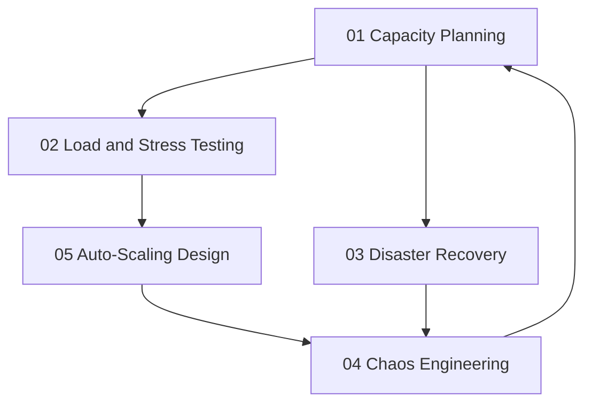

# Capacity and Resilience

> **Core idea:** Ensuring systems can handle current and future load, survive component failures, and recover from disasters — through proactive planning, testing, and automation rather than reactive heroics.

## What Capacity and Resilience Mean at Specialist Level

A senior software engineer may optimize a single service for performance. An SRE or platform engineer **designs capacity and resilience strategies across the entire organization**, balancing reliability, cost, and growth.

Capacity and resilience are not optional add-ons — they are engineering disciplines that prevent outages, reduce incident severity, and ensure business continuity. Without them, systems fail under load, recover slowly from disasters, and scale unpredictably.

## Topic Notes

| # | Topic | Focus | Status | File |
|---|---|---|---|---|
| 01 | Capacity Planning | Forecasting demand and planning resources | ✅ Done | `01_Capacity_Planning.md` |
| 02 | Load and Stress Testing | Performance testing and bottleneck identification | ✅ Done | `02_Load_and_Stress_Testing.md` |
| 03 | Disaster Recovery | Backup strategies and recovery procedures | ✅ Done | `03_Disaster_Recovery.md` |
| 04 | Chaos Engineering | Fault injection and resilience testing | ✅ Done | `04_Chaos_Engineering.md` |
| 05 | Auto-Scaling Design | Scaling policies and cost optimization | ✅ Done | `05_Auto_Scaling_Design.md` |

**Completion:** 5/5 : 100%

## How the Topics Connect

**Reading order:** Start with Capacity Planning to understand demand forecasting and resource allocation. Load and Stress Testing validates capacity assumptions. Auto-Scaling Design automates responses to load changes. Disaster Recovery prepares for catastrophic failures. Chaos Engineering tests the entire system under realistic failure conditions, feeding insights back into capacity planning.

## Existing Vault Anchors

These topic notes **do not duplicate** the existing knowledge base. They layer specialist-level application on top of it:

| Specialist topic | Existing foundation notes |
|---|---|
| Capacity Planning | [[software-engineering-note/06_Software_Engineering_Operations/07_Capacity_and_Disaster_Recovery]] |
| Load and Stress Testing | [[software-engineering-note/06_Software_Engineering_Operations/07_Capacity_and_Disaster_Recovery]] |
| Disaster Recovery | [[software-engineering-note/06_Software_Engineering_Operations/07_Capacity_and_Disaster_Recovery]] |
| Chaos Engineering | [[career-path/02_Senior_Software_Engineer/05_Quality_Reliability_Security/07_Chaos_Engineering]] |
| Auto-Scaling Design | [[software-engineering-note/02_Software_Architecture/Microservice/07 Deployment/071 Containers & Orchestration]] |

## Self-Assessment Checklist

Use this to gauge your current mastery of capacity and resilience:

- [ ] I have a capacity plan with growth forecasts for every critical service
- [ ] I run load tests regularly and track performance trends over time
- [ ] I have documented RTO and RPO targets for disaster recovery
- [ ] I have conducted at least one chaos engineering experiment in production
- [ ] I can explain the trade-offs between horizontal and vertical scaling
- [ ] I have auto-scaling policies that respond to real workload signals
- [ ] I balance reliability targets against infrastructure cost

## Related

- [[00_overview|SRE and Platform Engineer Overview]]
- [[01_Service_Objectives/00_overview|Service Objectives]] : SLOs define the reliability targets that capacity must support
- [[02_Observability/00_overview|Observability]] : metrics feed capacity forecasts and scaling decisions
- [[career-path/02_Senior_Software_Engineer/05_Quality_Reliability_Security/02_SRE_Principles|SRE Principles]] : SRE foundations from the Senior SWE path
