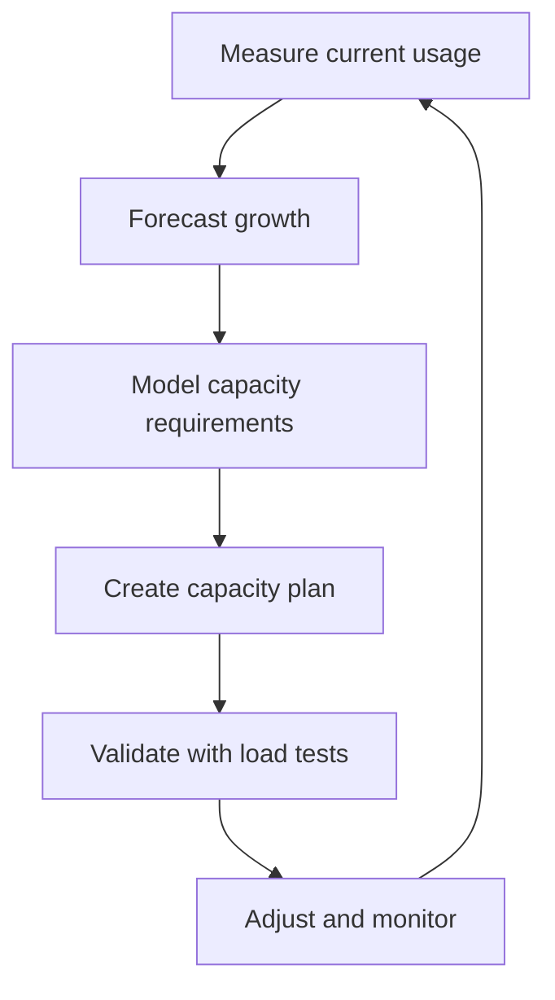

# Capacity Planning

> **One-line definition:** Forecasting future demand and planning resources to meet service objectives without over-provisioning or under-provisioning.

## Why This Is a Specialist Skill

A senior software engineer may size resources for a single service. An SRE or platform engineer **builds capacity planning processes across the organization**, **forecasts growth using data**, and **balances reliability targets against infrastructure cost**.

The difference is not technical complexity. It is **planning discipline**: turning reactive resource allocation into proactive capacity management.

## Capacity Planning Framework

## Capacity Planning Dimensions

| Dimension | What to measure | Forecasting approach | Planning horizon |
|---|---|---|---|
| **Traffic** | Requests per second, concurrent users | Trend analysis, seasonality | 6-12 months |
| **Data** | Storage size, database growth | Linear extrapolation, retention policy | 12-24 months |
| **Compute** | CPU, memory, GPU utilization | Usage patterns, workload profiling | 3-6 months |
| **Network** | Bandwidth, latency, packet loss | Traffic growth, new endpoints | 6-12 months |
| **Dependencies** | Third-party API limits, rate quotas | Contract review, usage tracking | 12-24 months |

## Forecasting Methods

| Method | When to use | Pros | Cons |
|---|---|---|---|
| **Linear extrapolation** | Steady growth, no major changes | Simple, transparent | Misses inflection points |
| **Trend analysis** | Historical data available | Captures patterns | Assumes past predicts future |
| **Scenario planning** | Uncertain future, multiple possibilities | Explores options | Can be speculative |
| **Workload modeling** | New services, major changes | Based on requirements | Requires accurate assumptions |
| **Industry benchmarks** | Lack internal data | External reference | May not fit your context |

## Capacity Planning Process

1. **Measure current state:** What are you using today? (CPU, memory, storage, network, API calls)
2. **Identify growth drivers:** What causes usage to increase? (users, features, data retention, traffic spikes)
3. **Collect historical data:** How has usage grown over the past 6-12 months?
4. **Choose forecasting method:** Linear, trend, scenario, or workload model?
5. **Calculate capacity needs:** What resources do you need to meet SLOs at forecasted load?
6. **Add headroom:** Plan for 20-40% buffer above forecast (depending on growth uncertainty)
7. **Create procurement plan:** When do you need to add capacity? (lead times for hardware, contracts)
8. **Monitor and adjust:** Track actual vs. forecast, refine models

## Capacity Planning Anti-Patterns

| Anti-pattern | Problem | What to do instead |
|---|---|---|
| **Reactive provisioning** | Outages from unexpected load | Plan ahead with forecasts |
| **Over-provisioning** | Wasted cost, unused resources | Use data-driven forecasts |
| **No headroom** | No buffer for spikes or forecast errors | Add 20-40% buffer |
| **Ignoring seasonality** | Under-provisioned during peaks | Model seasonal patterns |
| **Single-point forecasting** | One person's guess, no validation | Use multiple methods, review with team |
| **No monitoring** | Can't tell if forecast was accurate | Track actual vs. forecast |

## Practical Exercise

**For a service you own:**

1. **Measure current usage:** Collect the last 3 months of data for:
   - Requests per second (average and peak)
   - CPU and memory utilization
   - Storage growth rate
   - Database size and query volume

2. **Identify growth drivers:** What causes usage to increase?
   - User growth rate
   - Feature additions
   - Data retention policy changes

3. **Forecast 6-month demand:**
   - Use linear extrapolation from historical data
   - Apply trend analysis if patterns exist
   - Consider known future changes (new features, marketing campaigns)

4. **Calculate capacity needs:**
   - What resources do you need at forecasted load?
   - What headroom should you add?

5. **Create a capacity plan document:**
   - Current state
   - Growth forecast
   - Required capacity
   - Procurement timeline
   - Monitoring plan

**Bonus:** Compare your forecast to actual usage after 3 months. How accurate was it?

## Knowledge Connections

- [[02_Load_and_Stress_Testing]] : validates capacity assumptions
- [[05_Auto_Scaling_Design]] : automates capacity adjustments
- [[01_Service_Objectives/02_SLO_Definition]] : SLOs define the reliability targets capacity must support
- [[software-engineering-note/06_Software_Engineering_Operations/07_Capacity_and_Disaster_Recovery]] : capacity and DR foundations
- [[career-path/02_Senior_Software_Engineer/05_Quality_Reliability_Security/02_SRE_Principles]] : SRE principles from Senior SWE path

## Key Takeaways

- Capacity planning turns reactive provisioning into proactive management
- Measure current usage, identify growth drivers, forecast demand, add headroom
- Use multiple forecasting methods and validate with load tests
- Plan 20-40% headroom above forecast to handle spikes and forecast errors
- Track actual vs. forecast to improve models over time
- Capacity plans should cover traffic, data, compute, network, and dependencies
