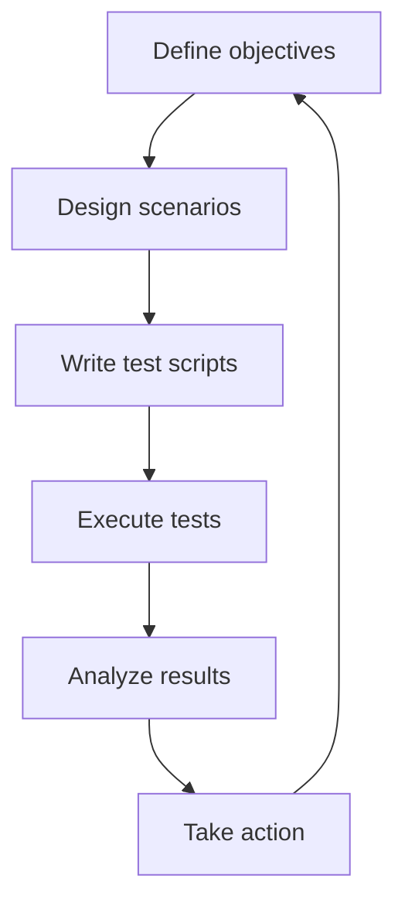

# Load and Stress Testing

> **One-line definition:** Validating system behavior under expected and extreme load to identify bottlenecks, validate capacity plans, and ensure SLOs are met.

## Why This Is a Specialist Skill

A senior software engineer may run basic performance tests. An SRE or platform engineer **designs comprehensive load testing strategies**, **simulates realistic production traffic**, and **uses results to drive capacity and architecture decisions**.

The difference is not tool knowledge. It is **testing discipline**: turning ad-hoc performance checks into systematic validation of system behavior.

## Load Testing Types

| Test type | Purpose | Load pattern | What it reveals |
|---|---|---|---|
| **Load testing** | Validate behavior at expected load | Steady-state at target capacity | Baseline performance, SLO compliance |
| **Stress testing** | Find breaking point | Gradually increase beyond capacity | Failure modes, resource limits |
| **Soak testing** | Detect degradation over time | Sustained load for hours/days | Memory leaks, connection exhaustion |
| **Spike testing** | Test response to sudden load | Rapid increase then decrease | Auto-scaling, cache warming |
| **Chaos testing** | Test resilience to failures | Inject failures under load | Fault tolerance, recovery behavior |

## Load Testing Framework

## Load Testing Process

1. **Define objectives:** What are you testing? (SLO compliance, capacity validation, bottleneck discovery)
2. **Design scenarios:** What user journeys will you simulate? (login, search, purchase, API calls)
3. **Determine load profile:** What traffic pattern? (steady, ramp-up, spike, sustained)
4. **Set success criteria:** What metrics must be met? (p99 latency < 200ms, error rate < 0.1%)
5. **Prepare test environment:** Is it production-like? (same infrastructure, same data volume)
6. **Write test scripts:** Realistic user behavior, think times, variable data
7. **Execute tests:** Start small, increase gradually, monitor system health
8. **Analyze results:** Compare to success criteria, identify bottlenecks
9. **Take action:** Fix issues, adjust capacity, refine architecture

## Load Generation Tools

| Tool | Strengths | Use case |
|---|---|---|
| **k6** | JavaScript scripting, distributed execution | API load testing, CI/CD integration |
| **Locust** | Python-based, scalable workers | Custom scenarios, complex user flows |
| **JMeter** | GUI-based, protocol support | Legacy systems, protocol diversity |
| **Gatling** | Scala DSL, performance | High-throughput scenarios |
| **Artillery** | YAML config, WebSocket support | Real-time applications |
| **Vegeta** | Go-based, constant rate | HTTP load testing, simple scenarios |

## Bottleneck Identification

| Bottleneck type | Symptoms | Investigation approach |
|---|---|---|
| **CPU** | High CPU utilization, slow response | Profiling, flame graphs |
| **Memory** | OOM kills, GC pauses, swapping | Heap dumps, memory profiling |
| **Database** | Slow queries, connection pool exhaustion | Query logs, connection metrics |
| **Network** | High latency, packet loss, bandwidth saturation | Network metrics, packet captures |
| **I/O** | Disk saturation, slow reads/writes | I/O metrics, storage profiling |
| **Dependencies** | Third-party API timeouts, rate limits | Dependency metrics, circuit breakers |

## Load Testing Anti-Patterns

| Anti-pattern | Problem | What to do instead |
|---|---|---|
| **Testing in dev environment** | Results don't reflect production | Use production-like environment |
| **Unrealistic scenarios** | Tests don't match real usage | Model actual user journeys |
| **No success criteria** | Can't tell if test passed | Define SLO-based criteria upfront |
| **One-time testing** | System changes, tests become stale | Run regularly in CI/CD |
| **Ignoring think time** | Unrealistic request rates | Add realistic user think times |
| **Testing only happy path** | Misses error handling bottlenecks | Include error scenarios |

## Practical Exercise

**For a service you own:**

1. **Define test objectives:**
   - Validate SLO compliance at 2x current load
   - Identify bottlenecks before they cause outages
   - Measure auto-scaling response time

2. **Design 3 test scenarios:**
   - Steady-state at target capacity (load test)
   - Gradual ramp to breaking point (stress test)
   - Sudden spike to 5x normal (spike test)

3. **Choose a tool** (k6, Locust, or your preferred tool)

4. **Write test scripts:**
   - Model realistic user journeys
   - Add think times between requests
   - Use variable data to avoid caching effects

5. **Execute tests:**
   - Start with 10% of target load
   - Gradually increase to full load
   - Monitor system metrics during test

6. **Analyze results:**
   - Did you meet SLOs?
   - Where were the bottlenecks?
   - How did auto-scaling respond?

7. **Document findings:**
   - Test results vs. success criteria
   - Bottlenecks discovered
   - Recommended actions

**Bonus:** Add load tests to your CI/CD pipeline and run them on every deployment.

## Knowledge Connections

- [[01_Capacity_Planning]] : load tests validate capacity forecasts
- [[05_Auto_Scaling_Design]] : tests validate scaling policies
- [[04_Chaos_Engineering]] : chaos tests build on load testing foundations
- [[02_Observability/01_Metrics_and_Dashboards]] : metrics are essential for analyzing test results
- [[software-engineering-note/06_Software_Engineering_Operations/07_Capacity_and_Disaster_Recovery]] : capacity and DR foundations

## Key Takeaways

- Load testing validates capacity plans and SLO compliance
- Use multiple test types: load, stress, soak, spike, chaos
- Define success criteria upfront based on SLOs
- Test in production-like environments with realistic scenarios
- Analyze results to identify bottlenecks and drive improvements
- Run load tests regularly, not just once before launch
