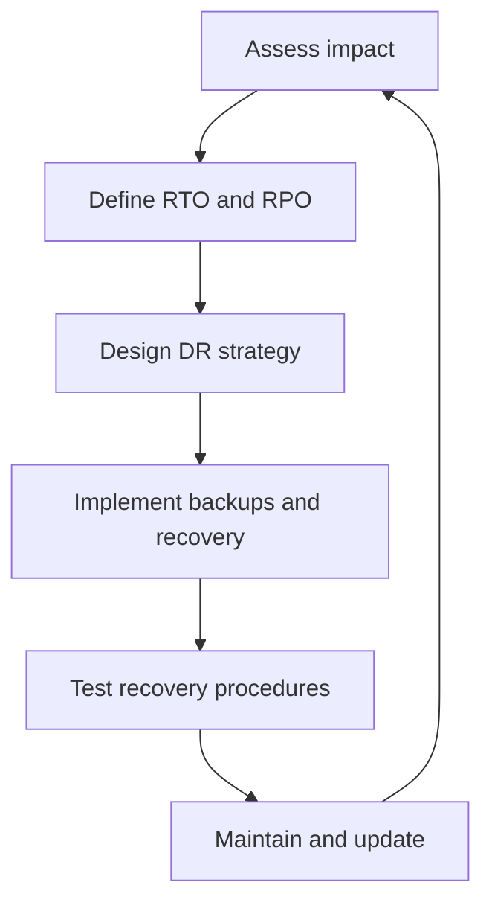
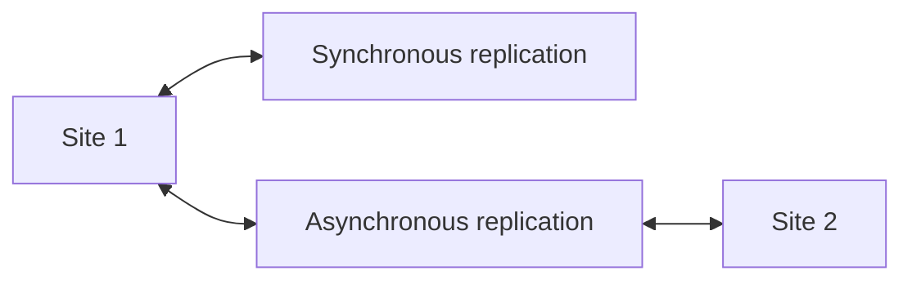
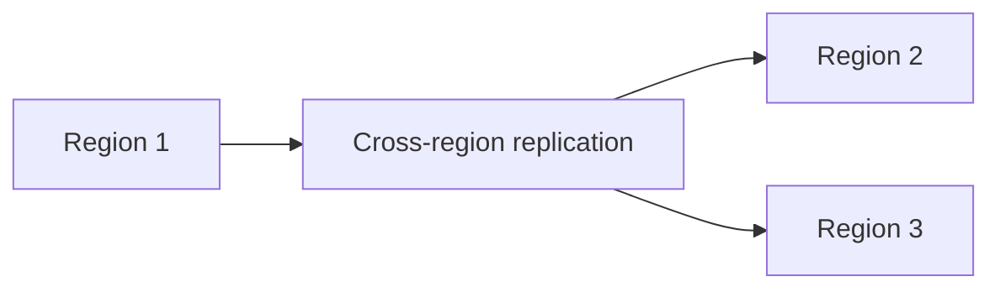

# Disaster Recovery

> **One-line definition:** Designing backup strategies and recovery procedures to restore service after catastrophic failures within defined RTO and RPO targets.

## Why This Is a Specialist Skill

A senior software engineer may implement basic backups. An SRE or platform engineer **designs disaster recovery strategies across the organization**, **defines RTO and RPO targets**, and **validates recovery procedures through regular exercises**.

The difference is not technical knowledge. It is **recovery discipline**: turning ad-hoc backups into tested, reliable disaster recovery procedures.

## Disaster Recovery Planning Framework

## RTO and RPO Definitions

| Metric | Definition | Example | Impact on design |
|---|---|---|---|
| **RTO** &#40;Recovery Time Objective&#41; | Maximum acceptable downtime | "Service must be restored within 4 hours" | Drives recovery procedure design |
| **RPO** &#40;Recovery Point Objective&#41; | Maximum acceptable data loss | "No more than 15 minutes of data loss" | Drives backup frequency and replication |

## Backup Strategies

| Strategy | RPO | Cost | Complexity | Use case |
|---|---|---|---|---|
| **Full backup** | Hours | High | Low | Small datasets, infrequent changes |
| **Incremental backup** | Hours | Medium | Medium | Large datasets, moderate changes |
| **Continuous replication** | Seconds | High | High | Critical data, low RPO |
| **Point-in-time recovery** | Minutes | High | High | Databases, transactional systems |
| **Snapshot-based** | Minutes | Medium | Medium | VMs, storage volumes |
| **Log shipping** | Minutes | Medium | Medium | Databases, audit trails |

## Disaster Recovery Architectures

### Active-Passive

- **Pros:** Lower cost, simpler
- **Cons:** Longer RTO, cold start issues
- **Use when:** RTO > 1 hour, cost-sensitive

### Active-Active

- **Pros:** Shorter RTO, load distribution
- **Cons:** Higher cost, complexity
- **Use when:** RTO < 15 minutes, high availability required

### Multi-Region

- **Pros:** Geographic redundancy, disaster isolation
- **Cons:** Highest cost, data consistency challenges
- **Use when:** RTO < 5 minutes, regulatory requirements

## Disaster Recovery Process

1. **Assess business impact:** What is the cost of downtime? What data is critical?
2. **Define RTO and RPO:** Work with stakeholders to set targets
3. **Design DR strategy:** Choose backup method, replication, failover approach
4. **Implement backups:** Automated, tested, monitored
5. **Document recovery procedures:** Step-by-step, tested, accessible
6. **Test regularly:** Tabletop exercises, partial failovers, full DR drills
7. **Maintain and update:** Review after incidents, update as systems change

## Recovery Procedure Components

| Component | Purpose | Example |
|---|---|---|
| **Detection** | Identify disaster occurred | Monitoring alerts, health checks |
| **Decision** | Decide to invoke DR | Runbook criteria, escalation path |
| **Communication** | Notify stakeholders | Status page, incident channel |
| **Failover** | Switch to DR site | DNS update, load balancer change |
| **Validation** | Confirm service restored | Smoke tests, SLO checks |
| **Failback** | Return to primary site | Planned maintenance window |

## Disaster Recovery Anti-Patterns

| Anti-pattern | Problem | What to do instead |
|---|---|---|
| **Untested backups** | Discover backup failures during disaster | Test restore procedures regularly |
| **No DR plan** | Chaos during disaster, longer RTO | Document and test recovery procedures |
| **RTO/RPO mismatch** | DR design doesn't meet business needs | Align DR strategy with RTO/RPO targets |
| **Single point of failure** | DR site fails too | Use multi-region, avoid shared dependencies |
| **Manual failover** | Slow, error-prone recovery | Automate failover where possible |
| **No DR exercises** | Procedures become stale | Conduct quarterly DR drills |

## Practical Exercise

**For a critical service you own:**

1. **Assess impact:**
   - What is the cost per hour of downtime?
   - What data would be lost if the primary site failed?
   - What is the business impact of extended outage?

2. **Define RTO and RPO:**
   - Work with stakeholders to set targets
   - Document in service catalog

3. **Audit current DR:**
   - What backups exist?
   - How often are they taken?
   - When were they last tested?
   - What is the actual RTO and RPO?

4. **Design DR improvements:**
   - What changes would meet RTO/RPO targets?
   - What is the cost?
   - What is the implementation timeline?

5. **Write a recovery runbook:**
   - Step-by-step recovery procedure
   - Decision criteria for invoking DR
   - Communication plan
   - Validation steps

6. **Conduct a tabletop exercise:**
   - Walk through a disaster scenario
   - Identify gaps in procedures
   - Update runbook based on findings

**Bonus:** Conduct a full DR drill with actual failover and measure actual RTO.

## Knowledge Connections

- [[01_Capacity_Planning]] : DR requires capacity planning for standby sites
- [[04_Chaos_Engineering]] : chaos tests validate DR procedures
- [[03_Incident_Response/00_overview]] : incident response coordinates with DR
- [[01_Service_Objectives/02_SLO_Definition]] : SLOs influence RTO/RPO targets
- [[software-engineering-note/06_Software_Engineering_Operations/07_Capacity_and_Disaster_Recovery]] : capacity and DR foundations

## Key Takeaways

- Define RTO and RPO before designing disaster recovery
- Choose backup strategy based on RPO and cost constraints
- Test backups and recovery procedures regularly, not just once
- Document step-by-step recovery runbooks and keep them accessible
- Conduct DR exercises quarterly to validate procedures
- Align DR architecture with business impact and SLO targets
