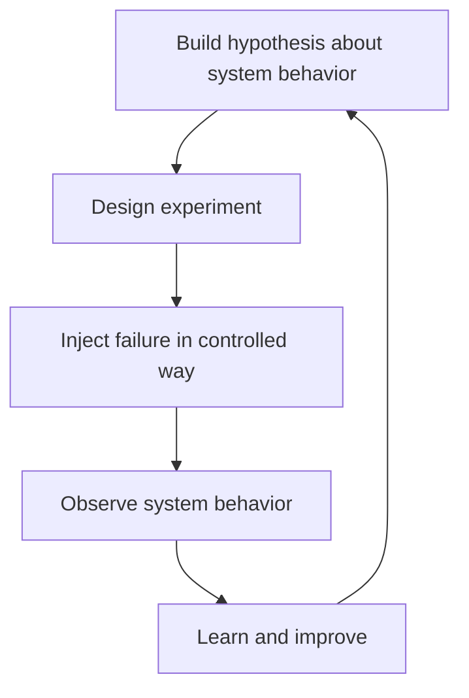

# Chaos Engineering

> **One-line definition:** Proactively injecting failures into production systems to validate resilience, discover weaknesses, and build confidence in system behavior under adverse conditions.

## Why This Is a Specialist Skill

A senior software engineer may understand chaos engineering concepts. An SRE or platform engineer **designs and executes chaos experiments in production**, **builds organizational confidence in system resilience**, and **turns failure injection into a continuous improvement practice**.

The difference is not tool knowledge. It is **experimentation discipline**: turning theoretical resilience into validated, production-proven behavior.

## Chaos Engineering Principles

| Principle | Description | Example |
|---|---|---|
| **Build hypothesis** | Predict how system should behave | "If we kill one database replica, read latency should increase by less than 10%" |
| **Start small** | Begin with low-risk experiments | Kill a single pod, not an entire cluster |
| **Automate** | Make experiments repeatable | Script experiments, run in CI/CD |
| **Minimize blast radius** | Limit impact on users | Run during low-traffic periods, have abort button |
| **Learn from failures** | Every experiment teaches something | Document findings, share with team |

## Chaos Experiment Types

| Experiment type | What to inject | What it tests |
|---|---|---|
| **Infrastructure failure** | Kill VMs, pods, containers | Auto-scaling, failover, redundancy |
| **Network issues** | Latency, packet loss, DNS failure | Timeouts, retries, circuit breakers |
| **Dependency failure** | Kill downstream services | Fallbacks, graceful degradation |
| **Resource exhaustion** | CPU, memory, disk pressure | Resource limits, OOM handling |
| **Data corruption** | Corrupt database, invalid config | Data validation, rollback procedures |
| **Clock skew** | Change system time | Time-based logic, certificate expiry |
| **Security events** | Revoke credentials, block IPs | Authentication fallbacks, incident response |

## Chaos Engineering Maturity

| Maturity level | Approach | Frequency | Scope |
|---|---|---|---|
| **GameDay** | Manual, scheduled events | Quarterly | Single team, controlled environment |
| **Automated** | Scripted experiments | Monthly | Multiple teams, production-like |
| **Continuous** | Always-on chaos platform | Weekly | Organization-wide, production |
| **Chaos as a service** | Self-service chaos tools | Daily | Any team, any environment |

## Chaos Engineering Process

1. **Identify critical services:** What systems are most important? What failures would be most impactful?
2. **Build hypothesis:** How should the system behave under failure? What SLOs should be maintained?
3. **Design experiment:** What failure to inject? What metrics to observe? What is the abort criteria?
4. **Minimize blast radius:** How to limit impact on users? When to run the experiment?
5. **Execute experiment:** Inject failure, observe behavior, collect metrics
6. **Analyze results:** Did the system behave as expected? What broke? What worked well?
7. **Improve system:** Fix weaknesses, update runbooks, share learnings
8. **Repeat:** Run experiment again to validate fixes, try new scenarios

## Chaos Engineering Tools

| Tool | Strengths | Use case |
|---|---|---|
| **Chaos Monkey** | Simple, proven | VM and container termination |
| **Litmus** | Kubernetes-native, CNCF project | Kubernetes chaos experiments |
| **Gremlin** | Commercial, comprehensive | Enterprise chaos engineering |
| **Chaos Mesh** | Kubernetes-native, visual | Complex Kubernetes scenarios |
| **Failure Flags** | Application-level faults | Code-level chaos, feature flags |
| **Steadybit** | Developer-friendly, SaaS | Teams new to chaos engineering |

## GameDay Planning

| Component | Purpose | Example |
|---|---|---|
| **Scenario** | What failure to simulate | "Primary database fails, read replica promoted" |
| **Participants** | Who needs to be involved | SRE team, database team, on-call engineers |
| **Environment** | Where to run the experiment | Staging environment, production with safeguards |
| **Metrics** | What to observe | Latency, error rate, recovery time |
| **Abort criteria** | When to stop the experiment | Error rate > 5%, latency > 2 seconds |
| **Communication** | How to keep stakeholders informed | Incident channel, status updates |
| **Retrospective** | How to capture learnings | Post-GameDay review, action items |

## Chaos Engineering Anti-Patterns

| Anti-pattern | Problem | What to do instead |
|---|---|---|
| **Chaos without hypothesis** | Random failure injection, no learning | Start with clear hypothesis |
| **Too much chaos** | Overwhelming system, no time to fix | Start small, increase gradually |
| **No abort button** | Experiment causes real outage | Always have way to stop experiment |
| **Chaos in isolation** | One team experiments, others unaware | Coordinate with all stakeholders |
| **No follow-up** | Experiment reveals issue, nothing fixed | Track findings, implement fixes |
| **Chaos as punishment** | Using chaos to blame teams | Frame as learning opportunity |

## Practical Exercise

**For a critical service you own:**

1. **Identify 3 failure scenarios:**
   - What failures would be most impactful?
   - What are you most uncertain about?

2. **For each scenario, build a hypothesis:**
   - How should the system behave?
   - What SLOs should be maintained?
   - What metrics will you observe?

3. **Design your first experiment:**
   - Choose the lowest-risk scenario
   - Define abort criteria
   - Plan communication with stakeholders

4. **Execute the experiment:**
   - Start in staging if possible
   - Monitor metrics closely
   - Be ready to abort if needed

5. **Analyze results:**
   - Did the system behave as expected?
   - What broke? What worked well?
   - What did you learn?

6. **Improve the system:**
   - Fix weaknesses discovered
   - Update runbooks
   - Share learnings with team

7. **Plan your next experiment:**
   - Build on what you learned
   - Increase scope or complexity

**Bonus:** Conduct a GameDay with multiple teams and multiple failure scenarios.

## Knowledge Connections

- [[03_Disaster_Recovery]] : chaos tests validate DR procedures
- [[02_Load_and_Stress_Testing]] : load tests provide baseline for chaos experiments
- [[03_Incident_Response/00_overview]] : incident response coordinates with chaos experiments
- [[01_Service_Objectives/02_SLO_Definition]] : SLOs define success criteria for chaos experiments
- [[career-path/02_Senior_Software_Engineer/05_Quality_Reliability_Security/07_Chaos_Engineering]] : chaos engineering foundations from Senior SWE path

## Key Takeaways

- Chaos engineering turns theoretical resilience into validated, production-proven behavior
- Start with a hypothesis: predict how the system should behave under failure
- Begin with low-risk experiments, gradually increase scope and complexity
- Always have an abort button and minimize blast radius
- Learn from every experiment: document findings, fix weaknesses, share knowledge
- Build organizational confidence through regular, controlled chaos experiments
