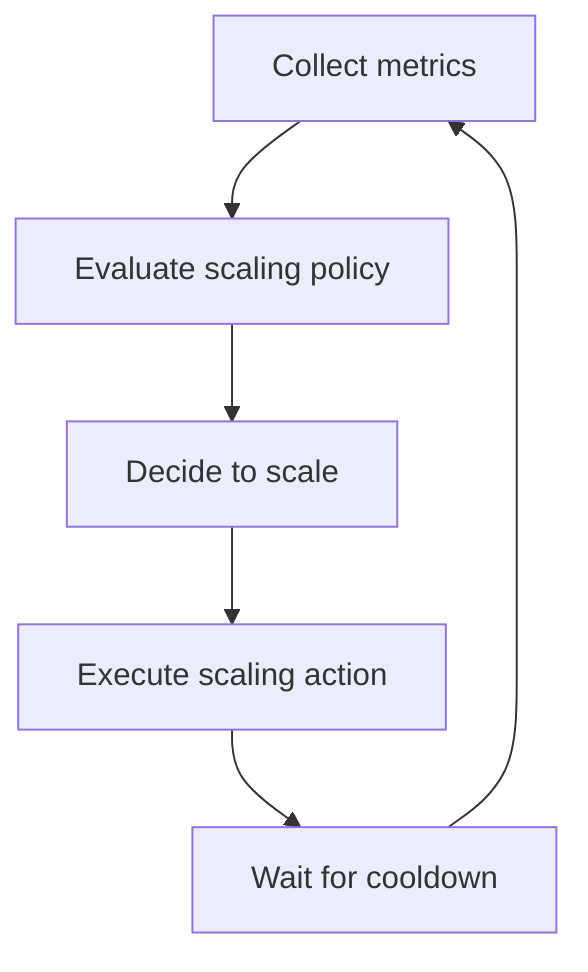

# Auto-Scaling Design

> **One-line definition:** Designing scaling policies that automatically adjust resources to match workload demand while meeting SLOs and optimizing cost.

## Why This Is a Specialist Skill

A senior software engineer may configure basic auto-scaling. An SRE or platform engineer **designs sophisticated scaling strategies**, **balances performance against cost**, and **validates scaling behavior under realistic conditions**.

The difference is not tool knowledge. It is **scaling discipline**: turning reactive resource allocation into proactive, cost-effective capacity management.

## Auto-Scaling Strategies


| Strategy | What scales | Pros | Cons | Use case |
|---|---|---|---|---|
| **Horizontal** | Number of instances | Linear scalability, no downtime | Requires stateless design, load balancer | Web servers, microservices |
| **Vertical** | Instance size &#40;CPU, memory&#41; | Simple, works for stateful services | Downtime during resize, upper limits | Databases, legacy applications |
| **Predictive** | Based on forecast | Proactive, avoids cold start | Requires historical data, can be wrong | Predictable traffic patterns |
| **Scheduled** | Based on time | Predictable, simple | Inflexible, misses unexpected spikes | Known peak hours, events |
| **Reactive** | Based on metrics | Responsive, cost-effective | Cold start delay, can oscillate | Unpredictable traffic |

## Scaling Signals

| Signal | What it measures | When to use | Example threshold |
|---|---|---|---|
| **CPU utilization** | Compute load | CPU-bound workloads | Scale at 70% CPU |
| **Memory utilization** | Memory pressure | Memory-bound workloads | Scale at 80% memory |
| **Request rate** | Traffic volume | API services, web servers | Scale at 1000 req/s per instance |
| **Queue depth** | Backlog size | Background workers, message queues | Scale at 100 messages in queue |
| **Latency** | Response time | User-facing services | Scale when p99 > 200ms |
| **Custom metrics** | Application-specific | Business logic, complex systems | Scale based on orders per minute |

## Scaling Policy Design



| Policy component | Purpose | Example |
|---|---|---|
| **Metric** | What to measure | CPU utilization |
| **Threshold** | When to scale | > 70% for scale-up, < 30% for scale-down |
| **Adjustment** | How much to scale | Add 2 instances, or increase by 50% |
| **Cooldown** | Prevent oscillation | Wait 5 minutes between scaling actions |
| **Min/Max** | Bound scaling | Minimum 2 instances, maximum 20 |
| **Stabilization** | Avoid rapid changes | Scale only if metric is above threshold for 3 minutes |

## Horizontal vs. Vertical Scaling

| Aspect | Horizontal | Vertical |
|---|---|---|
| **Scalability** | Theoretically unlimited | Limited by instance size |
| **Downtime** | None &#40;add/remove instances&#41; | Required for resize |
| **Complexity** | Higher &#40;load balancing, statelessness&#41; | Lower &#40;single instance&#41; |
| **Cost efficiency** | Better &#40;use smaller instances&#41; | Worse &#40;over-provisioning common&#41; |
| **State management** | Requires stateless or distributed state | Can be stateful |
| **Fault tolerance** | Higher &#40;multiple instances&#41; | Lower &#40;single point of failure&#41; |

## Cost Optimization Strategies

| Strategy | Description | Savings potential |
|---|---|---|
| **Right-sizing** | Match instance size to actual usage | 20-40% |
| **Spot/Preemptible instances** | Use spare capacity at discount | 60-90% |
| **Reserved instances** | Commit to 1-3 year usage | 30-70% |
| **Scheduled scaling** | Scale down during off-peak | 30-50% |
| **Auto-scaling** | Scale to match demand | 20-40% |
| **Multi-region** | Use cheaper regions for non-critical workloads | 10-30% |

## Auto-Scaling Implementation

### Kubernetes HPA &#40;Horizontal Pod Autoscaler&#41;

```yaml
apiVersion: autoscaling/v2
kind: HorizontalPodAutoscaler
metadata:
  name: web-app-hpa
spec:
  scaleTargetRef:
    apiVersion: apps/v1
    kind: Deployment
    name: web-app
  minReplicas: 2
  maxReplicas: 20
  metrics:
  - type: Resource
    resource:
      name: cpu
      target:
        type: Utilization
        averageUtilization: 70
  behavior:
    scaleUp:
      stabilizationWindowSeconds: 60
      policies:
      - type: Pods
        value: 2
        periodSeconds: 60
    scaleDown:
      stabilizationWindowSeconds: 300
      policies:
      - type: Pods
        value: 1
        periodSeconds: 120
```

### AWS Auto Scaling

```yaml
AutoScalingGroup:
  MinSize: 2
  MaxSize: 20
  DesiredCapacity: 4
  MetricsCollection:
    - Granularity: 1Minute
      Metrics:
        - CPUUtilization
        - NetworkIn
        - NetworkOut

ScalingPolicies:
  - PolicyType: TargetTrackingScaling
    TargetTrackingConfiguration:
      PredefinedMetricSpecification:
        PredefinedMetricType: ASGAverageCPUUtilization
      TargetValue: 70.0
      ScaleInCooldown: 300
      ScaleOutCooldown: 60
```

## Auto-Scaling Anti-Patterns

| Anti-pattern | Problem | What to do instead |
|---|---|---|
| **Scaling on wrong metric** | CPU high but not bottleneck | Scale on the actual bottleneck metric |
| **Too aggressive scaling** | Oscillation, cost spikes | Add cooldown and stabilization windows |
| **No minimum instances** | Cold start, slow response | Set minimum to handle baseline load |
| **No maximum instances** | Unbounded cost, resource exhaustion | Set maximum based on capacity plan |
| **Ignoring cold start** | New instances slow to serve requests | Use predictive scaling, warm pools |
| **Scaling stateful services horizontally** | Data consistency issues | Use vertical scaling or distributed state |

## Practical Exercise

**For a service you own:**

1. **Analyze current scaling:**
   - What scaling strategy are you using? &#40;horizontal, vertical, manual&#41;
   - What metrics trigger scaling?
   - What are your min/max bounds?

2. **Identify scaling signals:**
   - What metric best represents workload? &#40;CPU, memory, request rate, queue depth&#41;
   - What threshold indicates need to scale?

3. **Design scaling policy:**
   - Define scale-up threshold and adjustment
   - Define scale-down threshold and adjustment
   - Set cooldown periods
   - Set min/max bounds

4. **Calculate cost impact:**
   - What is current cost?
   - What would cost be with auto-scaling?
   - What is the break-even point?

5. **Test scaling behavior:**
   - Run load test to trigger scaling
   - Measure scale-up time
   - Measure scale-down time
   - Validate SLO compliance during scaling

6. **Optimize:**
   - Right-size instances
   - Consider spot/preemptible instances
   - Implement scheduled scaling for known patterns

**Bonus:** Implement predictive scaling based on historical traffic patterns.

## Knowledge Connections

- [[01_Capacity_Planning]] : auto-scaling implements capacity plans
- [[02_Load_and_Stress_Testing]] : tests validate scaling policies
- [[04_Chaos_Engineering]] : chaos tests validate scaling under failure
- [[01_Service_Objectives/02_SLO_Definition]] : SLOs define scaling targets
- [[software-engineering-note/02_Software_Architecture/Microservice/07 Deployment/071 Containers & Orchestration]] : container orchestration foundations

## Key Takeaways

- Auto-scaling turns reactive provisioning into proactive, cost-effective capacity management
- Choose scaling strategy based on workload characteristics: horizontal for stateless, vertical for stateful
- Scale on the right metric: the actual bottleneck, not just CPU
- Design scaling policies with cooldown, stabilization, and min/max bounds
- Optimize cost through right-sizing, spot instances, and scheduled scaling
- Test scaling behavior under load to validate policies and SLO compliance
