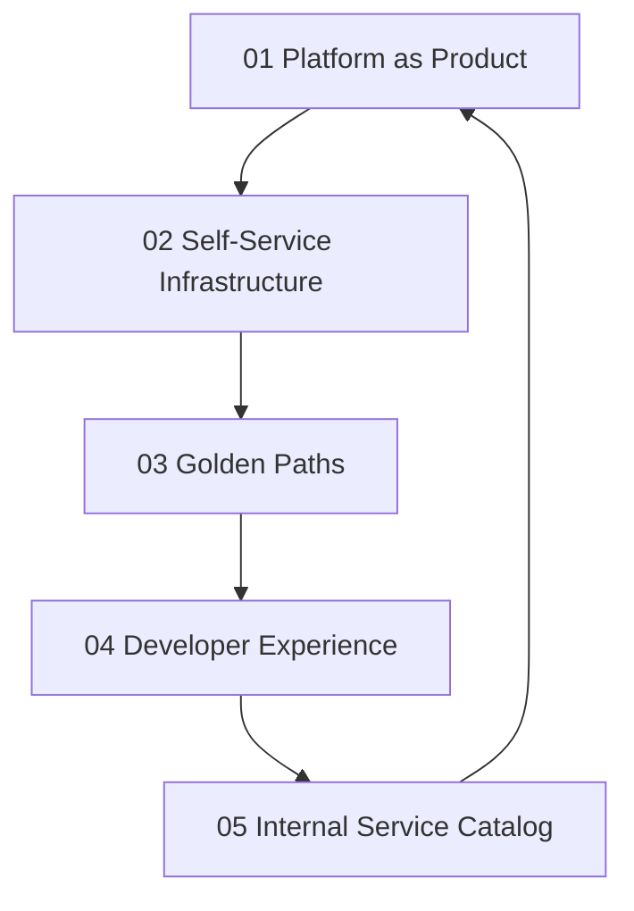

# Developer Platform

> **Core idea:** Building internal platforms that treat infrastructure as a product, providing self-service capabilities and paved roads that reduce cognitive load while maintaining standardization and reliability.

## What Developer Platform Means at Specialist Level

A senior software engineer may use platform tools built by others. An SRE or platform engineer **designs, builds, and operates** the platform itself, treating it as an internal product with users, roadmaps, and quality metrics.

Developer platforms are not just infrastructure automation. They are **products that enable product teams** to deliver faster, safer, and with less operational burden. The platform team's customers are other engineers, and success is measured by developer productivity, adoption, and satisfaction.

## Topic Notes

| # | Topic | Focus | Status | File |
|---|---|---|---|---|
| 01 | Platform as Product | Treating platform as internal product with user research and roadmap | ✅ Done | `01_Platform_as_Product.md` |
| 02 | Self-Service Infrastructure | Service catalogs, provisioning automation, developer portals | ✅ Done | `02_Self_Service_Infrastructure.md` |
| 03 | Golden Paths | Paved roads, standard tooling, reducing cognitive load | ✅ Done | `03_Golden_Paths.md` |
| 04 | Developer Experience | DX metrics, friction reduction, onboarding | ✅ Done | `04_Developer_Experience.md` |
| 05 | Internal Service Catalog | Service registry, API management, dependency tracking | ✅ Done | `05_Internal_Service_Catalog.md` |

**Completion:** 5/5 : 100%

## How the Topics Connect

**Reading order:** Start with Platform as Product to understand the mindset shift. Then Self-Service Infrastructure to see how platforms expose capabilities. Golden Paths shows how to reduce choice overload. Developer Experience measures whether the platform actually helps. Internal Service Catalog closes the loop with service discovery and dependency management.

## Existing Vault Anchors

These topic notes **do not duplicate** the existing knowledge base. They layer specialist-level application on top of it:

| Specialist topic | Existing foundation notes |
|---|---|
| Platform as Product | [[software-engineering-note/06_Software_Engineering_Operations/03_Accelerating_Flow]] |
| Self-Service Infrastructure | [[software-engineering-note/02_Software_Architecture/Microservice/07 Deployment/074 GitOps & CI-CD Pipelines]] |
| Golden Paths | [[software-engineering-note/06_Software_Engineering_Operations/02_Where_to_Start]] |
| Developer Experience | [[software-engineering-note/06_Software_Engineering_Operations/03_Accelerating_Flow]] |
| Internal Service Catalog | [[software-engineering-note/02_Software_Architecture/Microservice/Microservice Overview]] |

## Self-Assessment Checklist

Use this to gauge your current mastery of developer platforms:

- [ ] I can articulate the platform's value proposition to product teams
- [ ] I have conducted user research with platform users in the last quarter
- [ ] I maintain a platform roadmap aligned with organizational goals
- [ ] I can provision a new service end-to-end without manual intervention
- [ ] I have defined and track developer experience metrics
- [ ] I have built or contributed to a golden path for at least one service type
- [ ] I maintain an internal service catalog with dependency tracking

## Related

- [[00_overview|SRE and Platform Engineer Overview]]
- [[04_Delivery_Automation/00_overview|Delivery Automation]] : platforms enable safe delivery
- [[02_Observability/00_overview|Observability]] : platforms must be observable
- [[software-engineering-note/02_Software_Architecture/Microservice/07 Deployment/074 GitOps & CI-CD Pipelines|GitOps & CI-CD Pipelines]] : foundation for self-service delivery
