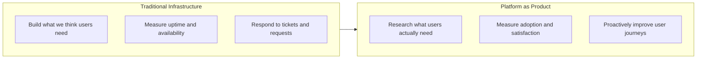
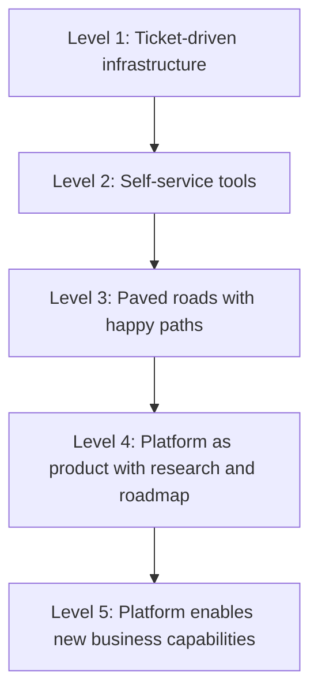

# Platform as Product

> **One-line definition:** Treating the internal platform as a product with users, roadmaps, and quality metrics rather than a collection of infrastructure tools.

## Why This Is a Specialist Skill

A senior software engineer may provide feedback on platform tools. An SRE or platform engineer **owns the platform as a product**, conducting user research, defining success metrics, and building roadmaps that balance user needs with organizational constraints.

The difference is not technical depth. It is **product thinking applied to infrastructure**: understanding user journeys, measuring adoption, and iterating based on feedback rather than building what seems technically elegant.

## Core Concepts

### Platform Product Thinking

| Aspect | Traditional Infrastructure | Platform as Product |
|---|---|---|
| **Mindset** | "We provide tools" | "We deliver outcomes" |
| **Users** | Ticket submitters | Customers with journeys |
| **Success** | Systems are up | Users are productive |
| **Roadmap** | Reactive to requests | Proactive based on research |
| **Feedback** | Complaints and tickets | Structured user research |
| **Metrics** | Uptime, latency, cost | Adoption, satisfaction, velocity |

### Platform User Research

| Research method | When to use | What it reveals |
|---|---|---|
| **User interviews** | Early discovery, major changes | Pain points, mental models, unmet needs |
| **Usage analytics** | Ongoing measurement | Adoption patterns, drop-off points, popular features |
| **Surveys** | Quarterly health checks | Satisfaction trends, feature priorities |
| **Shadowing** | Workflow optimization | Actual vs. documented workflows, workarounds |
| **Feedback channels** | Continuous improvement | Real-time issues, feature requests |

### Platform Roadmap Principles

| Principle | Description | Example |
|---|---|---|
| **User-first prioritization** | Solve real user problems, not hypothetical ones | "Teams spend 2 days setting up monitoring" → automate monitoring setup |
| **Progressive disclosure** | Start simple, add complexity for advanced users | Basic deployment template → advanced customization options |
| **Backward compatibility** | Don't break existing users when adding features | Deprecate gradually, provide migration paths |
| **Measurable outcomes** | Define success before building | "Reduce onboarding time from 2 weeks to 2 days" |

## Platform Maturity Model

| Level | Characteristics | Success metric |
|---|---|---|
| **1. Ticket-driven** | Manual provisioning, no self-service | Ticket resolution time |
| **2. Self-service** | Automated tools, but no guidance | Tool availability |
| **3. Paved roads** | Recommended paths with support | Adoption of paved roads |
| **4. Product** | User research, roadmap, DX metrics | User satisfaction, productivity |
| **5. Enabler** | Platform unlocks new capabilities | Time-to-market for new services |

## Anti-Patterns

| Anti-pattern | Problem | What to do instead |
|---|---|---|
| **Build it and they will come** | Assume users want what you built | Conduct user research before building |
| **Infrastructure hero complex** | Optimize for technical elegance, not usability | Measure user outcomes, not system elegance |
| **No roadmap** | Reactive to loudest voices, no strategic direction | Maintain a public roadmap with priorities |
| **Ignore feedback** | Users complain but nothing changes | Close the feedback loop visibly |
| **One-size-fits-none** | Single solution that doesn't fit anyone well | Offer tiers: simple for most, advanced for experts |
| **Metrics theater** | Track vanity metrics, not user outcomes | Measure adoption, satisfaction, productivity |

## Practical Exercise

**For your current platform:**

1. **Identify your users:** Who uses the platform? (product teams, data teams, security teams)
2. **Map a user journey:** Pick one common task (deploy a service, set up monitoring, provision a database)
   - What are the steps today?
   - Where do users get stuck?
   - How long does it take?
3. **Conduct a user interview:** Talk to 3 platform users
   - What's the hardest part of using the platform?
   - What would make you 10% more productive?
   - What do you wish the platform did that it doesn't?
4. **Define success metrics:** How will you know if the platform is succeeding?
   - Adoption: % of teams using the platform
   - Satisfaction: NPS or satisfaction score
   - Productivity: time to deploy, time to onboard

**Bonus:** Write a one-page platform vision: "In 12 months, our platform will..."

## Knowledge Connections

- [[02_Self_Service_Infrastructure]] : product thinking drives self-service design
- [[04_Developer_Experience]] : DX metrics measure product success
- [[software-engineering-note/06_Software_Engineering_Operations/03_Accelerating_Flow|Accelerating Flow]] : platforms accelerate developer flow
- [[software-engineering-note/02_Software_Architecture/Microservice/07 Deployment/074 GitOps & CI-CD Pipelines|GitOps & CI-CD Pipelines]] : delivery automation as platform capability

## Key Takeaways

- Platforms are products; engineers are users who deserve product thinking
- User research is not optional; build what users need, not what seems elegant
- Measure adoption and satisfaction, not just uptime and availability
- Maintain a public roadmap; users need visibility into platform direction
- Progressive disclosure reduces cognitive load while supporting advanced use cases
- Platform maturity moves from ticket-driven to enabling new business capabilities
- Success is user productivity, not infrastructure elegance
