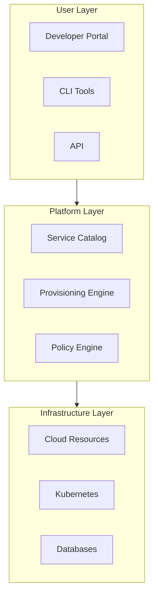
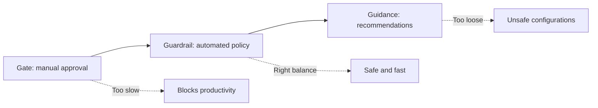

# Self-Service Infrastructure

> **One-line definition:** Enabling teams to provision, configure, and manage infrastructure without tickets, approvals, or platform team intervention.

## Why This Is a Specialist Skill

A senior software engineer may use self-service tools. An SRE or platform engineer **designs the self-service layer**, balancing autonomy with guardrails, building abstractions that hide complexity without hiding important trade-offs, and ensuring self-service paths are safe by default.

The difference is not automation skill. It is **designing the right level of abstraction**: enough to reduce cognitive load, not so much that users can't understand what they're getting.

## Core Concepts

### Self-Service Architecture

| Layer | Purpose | Example technologies |
|---|---|---|
| **User layer** | How users interact with the platform | Backstage, custom portal, CLI, Terraform modules |
| **Platform layer** | Orchestration, policy, and abstraction | Service catalog, policy engines, workflow automation |
| **Infrastructure layer** | Actual resources being provisioned | AWS, GCP, Kubernetes, managed databases |

### Self-Service Patterns

| Pattern | Description | When to use |
|---|---|---|
| **Template library** | Pre-built, tested infrastructure templates | Standard service types (web app, API, worker) |
| **Service catalog** | Click-to-deploy services with predefined options | Common infrastructure (databases, queues, caches) |
| **Policy-as-code** | Automated guardrails that prevent unsafe configurations | Enforcing security, cost, and compliance policies |
| **Progressive disclosure** | Simple defaults with advanced options available | Reducing cognitive load while supporting customization |
| **Sandbox environments** | Isolated environments for experimentation | Allowing users to try things safely |

### Guardrails vs. Gates

| Approach | Description | Example |
|---|---|---|
| **Gate** | Manual approval required before action | "Submit a ticket for database provisioning" |
| **Guardrail** | Automated checks that prevent unsafe actions | "Cannot provision database without backup policy" |
| **Guidance** | Recommendations without enforcement | "We recommend PostgreSQL for relational data" |

## Self-Service Capabilities

| Capability | Self-service level | Automation required |
|---|---|---|
| **Provision database** | Select type, size, backup policy | Infrastructure-as-code, policy validation |
| **Deploy service** | Push code, trigger pipeline | CI/CD, progressive delivery, rollback |
| **Create environment** | Spin up dev/test/staging | Namespace isolation, resource quotas |
| **Configure monitoring** | Enable dashboards, alerts | Observability templates, SLO integration |
| **Manage secrets** | Store and rotate credentials | Secret management, access control |
| **Scale resources** | Adjust CPU, memory, replicas | Autoscaling policies, cost controls |

## Implementation Considerations

### What to automate first

| Priority | Criteria | Example |
|---|---|---|
| **High** | Frequent, time-consuming, error-prone | Service deployment, database provisioning |
| **Medium** | Moderate frequency, moderate complexity | Environment creation, monitoring setup |
| **Low** | Rare, complex, high-risk | Production database migration, disaster recovery |

### Balancing autonomy and control

| Concern | Solution |
|---|---|
| **Cost overruns** | Resource quotas, cost alerts, auto-shutdown for dev |
| **Security violations** | Policy-as-code, mandatory encryption, network policies |
| **Compliance failures** | Audit logging, required controls, automated compliance checks |
| **Operational burden** | Standard configurations, automated maintenance, SLO-based alerting |

## Anti-Patterns

| Anti-pattern | Problem | What to do instead |
|---|---|---|
| **Self-service without guardrails** | Users create unsafe, expensive, or non-compliant resources | Add policy-as-code, quotas, and validation |
| **Over-abstraction** | Users can't understand what they're getting | Document what's provisioned, expose key parameters |
| **Under-abstraction** | Users must understand all infrastructure details | Provide sensible defaults, hide complexity |
| **No escape hatch** | Users can't customize when needed | Allow advanced options for power users |
| **Inconsistent interfaces** | Different tools for similar tasks | Unified portal or CLI with consistent UX |
| **No documentation** | Users don't know what's available | Maintain service catalog with examples |

## Practical Exercise

**For a service you support:**

1. **Map the current provisioning process:**
   - What steps are required today?
   - Which steps require tickets or approvals?
   - How long does end-to-end provisioning take?
2. **Identify automation opportunities:**
   - Which steps are repetitive and error-prone?
   - Which approvals could become automated guardrails?
3. **Design a self-service flow:**
   - What does the user provide? (service name, environment, size)
   - What does the platform provide? (defaults, templates, validation)
   - What guardrails are enforced? (cost, security, compliance)
4. **Define success metrics:**
   - Time to provision (before vs. after)
   - Error rate (failed provisioning attempts)
   - User satisfaction (survey after first use)

**Bonus:** Build a simple self-service prototype for one capability (even a script or template library).

## Knowledge Connections

- [[01_Platform_as_Product]] : self-service is a product capability
- [[03_Golden_Paths]] : self-service enables golden paths
- [[05_Internal_Service_Catalog]] : catalog exposes self-service options
- [[software-engineering-note/02_Software_Architecture/Microservice/07 Deployment/074 GitOps & CI-CD Pipelines|GitOps & CI-CD Pipelines]] : GitOps enables self-service delivery
- [[04_Delivery_Automation/00_overview|Delivery Automation]] : CI/CD as self-service capability

## Key Takeaways

- Self-service means no tickets, approvals, or platform team intervention required
- Guardrails are better than gates: automate policy enforcement, don't block productivity
- Progressive disclosure reduces cognitive load while supporting advanced customization
- Start with high-frequency, time-consuming, error-prone tasks
- Balance autonomy with control: quotas, policies, and audit logging
- Self-service without documentation is not self-service; users need to know what's available
- Measure time-to-provision, error rate, and user satisfaction to track success
