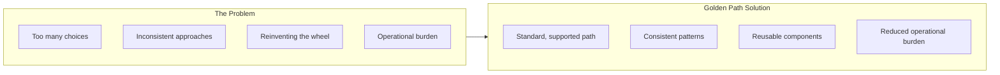
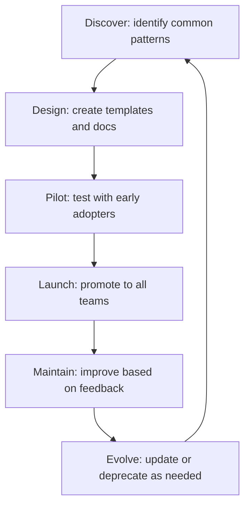

# Golden Paths

> **One-line definition:** Paved roads that provide standard, supported, and optimized ways to build and operate services while allowing teams to go off-path when needed.

## Why This Is a Specialist Skill

A senior software engineer may follow golden paths defined by others. An SRE or platform engineer **designs and maintains golden paths**, making trade-offs between standardization and flexibility, ensuring paths are well-supported and continuously improved, and making off-path options available but not default.

The difference is not technical depth. It is **reducing cognitive load by reducing choice overload**: providing clear, supported paths that work for 80% of use cases while allowing customization for the remaining 20%.

## Core Concepts

### Golden Path Philosophy

| Principle | Description | Example |
|---|---|---|
| **Opinionated defaults** | Make the right choice the easy choice | Default to PostgreSQL for relational data |
| **Well-supported** | Platform team maintains and troubleshoots the path | "If you use the golden path, we'll help debug issues" |
| **Continuously improved** | Paths evolve based on feedback and best practices | Quarterly updates to deployment templates |
| **Escape hatches** | Teams can go off-path when needed | Custom database choice with documented trade-offs |
| **Not mandatory** | Adoption is voluntary, driven by value | "Use it because it's better, not because you must" |

### Golden Path Components

| Component | Purpose | Example |
|---|---|---|
| **Templates** | Starting points for common service types | Web service template, API template, worker template |
| **Libraries** | Reusable code for common patterns | Authentication library, logging library, error handling |
| **Documentation** | Guides, tutorials, and reference docs | "Getting started with the golden path" |
| **Tooling** | CLI tools, IDE plugins, dashboards | `golden-path new-service` command |
| **Support** | Troubleshooting, office hours, SLAs | "Golden path users get priority support" |

### Golden Path vs. Mandates

| Aspect | Golden Path | Mandate |
|---|---|---|
| **Adoption** | Voluntary, driven by value | Required, enforced by policy |
| **Flexibility** | Escape hatches available | No exceptions allowed |
| **User perception** | "This helps me" | "This constrains me" |
| **Maintenance** | Platform team improves based on feedback | Platform team enforces compliance |
| **Success metric** | Adoption rate, user satisfaction | Compliance rate, audit findings |

## Golden Path Design

### When to create a golden path

| Signal | Action |
|---|---|
| **Multiple teams solving the same problem** | Create a golden path to avoid duplication |
| **Frequent operational issues** | Standardize on a well-supported approach |
| **High onboarding friction** | Provide templates and documentation |
| **Security or compliance requirements** | Make compliant configurations the default |
| **Cost optimization opportunities** | Standardize on cost-effective solutions |

### When not to create a golden path

| Signal | Action |
|---|---|
| **Unique requirements** | Allow customization, document trade-offs |
| **Rapidly changing domain** | Wait for patterns to emerge before standardizing |
| **Low adoption potential** | Don't invest in paths few teams will use |
| **High maintenance cost** | Ensure you can support what you standardize |

### Golden path lifecycle

## Golden Path Examples

### Web service golden path

| Component | Golden path choice | Rationale |
|---|---|---|
| **Language** | Python or Go | Team expertise, performance characteristics |
| **Framework** | FastAPI (Python) or Gin (Go) | Community support, performance |
| **Database** | PostgreSQL | Reliability, features, team expertise |
| **Cache** | Redis | Performance, feature set |
| **Queue** | RabbitMQ or Kafka | Reliability, team expertise |
| **Deployment** | Kubernetes with Helm | Scalability, operational maturity |
| **Observability** | Prometheus, Grafana, Jaeger | Open source, integration |

### Data pipeline golden path

| Component | Golden path choice | Rationale |
|---|---|---|
| **Orchestration** | Apache Airflow | Flexibility, community support |
| **Processing** | Apache Spark | Scalability, ecosystem |
| **Storage** | S3 or GCS | Cost, durability |
| **Catalog** | Apache Atlas or DataHub | Discovery, governance |
| **Quality** | Great Expectations | Validation, documentation |

## Anti-Patterns

| Anti-pattern | Problem | What to do instead |
|---|---|---|
| **Golden path as mandate** | Forced adoption creates resistance | Make adoption voluntary, driven by value |
| **No escape hatch** | Teams with unique needs are stuck | Allow off-path options with documented trade-offs |
| **Stale paths** | Golden paths don't evolve with best practices | Regular reviews, continuous improvement |
| **Poor documentation** | Users can't find or understand the path | Invest in getting-started guides and examples |
| **No support** | Users hit issues and get no help | Provide office hours, troubleshooting guides, SLAs |
| **Too many paths** | Choice overload returns | Focus on 2-3 paths per service type |
| **Ignoring feedback** | Users complain but nothing changes | Close the feedback loop, iterate based on input |

## Practical Exercise

**For a common service type in your organization:**

1. **Identify the golden path:**
   - What are the standard choices for language, framework, database, deployment?
   - Why were these choices made? (expertise, performance, cost, support)
2. **Assess the current state:**
   - Is there a template or starter kit?
   - Is there documentation for getting started?
   - Is there a support channel for questions?
3. **Map the user journey:**
   - How long does it take to go from "I need a service" to "service is running"?
   - Where do users get stuck or make suboptimal choices?
4. **Identify gaps:**
   - What's missing from the golden path? (templates, docs, tooling, support)
   - What would make adoption easier?
5. **Plan improvements:**
   - Pick one gap to address in the next quarter
   - Define success metrics (adoption rate, time-to-first-deployment, user satisfaction)

**Bonus:** Interview 3 teams using the golden path and 3 teams not using it. What's the difference?

## Knowledge Connections

- [[01_Platform_as_Product]] : golden paths are product features
- [[02_Self_Service_Infrastructure]] : golden paths are exposed via self-service
- [[04_Developer_Experience]] : golden paths improve DX by reducing cognitive load
- [[software-engineering-note/06_Software_Engineering_Operations/02_Where_to_Start|Where to Start]] : golden paths answer "where do I start?"
- [[04_Delivery_Automation/00_overview|Delivery Automation]] : golden paths include delivery automation

## Key Takeaways

- Golden paths reduce cognitive load by reducing choice overload
- Make the right choice the easy choice with opinionated defaults
- Golden paths are voluntary, not mandatory; adoption is driven by value
- Provide escape hatches for teams with unique requirements
- Golden paths must be well-supported, well-documented, and continuously improved
- Measure adoption rate and user satisfaction, not just compliance
- Focus on 2-3 paths per service type to avoid choice overload
