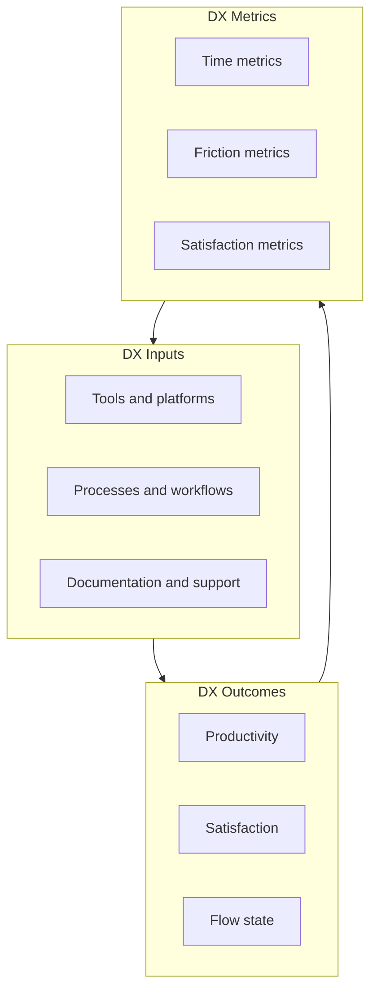
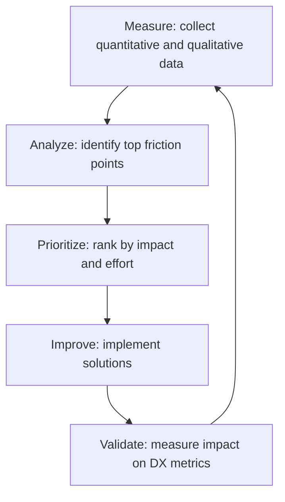

# Developer Experience

> **One-line definition:** Measuring and improving how developers interact with platforms, tools, and processes to maximize productivity and minimize friction.

## Why This Is a Specialist Skill

A senior software engineer may notice friction in their workflow. An SRE or platform engineer **systematically measures developer experience**, identifies friction points across the organization, and prioritizes improvements based on impact to productivity and satisfaction.

The difference is not noticing problems. It is **treating developer experience as a first-class metric** alongside reliability, performance, and cost, and using data to drive platform improvements.

## Core Concepts

### Developer Experience Framework

| DX dimension | Description | Example metric |
|---|---|---|
| **Productivity** | How much developers accomplish | Features delivered per sprint, code deployed per week |
| **Satisfaction** | How developers feel about their tools | NPS score, satisfaction survey results |
| **Flow** | How often developers are interrupted or blocked | Time in flow state, context switches per day |
| **Cognitive load** | How much mental effort is required | Time to onboard, time to find information |
| **Friction** | How many obstacles developers encounter | Failed deployments, manual workarounds, tickets filed |

### DX Metrics

| Metric category | Example metrics | How to measure |
|---|---|---|
| **Time metrics** | Time to first commit, time to deploy, time to recover | Pipeline logs, deployment timestamps, incident duration |
| **Friction metrics** | Failed deployments, manual steps, context switches | Pipeline failure rate, workflow audits, IDE telemetry |
| **Satisfaction metrics** | NPS score, satisfaction rating, likelihood to recommend | Quarterly surveys, feedback forms |
| **Adoption metrics** | % using golden path, % using self-service, % using portal | Platform analytics, service catalog usage |
| **Productivity metrics** | Deployment frequency, lead time, MTTR | DORA metrics, value stream mapping |

### DORA Metrics as DX Proxies

| DORA metric | What it measures | DX implication |
|---|---|---|
| **Deployment frequency** | How often code is deployed | High frequency suggests low friction |
| **Lead time for changes** | Time from commit to production | Short lead time suggests efficient pipeline |
| **Time to restore service** | Time to recover from failure | Fast recovery suggests good observability and tooling |
| **Change failure rate** | % of deployments causing failure | Low failure rate suggests good testing and validation |

## Measuring Developer Experience

### Quantitative methods

| Method | What it measures | Example |
|---|---|---|
| **Pipeline analytics** | Deployment success rate, duration, failure reasons | "30% of deployments fail due to environment issues" |
| **IDE telemetry** | Time spent coding vs. waiting, context switches | "Developers spend 20% of time waiting for builds" |
| **Platform analytics** | Self-service adoption, portal usage, support tickets | "70% of teams use self-service for database provisioning" |
| **DORA metrics** | Deployment frequency, lead time, MTTR, change failure rate | "Lead time improved from 5 days to 2 days" |

### Qualitative methods

| Method | What it reveals | Example |
|---|---|---|
| **User interviews** | Pain points, mental models, unmet needs | "I spend 2 hours setting up a new service" |
| **Surveys** | Satisfaction trends, feature priorities | "NPS improved from 20 to 45 after portal launch" |
| **Shadowing** | Actual vs. documented workflows, workarounds | "Developers bypass the portal and use CLI directly" |
| **Feedback channels** | Real-time issues, feature requests | "3 teams reported the same deployment issue this week" |

## Improving Developer Experience

### Common friction points

| Friction point | Impact | Solution |
|---|---|---|
| **Slow feedback loops** | Developers wait for builds, tests, deployments | Parallelize, cache, optimize critical path |
| **Complex onboarding** | New hires take weeks to become productive | Templates, tutorials, mentorship programs |
| **Poor documentation** | Developers can't find or understand docs | Improve search, add examples, keep docs current |
| **Flaky tests** | Developers lose trust in test suite | Quarantine flaky tests, invest in test reliability |
| **Manual workarounds** | Developers bypass automation due to gaps | Fix automation, don't accept workarounds |
| **Context switching** | Developers juggle multiple tools and interfaces | Unified portal, consistent UX, single pane of glass |

### DX improvement process

### Quick wins vs. strategic investments

| Type | Characteristics | Example |
|---|---|---|
| **Quick win** | Low effort, high impact, visible improvement | Fix a common deployment error, add a missing template |
| **Strategic investment** | High effort, high impact, long-term payoff | Build a developer portal, redesign the CI/CD pipeline |

## Anti-Patterns

| Anti-pattern | Problem | What to do instead |
|---|---|---|
| **Anecdotal DX** | Decisions based on loudest voices, not data | Measure systematically, use data to prioritize |
| **Vanity metrics** | Track metrics that don't reflect user experience | Measure outcomes (productivity, satisfaction), not outputs (features shipped) |
| **Ignore feedback** | Users complain but nothing changes | Close the feedback loop, communicate improvements |
| **One-size-fits-all** | Single solution for all developer types | Segment by role, experience level, service type |
| **Optimize locally** | Improve one step without considering end-to-end flow | Map the full developer journey, optimize holistically |
| **No baseline** | Can't measure improvement without a starting point | Establish baseline metrics before making changes |

## Practical Exercise

**For your current platform:**

1. **Establish baseline metrics:**
   - Time to deploy a service (from commit to production)
   - Deployment success rate
   - Developer satisfaction (NPS or 1-10 scale)
   - % of teams using self-service vs. filing tickets
2. **Conduct a friction audit:**
   - Map the developer journey for a common task (deploy a service, provision a database)
   - Identify steps that are slow, error-prone, or confusing
   - Interview 5 developers about their biggest pain points
3. **Prioritize improvements:**
   - Rank friction points by impact (how many developers affected) and effort (how hard to fix)
   - Pick 1 quick win and 1 strategic investment
4. **Define success criteria:**
   - What metric will improve?
   - By how much?
   - How will you measure it?

**Bonus:** Run a "DX retrospective" with a team: what's working, what's not, what should we try next?

## Knowledge Connections

- [[01_Platform_as_Product]] : DX metrics measure platform product success
- [[03_Golden_Paths]] : golden paths improve DX by reducing cognitive load
- [[02_Self_Service_Infrastructure]] : self-service reduces friction and wait times
- [[software-engineering-note/06_Software_Engineering_Operations/03_Accelerating_Flow|Accelerating Flow]] : DX is about accelerating developer flow
- [[04_Delivery_Automation/00_overview|Delivery Automation]] : CI/CD automation improves DX

## Key Takeaways

- Developer experience is a first-class metric alongside reliability, performance, and cost
- Measure DX quantitatively (time, friction, adoption) and qualitatively (satisfaction, interviews)
- DORA metrics are useful proxies for developer experience
- Common friction points: slow feedback, complex onboarding, poor documentation, flaky tests
- Establish baseline metrics before making improvements; you can't measure progress without a starting point
- Close the feedback loop: users need to see that their input leads to improvements
- Balance quick wins (visible, fast) with strategic investments (high impact, long-term)
