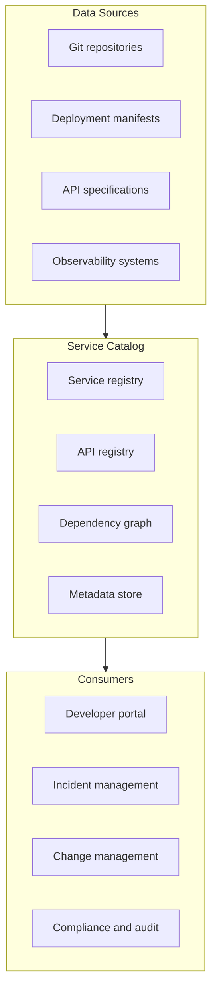

# Internal Service Catalog

> **One-line definition:** A centralized registry of internal services, APIs, and infrastructure that enables discovery, dependency tracking, and lifecycle management.

## Why This Is a Specialist Skill

A senior software engineer may use a service catalog to find APIs. An SRE or platform engineer **designs and maintains the service catalog**, ensuring it is accurate, comprehensive, and integrated with deployment, observability, and incident management workflows.

The difference is not using the catalog. It is **building the catalog as a source of truth** that enables dependency management, impact analysis, and operational visibility across the organization.

## Core Concepts

### Service Catalog Architecture

| Component | Purpose | Example technologies |
|---|---|---|
| **Service registry** | Inventory of all services with metadata | Backstage, custom database, service mesh |
| **API registry** | API specifications, documentation, versions | OpenAPI, Swagger, GraphQL schemas |
| **Dependency graph** | Which services depend on which others | Service mesh telemetry, static analysis |
| **Metadata store** | Owner, SLA, cost center, compliance status | Custom database, CMDB |

### Service Catalog Data Model

| Field | Description | Example |
|---|---|---|
| **Service name** | Unique identifier | `user-service` |
| **Owner** | Team or individual responsible | `Team Alpha` or `alice@example.com` |
| **Description** | What the service does | "Handles user authentication and authorization" |
| **Repository** | Source code location | `github.com/org/user-service` |
| **API spec** | API documentation | OpenAPI spec, GraphQL schema |
| **Dependencies** | Services this service calls | `database-service`, `notification-service` |
| **Dependents** | Services that call this service | `web-app`, `mobile-app` |
| **SLA** | Service level agreement | 99.9% availability, p99 latency < 200ms |
| **Environment** | Where it runs | `production`, `staging`, `dev` |
| **Cost center** | Who pays for it | `Product Team A` |
| **Compliance** | Regulatory requirements | `PCI-DSS`, `HIPAA`, `SOC 2` |

### Service Catalog Use Cases

| Use case | How the catalog helps | Example |
|---|---|---|
| **Service discovery** | Find services and APIs by capability | "I need a notification service" → search catalog |
| **Dependency analysis** | Understand impact of changes or failures | "If user-service goes down, what breaks?" |
| **Incident response** | Identify owner, dependencies, and runbooks | "Alert fired for payment-service → page Team Beta" |
| **Change management** | Assess risk of deployments and migrations | "Database migration affects these 5 services" |
| **Compliance and audit** | Track which services handle sensitive data | "Show me all services with PCI-DSS requirements" |
| **Cost management** | Attribute infrastructure costs to teams | "Team Alpha spent $10K on compute this month" |
| **Onboarding** | New engineers understand the system landscape | "Here are all the services and how they connect" |

## Building a Service Catalog

### Data collection strategies

| Strategy | Pros | Cons |
|---|---|---|
| **Automated discovery** | Always up-to-date, low maintenance | May miss undocumented services |
| **Manual registration** | Captures business context, ownership | Requires ongoing maintenance |
| **Hybrid approach** | Automated for technical data, manual for business context | Complexity of keeping both in sync |

### Integration points

| System | What it provides | What it consumes |
|---|---|---|
| **CI/CD pipeline** | Deployment status, version info | Service metadata for validation |
| **Observability platform** | Metrics, logs, traces, SLOs | Service ownership for alerting |
| **Incident management** | Incident history, on-call schedules | Service dependencies for impact analysis |
| **API gateway** | API specifications, traffic data | Service registry for routing |
| **Service mesh** | Dependency graph, traffic patterns | Service metadata for policy enforcement |

### Keeping the catalog current

| Challenge | Solution |
|---|---|
| **Services come and go** | Automate discovery from deployment systems |
| **Metadata becomes stale** | Require updates during deployment, periodic audits |
| **Ownership changes** | Integrate with HR systems, require owner confirmation |
| **Dependencies shift** | Use service mesh telemetry, static analysis |
| **Multiple sources of truth** | Designate catalog as authoritative, deprecate other sources |

## Service Catalog Maturity

| Level | Characteristics | Success metric |
|---|---|---|
| **1. Spreadsheet** | Manual list of services and owners | List exists |
| **2. Basic tool** | Dedicated tool with search and filtering | Teams can find services |
| **3. Automated** | Auto-discovery, dependency graph, metadata | Catalog is accurate and current |
| **4. Integrated** | Connected to CI/CD, observability, incident management | Catalog drives operational workflows |
| **5. Enabler** | Enables self-service, compliance, cost management | Catalog reduces friction and risk |

## Anti-Patterns

| Anti-pattern | Problem | What to do instead |
|---|---|---|
| **Stale catalog** | Data is outdated, users don't trust it | Automate discovery, require updates during deployment |
| **Incomplete catalog** | Missing services or metadata | Start with critical services, expand over time |
| **No owner** | No one maintains the catalog | Assign ownership, allocate time for maintenance |
| **Siloed catalogs** | Multiple tools with overlapping data | Consolidate into a single source of truth |
| **Read-only catalog** | Users can't update or add services | Provide self-service registration and updates |
| **No integration** | Catalog is isolated from operations | Connect to CI/CD, observability, incident management |
| **Over-engineered** | Complex schema that's hard to maintain | Start simple, add fields as needed |

## Practical Exercise

**For your current environment:**

1. **Inventory your services:**
   - How many services exist?
   - Where is the list maintained today? (spreadsheet, wiki, tool)
   - What metadata is captured? (owner, repo, dependencies, SLA)
2. **Assess completeness:**
   - Are all production services documented?
   - Is ownership clear for every service?
   - Are dependencies mapped?
3. **Identify integration opportunities:**
   - Could the catalog feed your incident management system?
   - Could it provide context during deployments?
   - Could it help with compliance audits?
4. **Plan improvements:**
   - Pick one gap to address (automation, metadata, integration)
   - Define success metrics (completeness, accuracy, usage)

**Bonus:** Map the dependency graph for one critical service. What would break if it went down? Who would you page?

## Knowledge Connections

- [[01_Platform_as_Product]] : catalog is a platform product feature
- [[02_Self_Service_Infrastructure]] : catalog exposes self-service options
- [[03_Golden_Paths]] : catalog documents golden path services
- [[04_Developer_Experience]] : catalog improves DX by enabling discovery
- [[02_Observability/00_overview|Observability]] : catalog provides context for observability data
- [[software-engineering-note/02_Software_Architecture/Microservice/Microservice Overview|Microservice Overview]] : catalog manages microservice complexity

## Key Takeaways

- Service catalog is the source of truth for what services exist, who owns them, and how they connect
- Automate discovery from deployment systems to keep the catalog current
- Integrate with CI/CD, observability, and incident management to drive operational workflows
- Start simple (spreadsheet or basic tool), evolve to automated and integrated
- Assign ownership and allocate time for maintenance; catalogs decay without attention
- Use the catalog for service discovery, dependency analysis, impact assessment, and compliance
- Measure completeness, accuracy, and usage to track catalog health
