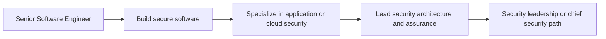

# Security Engineer

> **Positioning:** A specialist engineering path focused on reducing security risk through architecture, software development, verification, operations, and governance.

## What This Path Is

A security engineer applies engineering methods to protect systems, data, users, and organizations. The role may specialize in application security, cloud security, identity, detection and response, product security, security architecture, or security tooling.

The strongest security engineers enable delivery. They translate threats and policies into practical design choices, automated controls, useful guidance, and evidence that a system is protected appropriately for its context.

## Primary Outcomes

- Security risks identified early and treated proportionately
- Secure architecture and development practices
- Effective identity, access, data, and network controls
- Security testing and vulnerability management integrated into delivery
- Useful detection, response, and recovery capabilities
- Security decisions that engineers and stakeholders can understand

## Capability Areas

| Capability | Specialist behavior | Existing vault anchor |
|---|---|---|
| Threat and risk analysis | Models threats and prioritizes treatment | [[13_Software_Security/06_Domain_Specific_Security]] |
| Secure architecture | Embeds security principles before implementation | [[02_Software_Architecture/05_Security_and_Testability]] |
| Secure development | Integrates secure coding and dependency controls | [[13_Software_Security/05_Secure_Development_and_Assurance]] |
| Security verification | Uses SAST, DAST, fuzzing, review, and testing appropriately | [[13_Software_Security/07_Vulnerability_Management]] |
| Identity and access | Designs authentication, authorization, and accountability | [[13_Software_Security/03_Access_Control_and_Architecture]] |
| Operations | Supports monitoring, incident response, and recovery | [[CyBOK v1 - Overview]] |
| Governance | Connects controls to policy, regulation, and risk appetite | [[13_Software_Security/08_Security_Management_and_Governance]] |

## Typical Progression

## Signals for Moving Forward

- You naturally consider abuse cases, trust boundaries, and failure consequences.
- You can explain security risk without relying on fear or unexplained jargon.
- You can work with developers, architects, operations, legal, and compliance stakeholders.
- You understand that security is a lifecycle concern rather than a final gate.
- You can prioritize security work according to likelihood, impact, and context.

## Evidence to Build

- Threat model
- Secure design review
- Security requirements specification
- Secure coding guideline
- SAST, DAST, or software-composition analysis report
- Incident response plan
- Vulnerability management report
- Security architecture decision record
- Security metrics dashboard

## Nearby Paths

- [[06_Software_Architect|Software Architect]]: architecture with security as one of several quality concerns
- [[07_SRE_and_Platform_Engineer|SRE and Platform Engineer]]: reliability and operational systems
- [[03_Staff_Engineer|Staff Engineer]]: broad technical influence
- [[15_Solutions_and_Enterprise_Architect|Solutions or Enterprise Architect]]: security across customer and enterprise contexts

## Suggested Future Note Route

1. [[CyBOK v1 - Overview]]
2. [[13_Software_Security/Software Security Overview]]
3. [[13_Software_Security/05_Secure_Development_and_Assurance]]
4. [[13_Software_Security/06_Domain_Specific_Security]]
5. [[13_Software_Security/07_Vulnerability_Management]]
6. [[02_Software_Architecture/05_Security_and_Testability]]
7. [[02_Software_Architecture/09_Evaluation_and_Governance]]

## Sources

- [OWASP Secure by Design Framework](https://owasp.org/www-project-secure-by-design-framework/)
- [[CyBOK v1 - Overview]]
- [[SWEBOK v4 - Overview]]

## Related

- [[00_Career_Path_Overview]]
- [[06_Software_Architect]]
- [[07_SRE_and_Platform_Engineer]]
- [[09_Data_and_ML_Engineer]]
