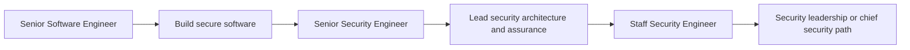
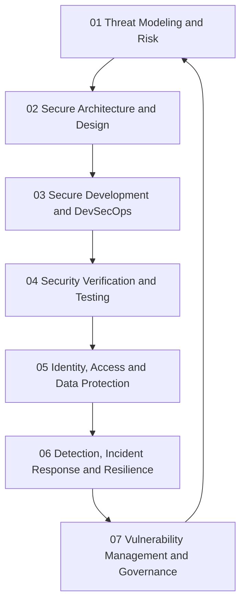
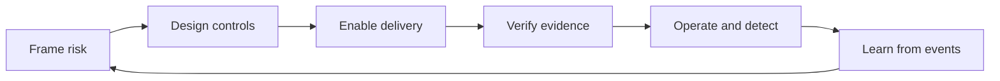

# Security Engineer

> **Positioning:** A specialist engineering path focused on reducing security risk through architecture, software development, verification, operations, and governance.

## What This Path Is

A security engineer applies engineering methods to protect systems, data, users, and organizations. The role may specialize in application security, cloud security, identity, detection and response, product security, security architecture, or security tooling.

The strongest security engineers enable delivery. They translate threats and policies into practical design choices, automated controls, useful guidance, and evidence that a system is protected appropriately for its context.

## Primary Outcomes

- Security risks identified early and treated proportionately
- Secure architecture and development practices
- Effective identity, access, data, and network controls
- Security testing and vulnerability management integrated into delivery
- Useful detection, response, and recovery capabilities
- Security decisions that engineers and stakeholders can understand

## What Senior Security Engineers Do Differently

A mid-level security engineer usually contributes to a defined assessment, control, or remediation task. A senior security engineer owns the **security decision system** around a product or platform: what matters, how risk is evaluated, which controls are proportionate, how evidence is produced, and how the organization learns from failures.

The senior specialist does not become a bottleneck or a final approval gate. They create reusable patterns, automated guardrails, clear escalation paths, and strong partnerships so that product and engineering teams can make safer decisions at speed.

| Dimension | Mid-level approach | Senior-specialist approach |
|---|---|---|
| Threats | Finds vulnerabilities in a defined scope | Models adversaries, system context, and changing attack paths |
| Controls | Applies known controls | Chooses proportionate controls and explains their trade-offs |
| Findings | Reports issues | Owns prioritization, remediation economics, and exceptions |
| Incidents | Performs assigned response tasks | Leads containment decisions, communication, recovery, and learning |
| Governance | Follows policy | Converts policy and regulation into usable engineering practices |
| Influence | Advises one team | Builds security capability across teams without becoming a bottleneck |

## Capability Areas

| # | Capability | Senior-specialist behavior | Existing vault anchor |
|---|---|---|---|
| 01 | [[01_Threat_Modeling_and_Risk/00_overview|Threat Modeling and Risk]] | Frames system context, adversaries, attack paths, and treatment decisions | [[document-template/14_Security/Threat-Model]] |
| 02 | [[02_Secure_Architecture_and_Design/00_overview|Secure Architecture and Design]] | Turns security principles into architecture decisions and resilient boundaries | [[document-template/14_Security/Security-Architecture]] |
| 03 | [[03_Secure_Development_and_DevSecOps/00_overview|Secure Development and DevSecOps]] | Makes secure delivery the default through requirements, enablement, and automation | [[software-engineering-note/13_Software_Security/05_Secure_Development_and_Assurance]] |
| 04 | [[04_Security_Verification_and_Testing/00_overview|Security Verification and Testing]] | Selects verification depth and interprets evidence according to risk | [[software-engineering-note/05_Software_Testing/Software Testing Overview]] |
| 05 | [[05_Identity_Access_and_Data_Protection/00_overview|Identity, Access and Data Protection]] | Designs accountable identity, authorization, secrets, privacy, and data controls | [[software-engineering-note/13_Software_Security/03_Access_Control_and_Architecture]] |
| 06 | [[06_Detection_Incident_Response_and_Resilience/00_overview|Detection, Incident Response and Resilience]] | Builds detection quality and leads containment, recovery, and learning | [[body-of-knowledge/CyBOK/07_Security_Operations_and_Incident_Management]] |
| 07 | [[07_Vulnerability_Management_and_Governance/00_overview|Vulnerability Management and Governance]] | Connects findings, remediation, risk acceptance, metrics, and control evidence | [[software-engineering-note/13_Software_Security/07_Vulnerability_Management]] |

## Typical Progression

## Capability Sequence

**Reading order:** Start with threat and risk framing, then design controls, embed them in delivery, verify them with evidence, protect identities and data, operate the system under attack, and finally use governance and metrics to improve the whole loop.

## Signals for Moving Forward

- You naturally consider abuse cases, trust boundaries, and failure consequences.
- You can explain security risk without relying on fear or unexplained jargon.
- You can work with developers, architects, operations, legal, and compliance stakeholders.
- You understand that security is a lifecycle concern rather than a final gate.
- You can prioritize security work according to likelihood, impact, and context.

## Senior Security Engineer Capability Checklist

Use this as a working self-assessment. Evidence matters more than confidence: link each checked item to a real design review, incident, report, runbook, or improvement outcome.

- [ ] I can define the assets, trust boundaries, attack surface, and likely adversaries for a system.
- [ ] I can turn a threat model into prioritized security requirements and treatment decisions.
- [ ] I can explain security architecture trade-offs in business and engineering language.
- [ ] I can design secure defaults without making normal delivery unnecessarily difficult.
- [ ] I can choose appropriate security verification depth instead of treating every scanner result equally.
- [ ] I can assess identity, authorization, secrets, privacy, and data-protection consequences together.
- [ ] I can design detections that support investigation rather than merely collecting logs.
- [ ] I can lead or materially support containment, recovery, and post-incident learning.
- [ ] I can prioritize vulnerabilities using exploitability, exposure, asset criticality, and compensating controls.
- [ ] I can create governance evidence and metrics that help leaders make better risk decisions.
- [ ] I can enable other engineers through patterns, tooling, training, and security champions.
- [ ] I can state residual risk clearly when a control is incomplete or a remediation is deferred.

## Role Boundary: Security Engineer and Staff Engineer

These paths overlap, but they are not identical:

| Role | Center of gravity | Typical senior question |
|---|---|---|
| Security Engineer | Security depth and risk reduction | How do we reduce this security risk proportionately across the lifecycle? |
| Staff Engineer | Broad technical direction and organizational leverage | How should multiple teams and systems evolve to solve this class of problem? |
| Security Architect | Security structure and durable control boundaries | What security architecture will remain trustworthy as the system changes? |
| Security Engineering Manager | People, capability, prioritization, and team health | How do we build a sustainable security capability and operating model? |

A Security Engineer can grow toward Staff scope by expanding influence across systems and teams. A Staff Engineer can specialize in security by developing deeper security judgment and domain evidence. The two paths are complementary, not competing labels.

## Evidence to Build

A senior security engineer should leave behind reusable evidence, not only completed tickets:

| Evidence artifact | What it demonstrates |
|---|---|
| Threat model and risk register | You can frame adversaries, attack paths, likelihood, impact, and treatment |
| Security architecture decision record | You can explain security trade-offs and durable design choices |
| Security requirements and abuse-case set | You can convert risk into implementable product behavior |
| DevSecOps control map | You can place useful guardrails in the delivery workflow without creating noise |
| Risk-based security test strategy | You can choose verification depth and explain residual uncertainty |
| Identity and data protection design | You can protect sensitive assets while preserving usability and operability |
| Detection and incident runbook | You can prepare teams to recognize, contain, recover, and learn from incidents |
| Vulnerability management report | You can connect findings to remediation priority, SLA, exceptions, and trends |
| Security metrics dashboard | You can communicate risk and control effectiveness to technical and non-technical stakeholders |
| Security enablement session | You can multiply security capability across engineering teams |

## Senior Practice Loop

The loop is the career-path capstone: a senior security engineer connects design-time reasoning, delivery-time controls, run-time detection, and governance-time learning.

## Nearby Paths

- [[career-path/06_Software_Architect/00_overview|Software Architect]]: architecture with security as one of several quality concerns
- [[career-path/07_SRE_and_Platform_Engineer/00_overview|SRE and Platform Engineer]]: reliability and operational systems
- [[career-path/03_Staff_Engineer/00_overview|Staff Engineer]]: broad technical influence
- [[career-path/15_Solutions_and_Enterprise_Architect/00_overview|Solutions or Enterprise Architect]]: security across customer and enterprise contexts

## Suggested Future Note Route

1. [[CyBOK v1 - Overview]]
2. [[software-engineering-note/13_Software_Security/Software Security Overview]]
3. [[software-engineering-note/13_Software_Security/05_Secure_Development_and_Assurance]]
4. [[software-engineering-note/13_Software_Security/06_Domain_Specific_Security]]
5. [[software-engineering-note/13_Software_Security/07_Vulnerability_Management]]
6. [[software-engineering-note/02_Software_Architecture/05_Security_and_Testability]]
7. [[software-engineering-note/02_Software_Architecture/09_Evaluation_and_Governance]]

## Sources

- [OWASP Secure by Design Framework](https://owasp.org/www-project-secure-by-design-framework/)
- [[CyBOK v1 - Overview]]
- [[SWEBOK v4 - Overview]]

## Related

- [[00_Career_Path_Overview]]
- [[career-path/06_Software_Architect/00_overview|Software Architect]]
- [[career-path/07_SRE_and_Platform_Engineer/00_overview|SRE and Platform Engineer]]
- [[career-path/09_Data_and_ML_Engineer/00_overview|Data and ML Engineer]]
