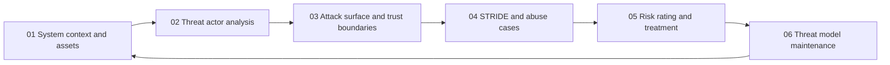

# Threat Modeling and Risk

> **Core idea:** A senior security engineer turns an uncertain system, adversary, and consequence landscape into explicit risk decisions with accountable owners and usable evidence.

## What This Capability Means at Senior Level

Threat modeling at specialist level is not a diagramming exercise or a list of familiar vulnerabilities. It is a way to decide what deserves protection, which attack paths are credible, what uncertainty remains, and how much treatment is proportionate to the business context. The senior engineer makes the system boundary and assumptions visible before asking teams to implement controls.

A mid-level engineer can facilitate a STRIDE session or complete a threat-model template. A senior security engineer owns the quality of the decision process: they involve the right system and business owners, challenge optimistic assumptions, distinguish plausible abuse from theoretical possibility, and connect each important threat to a treatment, an owner, a due date, and evidence. They also make risk legible to people who do not use security vocabulary.

The output is a living risk model, not a document that is approved once and forgotten. It should guide architecture, delivery sequencing, testing depth, monitoring, exception handling, and incident learning.

## Topic Notes

| # | Topic | Senior focus | Status | File |
|---|---|---|---|---|
| 01 | System Context and Assets | Define scope, assets, ownership, and consequence boundaries | ✅ Done | `01_System_Context_and_Assets.md` |
| 02 | Threat Actor Analysis | Prioritize adversaries by motive, access, capability, and constraints | ✅ Done | `02_Threat_Actor_Analysis.md` |
| 03 | Attack Surface and Trust Boundaries | Find exposed paths and challenge inherited trust | ✅ Done | `03_Attack_Surface_and_Trust_Boundaries.md` |
| 04 | STRIDE and Abuse Cases | Turn threat categories into credible misuse scenarios | ✅ Done | `04_STRIDE_and_Abuse_Cases.md` |
| 05 | Risk Rating and Treatment | Make proportionate treatment and acceptance decisions | ✅ Done | `05_Risk_Rating_and_Treatment.md` |
| 06 | Threat Model Maintenance | Keep assumptions, controls, and evidence current as systems change | ✅ Done | `06_Threat_Model_Maintenance.md` |

**Completion:** All six topics are drafted and linked.

## How the Topics Connect

**Reading order:** Establish the system and its valuable assets first. Then model who may attack and where trust changes. Use STRIDE and abuse cases to produce scenarios, convert scenarios into risk decisions, and finally establish the maintenance loop that keeps the model useful.

## Existing Vault Anchors

These notes overlay senior-specialist judgment on existing security knowledge rather than repeating it:

| Senior topic | Existing foundation notes |
|---|---|
| System context and assets | [[software-engineering-note/13_Software_Security/Software Security Overview]], [[software-engineering-note/13_Software_Security/01_Security_Fundamentals]] |
| Threat actor analysis | [[software-engineering-note/13_Software_Security/01_Security_Fundamentals]], [[body-of-knowledge/CyBOK/09_Software_Security]] |
| Attack surface and trust boundaries | [[body-of-knowledge/SWEBOK/13_Software_Security]], [[document-template/14_Security/Threat-Model]] |
| STRIDE and abuse cases | [[document-template/14_Security/Threat-Model]], [[software-engineering-note/13_Software_Security/Software Security Overview]] |
| Risk rating and treatment | [[body-of-knowledge/CyBOK/09_Software_Security]], [[body-of-knowledge/SWEBOK/13_Software_Security]] |
| Threat model maintenance | [[document-template/14_Security/Threat-Model]], [[software-engineering-note/13_Software_Security/Software Security Overview]] |

## Evidence a Senior Engineer Produces

- A context and asset register with named owners and explicit exclusions
- Threat actor assumptions that cite observed exposure, business context, or credible intelligence
- A data-flow or trust-boundary model tied to deployed components and interfaces
- Abuse cases with consequences, controls, residual risk, and verification evidence
- Risk decisions that record the accountable owner, treatment, deadline, and acceptance authority
- Change records showing when the model was revisited and what changed in the decision set

## Self-Assessment Checklist

- [ ] I can state the system boundary, important exclusions, and the reason for each exclusion
- [ ] I can name the assets that matter and the people accountable for their protection
- [ ] I can distinguish a credible threat actor from a merely imaginable one
- [ ] I can show where trust changes in the deployed system, including human and third-party boundaries
- [ ] I can facilitate abuse-case discussion without turning it into a vulnerability checklist
- [ ] I can explain why a risk is high or low without hiding behind a generic score
- [ ] I can assign treatment and residual-risk ownership to someone with authority to act
- [ ] I can produce evidence that a mitigation works, not only that it was planned
- [ ] I have a trigger and owner for refreshing every important threat model

## Related

- [[../00_overview|Security Engineer Overview]]
- [[02_Secure_Architecture_and_Design/00_overview|Secure Architecture and Design]]
- [[03_Secure_Development_and_DevSecOps/00_overview|Secure Development and DevSecOps]]
- [[document-template/14_Security/Threat-Model|Threat Model Template]]
