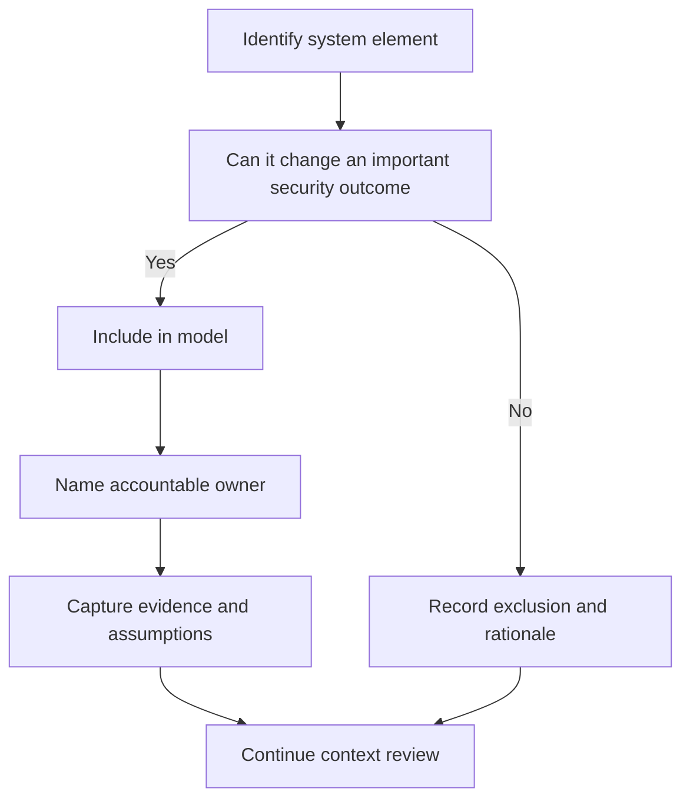

# System Context and Assets

> **One-line definition:** Defining the real socio-technical system, its valuable assets, ownership, dependencies, and consequential exclusions before assessing threats.

## Why This Is a Senior Skill

A mid-level engineer often starts with the service or repository in front of them. A senior security engineer starts with the protection problem. They include users, operators, identity providers, deployment systems, data processors, support workflows, suppliers, and recovery paths when those elements can change the security outcome. They also record what is intentionally out of scope so that an apparently complete model does not create false confidence.

The difficult judgment is deciding which assets are valuable and why. A database is not the only asset. Credentials, signing authority, customer trust, safety decisions, audit evidence, availability of a business process, and the ability to recover may matter more than a particular component. Senior engineers connect each asset to an owner and a consequence statement so that later risk decisions have a business anchor.

## Core Frameworks

### 1. System context canvas

Use a one-page canvas before drawing detailed flows. Each item should be observable in a deployment, process, contract, or runbook.

| Canvas element | Senior question | Evidence to capture |
|---|---|---|
| Mission | What user or business outcome must remain trustworthy? | Product goal, service objective, or safety case |
| Actors | Who uses, operates, administers, supplies, or attacks it? | Role catalogue, support model, access records |
| Components | Which deployed components participate in the outcome? | Inventory, architecture diagram, deployment manifest |
| Data | Which data is created, transformed, stored, or exported? | Data catalogue, classification, retention rules |
| Dependencies | Which external systems can alter the security result? | Contracts, API catalogue, identity and cloud maps |
| Lifecycle | How is the system built, changed, monitored, and retired? | Pipeline, change process, incident and disposal records |

### 2. Asset consequence ledger

Record the consequence of loss rather than assigning a vague label such as sensitive. Consider confidentiality, integrity, availability, authenticity, accountability, privacy, safety, and recoverability as separate dimensions when they affect decisions.

| Asset | Owner | Loss scenario | Primary consequence | Time sensitivity | Required evidence |
|---|---|---|---|---|---|
| Customer identity record | Product or data owner | Unauthorized disclosure or alteration | Privacy and fraud exposure | Immediate for active sessions | Classification, access policy, audit trail |
| Signing key | Security or platform owner | Forged release or token | System-wide integrity loss | Immediate | Key custody, rotation test, use logs |
| Recovery procedure | Service owner | Recovery cannot be trusted | Prolonged outage or unsafe restoration | Depends on service | Tested runbook and exercise result |

### 3. Scope decision framework

For every boundary candidate, classify it as included, referenced, or escalated. A referenced component is not ignored. Its assumptions and owner are recorded, with a follow-up path when evidence is unavailable.

## Decision Framework

Use this matrix when the team disagrees about whether an element belongs in the model:

| Question | If yes | If no |
|---|---|---|
| Can compromise change asset confidentiality, integrity, availability, privacy, or safety? | Include the element and its relevant flows | Continue to the next question |
| Can the element grant identity, signing, deployment, or administrative authority? | Include it as a control-plane asset | Continue to the next question |
| Is it a supplier or platform dependency with an opaque security boundary? | Include its interface and document supplier assumptions | Record as an explicit exclusion |
| Is there no named owner or usable evidence? | Escalate the ownership and assurance gap | Accept the documented scope |

## In Practice

### Context workshop

Run a 60 to 90 minute session with a product owner, service owner, engineer, operator, and someone who understands data or customer impact.

1. State the user outcome and the unacceptable failure modes.
2. List actors, components, data, dependencies, and lifecycle paths.
3. Mark assets, owners, trust changes, and recovery capabilities.
4. Challenge every implicit assumption with a request for evidence.
5. Agree on exclusions, open questions, and the next decision owner.

### Common anti-patterns

| Anti-pattern | Why it fails | Senior response |
|---|---|---|
| Repository-only scope | Omits identity, deployment, support, and recovery paths | Model the outcome and lifecycle, not only source code |
| Data-store fixation | Treats storage as the only valuable asset | Trace authority, decisions, keys, and user trust |
| Anonymous ownership | Risks cannot be treated by an unnamed team | Assign accountable owners before rating risk |
| Diagram as evidence | A picture can be stale or aspirational | Link each important claim to an inventory, test, or record |
| Silent exclusion | Readers assume omitted dependencies were reviewed | Record exclusions and their rationale in the model |

## Practical Exercise

Choose a system you work on and create a context and asset register.

1. Write the mission in one sentence and list three unacceptable outcomes.
2. Identify at least five assets, including one authority asset and one recovery asset.
3. Name an owner and a plausible loss scenario for each asset.
4. Map the actors, components, data flows, dependencies, and lifecycle paths that affect those outcomes.
5. Mark every element as included, referenced, or excluded, with a reason and an evidence request.
6. Ask a product or operations partner to challenge one assumption and record what changed.

**Evidence of completion:** A reviewed context canvas, asset ledger, decision log, and list of unresolved ownership questions.

## Knowledge Connections

- [[00_overview|Threat Modeling and Risk]]
- [[02_Threat_Actor_Analysis|Threat Actor Analysis]]
- [[03_Attack_Surface_and_Trust_Boundaries|Attack Surface and Trust Boundaries]]
- [[software-engineering-note/13_Software_Security/Software Security Overview|Software Security Overview]]
- [[software-engineering-note/13_Software_Security/01_Security_Fundamentals|Security Fundamentals]]
- [[body-of-knowledge/SWEBOK/13_Software_Security|SWEBOK Software Security]]
- [[document-template/14_Security/Threat-Model|Threat Model Template]]

## Key Takeaways

- Define the system around the outcome and lifecycle, not only the repository or service.
- Treat authority, trust, recovery capability, and evidence as assets when their loss matters.
- Give each important asset a named owner and a concrete consequence statement.
- Make scope exclusions visible so readers can evaluate residual uncertainty.
- Prefer evidence from deployed reality, process records, and tests over aspirational diagrams.
- A clear context model is the foundation for credible actor, attack-surface, and risk decisions.
