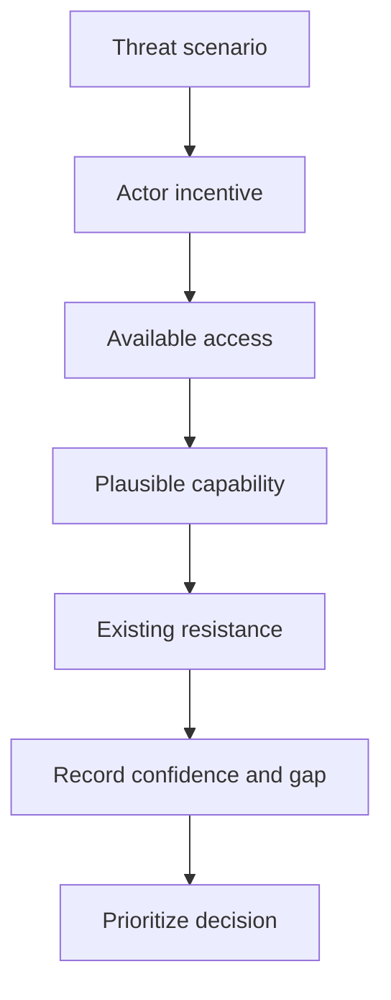

# Threat Actor Analysis

> **One-line definition:** Building evidence-based profiles of adversaries and insiders so that threat scenarios reflect motive, access, capability, constraints, and likely behavior.

## Why This Is a Senior Skill

A basic assessment may list nation states, criminals, insiders, competitors, and curious researchers. A senior security engineer refuses to treat that list as a risk analysis. They ask which actors have a reason to target this system, how they could obtain access, what capability they can plausibly sustain, what constraints limit them, and which actions would create value for them.

The senior judgment is not to predict an attacker perfectly. It is to reduce uncertainty enough to choose controls and evidence. Overstating exotic actors wastes budget and alarms stakeholders. Underestimating ordinary actors with stolen credentials, supplier access, or time creates preventable exposure. Actor analysis therefore combines system context, business incentives, observed telemetry, sector intelligence, and explicit confidence levels.

## Core Frameworks

### 1. Actor dossier

Use a short dossier for each actor that can materially change a decision.

| Field | Question | Example evidence |
|---|---|---|
| Objective | What outcome would make the attack worthwhile? | Fraud pattern, espionage interest, disruption goal |
| Access | How could the actor reach the system or a trusted dependency? | Public endpoint, stolen account, supplier channel |
| Capability | What technical, social, or operational capability is plausible? | Known tooling, staff skill, resources, history |
| Persistence | Can the actor retry, automate, or wait for a change? | Botnet scale, insider time, long-lived access |
| Constraints | What limits cost, visibility, time, or legal exposure? | Detection, segmentation, operational risk |
| Confidence | Which claims are observed, inferred, or speculative? | Logs, intelligence, assumption register |

### 2. Capability and opportunity matrix

Separate what an actor can do from where the system gives them an opportunity. A low-capability actor with a high-opportunity path may outrank a sophisticated actor who lacks access.

| Opportunity | Low capability | Medium capability | High capability |
|---|---|---|---|
| Public unauthenticated interface | Opportunistic abuse | Automated exploitation | Targeted exploit chain |
| Compromised user identity | Phishing and reuse | Session or workflow abuse | Privilege escalation and evasion |
| Supplier or deployment access | Misuse of exposed credentials | Pipeline manipulation | Long-term supply-chain operation |
| Physical or insider access | Data copying | Policy bypass | Covert persistence and collusion |

### 3. Feasibility review

For each important scenario, review four factors: incentive, access, capability, and resistance. Use qualitative judgments such as low, medium, high, and unknown. Unknown is a finding because the control decision may depend on it.

## Decision Framework

When two actors compete for attention, use this sequence rather than choosing by reputation:

| Decision question | Prefer higher priority when |
|---|---|
| Is there a meaningful objective? | The asset supports fraud, leverage, safety impact, or strategic value |
| Is access practical? | The actor can reach a public, identity, supplier, or operational path |
| Is capability sustainable? | The actor can repeat, automate, or combine the attack with social access |
| Is detection weak? | The scenario has low observability or relies on trusted actions |
| Is the consequence material? | A successful action changes an important business or security outcome |
| Is the confidence low but decision critical? | The uncertainty itself requires validation before accepting risk |

## In Practice

### Facilitation pattern

Start with the asset and a consequence, not with a named villain. Ask each participant to state who benefits from the consequence, who can reach the path, and which assumptions are untested. Compare the answers, then create actor dossiers only for scenarios that affect treatment choices.

### Senior trade-offs

| Weak approach | Senior approach |
|---|---|
| Uses a fixed actor catalogue | Tailors actors to the system, business model, and exposure |
| Treats motive as enough | Connects motive to access, capability, and consequence |
| Assumes the most sophisticated actor | Tests ordinary credential, supplier, and insider paths first |
| Hides uncertainty behind a score | Records confidence and funds validation where it matters |
| Models only external attackers | Includes trusted users, operators, suppliers, and compromised automation |

### Evidence to collect

Use identity logs, attack telemetry, abuse reports, fraud signals, supplier access records, incident history, and sector intelligence. Do not claim that an actor is likely only because the actor appears in a generic threat report. Explain the connection to this system.

## Practical Exercise

Select one high-value asset from your context model and build three actor dossiers.

1. Choose one opportunistic external actor, one compromised-identity scenario, and one privileged or supplier scenario.
2. Record objective, access path, capability, persistence, constraints, and confidence for each.
3. Identify the first observable action that would distinguish each scenario in telemetry.
4. Rank the scenarios using consequence, feasibility, and detection weakness rather than actor prestige.
5. Ask an operations or fraud partner to challenge one assumption.
6. Convert the most decision-relevant uncertainty into a validation task or a treatment requirement.

**Evidence of completion:** Three actor cards, a ranked rationale, one telemetry hypothesis per actor, and a documented assumption change.

## Knowledge Connections

- [[01_System_Context_and_Assets|System Context and Assets]]
- [[03_Attack_Surface_and_Trust_Boundaries|Attack Surface and Trust Boundaries]]
- [[04_STRIDE_and_Abuse_Cases|STRIDE and Abuse Cases]]
- [[software-engineering-note/13_Software_Security/01_Security_Fundamentals|Security Fundamentals]]
- [[software-engineering-note/13_Software_Security/Software Security Overview|Software Security Overview]]
- [[body-of-knowledge/CyBOK/09_Software_Security|CyBOK Software Security]]
- [[document-template/14_Security/Threat-Model|Threat Model Template]]

## Key Takeaways

- A threat actor list is not useful until it is connected to objective, access, capability, and consequence.
- Ordinary compromised identities and trusted dependencies deserve the same rigor as advanced external actors.
- Use confidence and unknowns to guide evidence gathering instead of hiding uncertainty in a score.
- Prioritize scenarios where opportunity, material consequence, and weak detection combine.
- Model insiders, operators, suppliers, and automation because trust can be abused without an exploit.
- The purpose of actor analysis is proportionate control selection, not perfect prediction.
