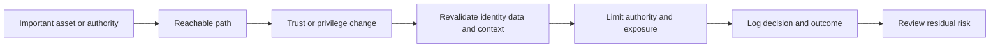

# Attack Surface and Trust Boundaries

> **One-line definition:** Making every reachable interface, privilege transition, data flow, and trust assumption visible enough to challenge and control.

## Why This Is a Senior Skill

A mid-level review often inventories ports, endpoints, and packages. A senior security engineer models exposure as a set of paths through which an actor can influence assets or authority. The surface includes public interfaces, identity and recovery flows, administrative tooling, CI and deployment systems, support workflows, telemetry, cloud control planes, software supply chains, and failure paths. It also includes features that are technically internal but reachable through a compromised principal.

Trust boundaries are decisions, not lines on a diagram. A boundary exists when the system changes its assumptions about identity, integrity, authority, data classification, or execution environment. Senior engineers ask what evidence justifies crossing the boundary, what is revalidated, what is logged, and what happens when a dependency behaves like an attacker.

## Core Frameworks

### 1. Attack-surface register

| Surface item | Reachability | Asset or authority affected | Assumption | Control owner | Evidence |
|---|---|---|---|---|---|
| Public API | Internet | Customer data and actions | Caller identity is valid | API team | Route inventory, auth tests |
| Admin workflow | Restricted identity | Privileged configuration | Admin device and session are trusted | Platform team | Access review, session logs |
| Build pipeline | Supplier and developer access | Release integrity | Pipeline credentials cannot be reused | Developer platform | Provenance, isolated runners |
| Recovery path | Operational access | Data availability and integrity | Restore source is authentic | Service owner | Recovery exercise, checksums |

### 2. Trust-boundary review

For each boundary crossing, answer the same questions:

1. What is trusted before the crossing?
2. What is trusted after the crossing?
3. Which claims are revalidated?
4. Which authority is added, removed, or delegated?
5. What happens if the other side is compromised or unavailable?
6. Which evidence proves the boundary behaves as intended?

### 3. Exposure decision matrix

| Exposure pattern | Default posture | Senior question |
|---|---|---|
| Public and unauthenticated | Minimize and constrain | Can the capability be removed, rate limited, or made read-only? |
| Authenticated user | Verify every relevant action | Is identity enough, or must resource ownership and context also be checked? |
| Service to service | Authenticate and authorize explicitly | What stops a compromised service from using broad authority? |
| Administrative plane | Isolate and monitor strongly | Can routine work be separated from emergency authority? |
| Third-party callback | Treat as untrusted input | How are origin, replay, payload, and failure handled? |

## Decision Framework

Use the following flow when a team proposes a new interface or trust crossing:

The decision is not complete until the path has an owner, a control, an evidence source, and a response when validation fails.

## In Practice

### Review method

Start from each important asset and walk backward to every actor and interface that can influence it. Then walk forward from every public, privileged, or automated entry point to the assets it can reach. Compare the two lists. The gaps are often in operational paths, identity recovery, support tooling, and deployment systems.

### Anti-patterns

| Anti-pattern | Failure mode | What to do instead |
|---|---|---|
| Perimeter as trust | Internal compromise becomes unrestricted access | Verify identity, action, resource, and context at each boundary |
| Endpoint-only inventory | Recovery, admin, and pipeline paths stay invisible | Include control planes and lifecycle paths |
| Trust by network location | A subnet is treated as proof of intent | Use explicit identity and authorization evidence |
| Boundary without owner | Controls drift and exceptions persist | Assign a boundary owner and review trigger |
| Hidden transitive access | A dependency can call more than expected | Document capabilities and test least privilege |

### Evidence that closes the loop

Use route inventories, policy tests, identity logs, service-account grants, cloud flow records, deployment manifests, dependency contracts, and negative tests. A boundary diagram without a control or test is a hypothesis, not assurance.

## Practical Exercise

Take one user journey and one administrative journey in a real system.

1. Trace each journey from actor to final asset, including services, data stores, queues, identity providers, and support actions.
2. Mark every trust, data-classification, and privilege change.
3. Add each entry point and crossing to an attack-surface register.
4. For each crossing, record the validation, authority limit, failure behavior, logging, owner, and evidence.
5. Remove one assumed-trust step and redesign it with explicit validation.
6. Ask the service owner to demonstrate one negative test where boundary validation rejects an invalid request.

**Evidence of completion:** Updated flow, attack-surface register, boundary decisions, one negative test result, and one owner-confirmed gap.

## Knowledge Connections

- [[01_System_Context_and_Assets|System Context and Assets]]
- [[02_Threat_Actor_Analysis|Threat Actor Analysis]]
- [[04_STRIDE_and_Abuse_Cases|STRIDE and Abuse Cases]]
- [[02_Secure_Architecture_and_Design/03_Zero_Trust_and_Segmentation|Zero Trust and Segmentation]]
- [[body-of-knowledge/SWEBOK/13_Software_Security|SWEBOK Software Security]]
- [[body-of-knowledge/CyBOK/09_Software_Security|CyBOK Software Security]]
- [[document-template/14_Security/Threat-Model|Threat Model Template]]

## Key Takeaways

- Attack surface includes operational, identity, supplier, pipeline, and recovery paths, not only network endpoints.
- A trust boundary is a change in assumptions or authority that requires explicit validation.
- Start from assets and entry points to find paths that a component inventory misses.
- Network location is context, not proof of trust.
- Every boundary needs a control owner, failure behavior, and evidence source.
- Negative tests and observed telemetry make boundary claims credible.
