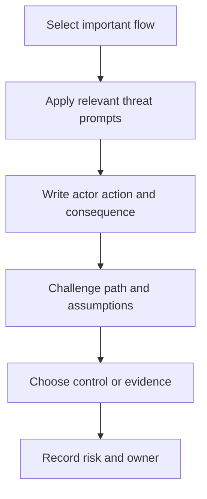

# STRIDE and Abuse Cases

> **One-line definition:** Using threat categories and adversarial scenarios as prompts for better decisions, not as a compliance checklist.

## Why This Is a Senior Skill

A junior workshop can attach the six STRIDE categories to every data-flow diagram element and produce a long list of generic threats. A senior security engineer uses STRIDE selectively to expose missing questions, then writes abuse cases that explain who acts, what they manipulate, how the system responds, and why the outcome matters. The goal is a scenario that can drive architecture, implementation, testing, monitoring, or a conscious risk decision.

Senior facilitation also prevents the method from becoming a security performance. Participants should be able to challenge the scenario, state the assumptions, and identify evidence that would distinguish it from harmless behavior. A category with no credible actor, path, or consequence is a prompt for discussion, not automatically a finding.

## Core Frameworks

### 1. Threat prompt to abuse case

Use STRIDE as a lens over a concrete flow. Then convert only the meaningful result into an abuse case.

| Prompt | Senior question | Abuse-case output |
|---|---|---|
| Spoofing | Which identity claim could be forged or replayed? | Actor impersonates a principal and reaches a protected action |
| Tampering | Which value, command, or state could be changed? | Actor alters a decision, message, artifact, or record |
| Repudiation | Which important action lacks credible attribution? | Principal denies an action that cannot be reconstructed |
| Information disclosure | Which flow could reveal protected information? | Actor learns data, metadata, or secrets outside their authority |
| Denial of service | Which dependency or resource can be exhausted? | Actor blocks a critical outcome or recovery path |
| Elevation of privilege | Which boundary could grant excess authority? | Actor turns a limited foothold into a privileged action |

### 2. Abuse-case quality test

An abuse case is ready for treatment when it has all of the following:

| Element | Test |
|---|---|
| Actor | A named or clearly described principal has a motive |
| Action | The behavior is concrete enough to test or observe |
| Path | The interfaces, trust crossings, or assumptions are known |
| Consequence | The asset and business or user impact are explicit |
| Control | A preventive, detective, responsive, or recovery action is possible |
| Evidence | A test, log, review, or simulation can support the claim |

### 3. Workshop flow

## Decision Framework

When deciding whether to keep a scenario, use this triage:

| Scenario signal | Decision |
|---|---|
| Credible actor, reachable path, material consequence | Keep as a risk item and assign treatment |
| Credible actor and path, uncertain consequence | Keep, then validate impact with the asset owner |
| Material consequence, uncertain path | Keep as an assumption gap and request evidence |
| Generic vulnerability with no actor or asset connection | Reframe around an abuse case or remove from the model |
| Duplicate scenario with the same control and owner | Consolidate and preserve the strongest consequence statement |
| Scenario is prevented by a verified design constraint | Record the evidence and close the scenario with rationale |

## In Practice

### Facilitation agenda

For a 75 minute review, spend the first 10 minutes naming the user outcome and high-value assets. Spend 20 minutes selecting two or three flows. Spend 25 minutes applying only relevant STRIDE prompts. Spend 15 minutes challenging actors, paths, and consequences. Finish with five minutes assigning owners, evidence, and unresolved questions.

### Senior facilitation behaviors

| Weak behavior | Senior behavior |
|---|---|
| Reads every STRIDE category mechanically | Selects prompts based on the flow and trust change |
| Accepts "could happen" as sufficient | Requests a plausible actor, path, and consequence |
| Produces findings without owners | Leaves the room with accountable treatment decisions |
| Treats all threats equally | Uses asset value, feasibility, detection, and uncertainty |
| Stops at preventive controls | Includes detection, response, recovery, and evidence |

### Useful artifacts

Keep the data-flow reference, abuse-case cards, decision log, control traceability, open assumptions, and evidence links together. The artifact should let a reviewer understand not only what was identified, but why it was prioritized or closed.

## Practical Exercise

Run a focused threat workshop on one feature that handles identity, sensitive data, money, or administrative authority.

1. Draw the selected flow and identify the asset and trust crossings.
2. Choose the STRIDE prompts that fit the flow and explain why the others are less relevant.
3. Write at least four abuse cases using actor, action, path, consequence, control, and evidence.
4. Ask a developer, operator, and product owner to challenge different assumptions.
5. Rank the cases and assign a treatment owner, a verification method, and a review date.
6. Convert one case into an automated or repeatable test.

**Evidence of completion:** Workshop notes, abuse-case cards, a decision log, one linked test, and owner acknowledgement.

## Knowledge Connections

- [[02_Threat_Actor_Analysis|Threat Actor Analysis]]
- [[03_Attack_Surface_and_Trust_Boundaries|Attack Surface and Trust Boundaries]]
- [[05_Risk_Rating_and_Treatment|Risk Rating and Treatment]]
- [[software-engineering-note/13_Software_Security/Software Security Overview|Software Security Overview]]
- [[body-of-knowledge/SWEBOK/13_Software_Security|SWEBOK Software Security]]
- [[body-of-knowledge/CyBOK/09_Software_Security|CyBOK Software Security]]
- [[document-template/14_Security/Threat-Model|Threat Model Template]]

## Key Takeaways

- STRIDE is a questioning lens, not proof that a threat exists.
- A useful abuse case connects an actor, action, path, consequence, control, and evidence.
- Select prompts according to the flow, asset, and trust change instead of applying every category mechanically.
- Challenge vague scenarios until someone can explain how the behavior would be observed or tested.
- Assign owners and verification methods during the workshop, not in a later cleanup task.
- Include detection, response, and recovery when prevention alone cannot provide enough assurance.
