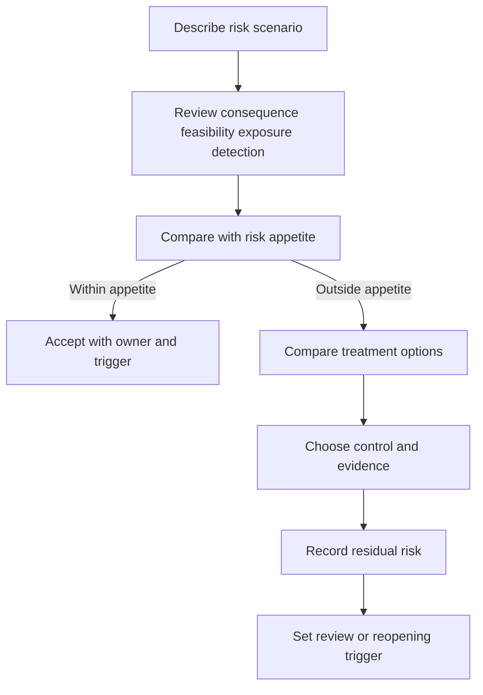

# Risk Rating and Treatment

> **One-line definition:** Converting threat scenarios and uncertainty into proportionate treatment decisions with explicit residual risk ownership.

## Why This Is a Senior Skill

A mid-level engineer may calculate a severity score or copy a scanner rating into a backlog. A senior security engineer frames the risk in terms that support a real decision: which asset is affected, who can act, what could happen, how feasible the path is, how detectable it is, what uncertainty remains, and what the organization is willing to accept. They know that a numerical score is a communication aid, not a substitute for judgment.

Senior engineers also own the uncomfortable parts of treatment. They distinguish remediation from mitigation, compensating controls, transfer, avoidance, and acceptance. They make sure the person accepting residual risk has the authority and context to do so, and they define what evidence or change would reopen the decision.

## Core Frameworks

### 1. Risk statement

Use a consistent sentence that keeps the reasoning visible:

> Because **actor or condition** can use **path or weakness** against **asset**, **consequence** may occur in **context**, with **confidence level**.

Then record the current control state, treatment options, owner, target date, residual risk, and reopening trigger.

### 2. Multi-factor risk view

Review the factors separately before choosing an overall level. Do not hide an unknown inside a convenient middle rating.

| Factor | Questions for judgment |
|---|---|
| Consequence | What changes for users, the business, safety, privacy, legal obligations, or recovery? |
| Feasibility | What access, capability, time, and prerequisites are needed? |
| Exposure | How reachable is the path and how many principals can use it? |
| Detection | Would the action be visible soon enough to limit harm? |
| Control strength | Which controls are independent, tested, and operating in reality? |
| Uncertainty | Which assumptions could change the decision materially? |

### 3. Treatment choices

| Treatment | Use when | Evidence of a good decision |
|---|---|---|
| Avoid | The feature or exposure is not worth the risk | Product decision and removed path |
| Reduce | A control can lower likelihood or consequence proportionately | Implemented control and verification result |
| Transfer or share | Contractual or insurance arrangements genuinely shift a defined loss | Contract, responsibility model, and residual risk |
| Accept | Residual risk is within appetite and the owner has authority | Signed decision, expiry or trigger, monitoring |
| Defer with guardrail | Immediate full remediation is not possible | Temporary control, deadline, and escalation |

### 4. Treatment flow

## Decision Framework

Use this review table to keep ratings from becoming automatic:

| Situation | Senior response |
|---|---|
| High consequence and uncertain feasibility | Validate the path quickly and apply interim protection while uncertainty is open |
| Moderate consequence but broad exposure | Prefer scalable guardrails and measure abuse rather than relying on manual review |
| Strong preventive control but weak detection | Add telemetry or response capability before declaring the risk treated |
| Scanner severity conflicts with business impact | Explain the context, preserve technical evidence, and make a separate business decision |
| Remediation is expensive and risk is acceptable | Record acceptance with authority, expiry, trigger, and compensating controls |
| Risk owner cannot authorize acceptance | Escalate to the accountable business or service authority |

## In Practice

### Risk review conversation

Lead with the outcome, not the tool finding. State what can happen, how the path works, what evidence supports the claim, what is uncertain, and which choices are available. Invite the asset owner to describe the consequence and the service owner to describe operational constraints. End with one accountable decision, not a collection of comments.

### Anti-patterns

| Anti-pattern | Why it fails | Better practice |
|---|---|---|
| Severity equals priority | Technical severity ignores exposure, asset value, and timing | Reframe with consequence, feasibility, exposure, and detection |
| Risk acceptance without an owner | Nobody is accountable for residual exposure | Require named authority, expiry, and reopening trigger |
| Permanent exception | A temporary compromise becomes normal architecture | Add a due date, guardrail, and review evidence |
| Control equals treatment | A planned control may not operate or reduce the scenario | Verify operation and reassess residual risk |
| Score debate | Teams argue about a number instead of a decision | Separate facts, assumptions, uncertainty, and appetite |

### Evidence log

For each material item preserve the scenario, initial assessment, options considered, selected treatment, owner, target, evidence link, residual assessment, and next trigger. This makes later reviews faster and supports accountability without blaming individuals.

## Practical Exercise

Take three open security findings or threat scenarios from a current project.

1. Rewrite each as a complete risk statement with asset, actor or condition, path, consequence, and confidence.
2. Ask the asset owner to describe the business or user impact in concrete terms.
3. Rate consequence, feasibility, exposure, detection, control strength, and uncertainty separately.
4. Compare avoidance, reduction, transfer, acceptance, and temporary guardrail options.
5. Record the selected treatment, accountable owner, evidence required, target date, and reopening trigger.
6. Review one decision with a stakeholder who is not a security specialist and revise the explanation for clarity.

**Evidence of completion:** A treatment register, three decision records, one verified control or guardrail, and one stakeholder-confirmed risk explanation.

## Knowledge Connections

- [[04_STRIDE_and_Abuse_Cases|STRIDE and Abuse Cases]]
- [[06_Threat_Model_Maintenance|Threat Model Maintenance]]
- [[02_Secure_Architecture_and_Design/04_Secure_Architecture_Decisions|Secure Architecture Decisions]]
- [[software-engineering-note/13_Software_Security/Software Security Overview|Software Security Overview]]
- [[software-engineering-note/13_Software_Security/01_Security_Fundamentals|Security Fundamentals]]
- [[body-of-knowledge/SWEBOK/13_Software_Security|SWEBOK Software Security]]
- [[body-of-knowledge/CyBOK/09_Software_Security|CyBOK Software Security]]

## Key Takeaways

- Risk rating exists to support a decision, not to produce a precise-looking number.
- Keep consequence, feasibility, exposure, detection, control strength, and uncertainty visible.
- Choose among avoidance, reduction, transfer, acceptance, and temporary guardrails deliberately.
- Residual risk acceptance requires an accountable authority, an expiry or trigger, and monitoring.
- A control is treatment only after its operation and effect are supported by evidence.
- Clear risk framing lets security, product, engineering, and operations make the decision together.
