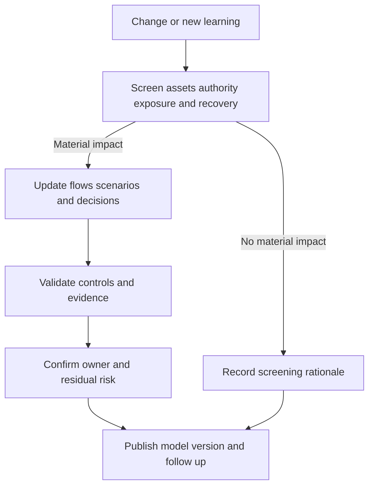

# Threat Model Maintenance

> **One-line definition:** Keeping threats, assumptions, controls, owners, and evidence synchronized with the system as it changes and as new learning arrives.

## Why This Is a Senior Skill

A model that is accurate on approval day can become misleading after a new identity provider, data flow, deployment path, supplier, or business use case is introduced. A mid-level engineer may schedule an annual review. A senior security engineer designs maintenance into engineering work: change triggers, ownership, model versioning, evidence links, review depth, and feedback from incidents, tests, vulnerabilities, and operational drift.

Maintenance is not a promise to reread every page on every change. It is a risk-based control loop. Small changes should be screened quickly. Changes that alter assets, authority, trust boundaries, exposure, recovery, or adversary opportunity should trigger focused re-analysis. Material uncertainty should block a false sense of completion or create an explicit temporary decision.

## Core Frameworks

### 1. Change-trigger matrix

| Change signal | Likely model impact | Minimum response |
|---|---|---|
| New public interface or protocol | Attack surface and abuse cases | Update flow, boundary, scenarios, and tests |
| New data type or use | Asset consequence and privacy assumptions | Reclassify asset, owner, flows, and treatment |
| New identity, role, or service account | Authority and spoofing scenarios | Review trust, privilege, lifecycle, and logs |
| New supplier or cloud capability | Dependency and shared-responsibility assumptions | Add supplier boundary and assurance evidence |
| Deployment or recovery change | Integrity, availability, and recovery paths | Review pipeline, rollback, restore, and failure behavior |
| Incident, exploit, or major finding | Threat assumptions and control effectiveness | Update scenario, evidence, treatment, and monitoring |

### 2. Freshness and confidence indicators

Track more than the date of last edit:

| Indicator | Healthy signal | Warning signal |
|---|---|---|
| Model coverage | Deployed components and flows map to current inventory | Diagram contains retired or missing components |
| Ownership | Every material risk and boundary has an active owner | Ownership points to a team or person that no longer exists |
| Evidence | Tests, logs, reviews, and decisions are current | Links are stale or controls are asserted only |
| Assumptions | Open assumptions have validation tasks | Unknowns are carried without a trigger |
| Learning | Incidents and changes feed the model | Model has never changed after operational learning |

### 3. Maintenance loop

## Decision Framework

Choose review depth based on what changed, not on a calendar alone:

| Review level | Trigger | Deliverable |
|---|---|---|
| Screen | Low-risk code or configuration change with no new path | Short impact statement and rationale |
| Focused review | New flow, asset, identity, boundary, or dependency | Updated relevant diagrams, scenarios, controls, and tests |
| Full review | Major architecture, business model, incident, or material threat change | Revalidated context, actors, surface, risk register, and evidence |
| Emergency review | Active exploitation or severe control failure | Immediate containment decisions, temporary model, and follow-up plan |

## In Practice

### Make maintenance part of delivery

Add a threat-model impact question to architecture review, change templates, and pull-request guidance. Keep model references near the system owner and source of truth. Define who screens changes, who can require a focused review, and who accepts residual risk. Use version history to show why a decision changed rather than overwriting the rationale.

### Common anti-patterns

| Anti-pattern | Why it fails | What to do instead |
|---|---|---|
| Annual-only review | High-risk changes ship between reviews | Use change triggers plus periodic health checks |
| Security-owned document | The model becomes stale when security is absent | Make system and asset owners responsible for updates |
| Diagram drift | The model no longer matches deployment reality | Link to inventories and validate during change review |
| Closed findings without evidence | Status hides whether risk actually changed | Require test, telemetry, or review evidence |
| Incident handled separately | Learning never improves prevention | Feed incident paths and control failures back into the model |

### Evidence of a living model

Useful evidence includes version history, impact screens, updated architecture decisions, threat-model review attendance, automated inventory comparisons, test results, incident-derived changes, and closed-loop follow-up items. The best evidence makes the next review cheaper and more precise.

## Practical Exercise

Choose a threat model that has not been updated recently and run a maintenance review.

1. Compare its components, flows, identities, suppliers, and recovery paths with the current deployed inventory.
2. List changes, incidents, vulnerabilities, and new business uses since the last review.
3. Classify each item as no impact, focused review, full review, or emergency review.
4. Update at least one scenario, one control, one owner, and one evidence link.
5. Add a change trigger to the team workflow and nominate the person who will screen future changes.
6. Review the result with the service owner and record the next refresh condition.

**Evidence of completion:** A versioned model update, impact-screen decisions, one validated evidence link, a workflow trigger, and owner confirmation.

## Knowledge Connections

- [[01_System_Context_and_Assets|System Context and Assets]]
- [[03_Attack_Surface_and_Trust_Boundaries|Attack Surface and Trust Boundaries]]
- [[05_Risk_Rating_and_Treatment|Risk Rating and Treatment]]
- [[02_Secure_Architecture_and_Design/04_Secure_Architecture_Decisions|Secure Architecture Decisions]]
- [[software-engineering-note/13_Software_Security/Software Security Overview|Software Security Overview]]
- [[body-of-knowledge/SWEBOK/13_Software_Security|SWEBOK Software Security]]
- [[document-template/14_Security/Threat-Model|Threat Model Template]]

## Key Takeaways

- Threat models remain useful only when their assumptions and evidence track deployed reality.
- Use change triggers to select review depth instead of relying on an annual calendar.
- Treat new authority, data, exposure, dependencies, recovery paths, and incidents as likely model changes.
- Keep system and asset owners accountable while security engineers provide method and challenge.
- Version decisions and evidence so reviewers can understand why risk changed.
- A living model is part of delivery and incident learning, not a separate security ceremony.
