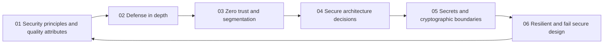

# Secure Architecture and Design

> **Core idea:** A senior security engineer turns security principles and risk scenarios into architecture decisions that are proportionate, observable, resilient, and accountable.

## What This Capability Means at Senior Level

Secure architecture is the practice of shaping system structure so that important security properties survive ordinary change, misuse, dependency failure, and partial compromise. The senior specialist does not simply add controls to a diagram. They decide where trust should exist, which authority should be delegated, how controls fail, where secrets and cryptographic responsibility terminate, and what evidence will demonstrate that the design works.

A mid-level engineer can implement a known pattern such as least privilege, network segmentation, or encryption. A senior security engineer selects and composes patterns under real constraints: latency, availability, usability, cost, operational skill, supplier boundaries, migration risk, and incident response. They make trade-offs explicit in architecture decision records and create guardrails that let delivery teams apply the design consistently.

The outcome is not a perfect architecture. It is a system whose important security properties are clear, whose failure behavior is deliberate, and whose residual risk can be explained and revisited.

## Topic Notes

| # | Topic | Senior focus | Status | File |
|---|---|---|---|---|
| 01 | Security Principles and Quality Attributes | Translate principles into measurable architecture constraints | ✅ Done | `01_Security_Principles_and_Quality_Attributes.md` |
| 02 | Defense in Depth | Compose independent preventive, detective, and recovery layers | ✅ Done | `02_Defense_in_Depth.md` |
| 03 | Zero Trust and Segmentation | Make identity, context, and resource boundaries explicit | ✅ Done | `03_Zero_Trust_and_Segmentation.md` |
| 04 | Secure Architecture Decisions | Record trade-offs, authority, assumptions, and evidence | ✅ Done | `04_Secure_Architecture_Decisions.md` |
| 05 | Secrets and Cryptographic Boundaries | Place key, secret, and cryptographic responsibilities deliberately | ✅ Done | `05_Secrets_and_Cryptographic_Boundaries.md` |
| 06 | Resilient and Fail-Secure Design | Choose safe behavior when controls or dependencies fail | ✅ Done | `06_Resilient_and_Fail_Secure_Design.md` |

**Completion:** All six topics are drafted and linked.

## How the Topics Connect

**Reading order:** Start with principles and quality attributes to frame the outcome. Add layered controls, then place explicit identity and segmentation boundaries. Capture the important choices in decision records, make secrets and cryptography accountable, and finish by testing how the design behaves under failure.

## Existing Vault Anchors

These notes assume the foundational concepts already exist in the vault and focus on specialist judgment and evidence:

| Senior topic | Existing foundation notes |
|---|---|
| Security principles and quality attributes | [[software-engineering-note/13_Software_Security/01_Security_Fundamentals]], [[body-of-knowledge/SWEBOK/13_Software_Security]] |
| Defense in depth | [[software-engineering-note/13_Software_Security/Software Security Overview]], [[document-template/14_Security/Security-Architecture]] |
| Zero trust and segmentation | [[document-template/14_Security/Security-Architecture]], [[body-of-knowledge/CyBOK/09_Software_Security]] |
| Secure architecture decisions | [[document-template/14_Security/Security-Architecture]], [[body-of-knowledge/SWEBOK/13_Software_Security]] |
| Secrets and cryptographic boundaries | [[software-engineering-note/13_Software_Security/01_Security_Fundamentals]], [[body-of-knowledge/CyBOK/09_Software_Security]] |
| Resilient and fail-secure design | [[document-template/14_Security/Security-Architecture]], [[software-engineering-note/13_Software_Security/Software Security Overview]] |

## Evidence a Senior Engineer Produces

- Quality attribute scenarios with measurable security outcomes and known trade-offs
- Architecture diagrams that show trust, authority, data, control, and recovery boundaries
- Layered control maps with independence assumptions and failure behavior
- Decision records that name options, constraints, owners, residual risk, and verification
- Secret and cryptographic boundary inventories with custody and lifecycle evidence
- Failure exercises showing whether the system denies safely, limits blast radius, detects compromise, and recovers

## Self-Assessment Checklist

- [ ] I can turn a vague security principle into an observable quality attribute scenario
- [ ] I can explain which controls are independent and which share a common failure mode
- [ ] I can describe every important trust zone, policy decision, and enforcement point
- [ ] I can record an architecture trade-off without hiding constraints or residual risk
- [ ] I can identify where secrets and cryptographic authority enter, move, and terminate
- [ ] I can specify behavior when identity, key, network, storage, or telemetry dependencies fail
- [ ] I can show evidence that security controls operate in the deployed architecture
- [ ] I can make a secure pattern usable by teams without becoming a manual approval bottleneck
- [ ] I can revisit architecture decisions when threat assumptions, scale, or business context changes

## Related

- [[../00_overview|Security Engineer Overview]]
- [[../01_Threat_Modeling_and_Risk/00_overview|Threat Modeling and Risk]]
- [[03_Secure_Development_and_DevSecOps/00_overview|Secure Development and DevSecOps]]
- [[document-template/14_Security/Security-Architecture|Security Architecture Template]]
