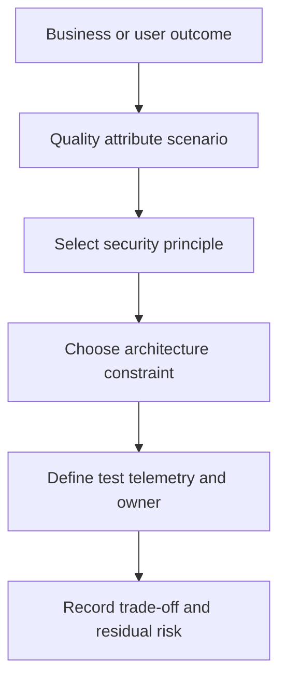

# Security Principles and Quality Attributes

> **One-line definition:** Translating broad security principles into measurable quality attribute scenarios and architecture constraints that fit the system context.

## Why This Is a Senior Skill

A mid-level engineer may repeat principles such as least privilege, defense in depth, fail secure, or separation of duties. A senior security engineer decides which principle matters most for a particular risk, how it changes the architecture, how it competes with availability or usability, and what evidence will show that it is operating. Principles are decision aids, not a substitute for a threat model or a design rationale.

The senior specialist also prevents security from being treated as an unmeasurable quality. They turn concerns into scenarios with a stimulus, environment, response, and measurable result. This lets architects and product owners compare options without pretending that confidentiality, integrity, availability, recovery, cost, and user friction can all be maximized at once.

## Core Frameworks

### 1. Quality attribute scenario

Describe the desired behavior in a form that can guide design and verification.

| Element | Question | Example prompt |
|---|---|---|
| Stimulus | What event tests the security property? | A service identity requests a privileged action |
| Source | Who or what creates the event? | A workload with a stolen credential |
| Environment | Under what operating condition? | Normal traffic or active dependency compromise |
| Artifact | Which component or boundary responds? | Policy decision point and target service |
| Response | What should the system do? | Deny, constrain, log, and raise a signal |
| Measure | How will success be observed? | Unauthorized action rejected and recorded promptly |

### 2. Principle selection matrix

| Principle | Best fit | Trade-off to make explicit | Evidence |
|---|---|---|---|
| Least privilege | Broad or sensitive authority | Operator effort and workflow complexity | Access review, denied-action tests |
| Separation of duties | High-impact or irreversible action | Coordination and emergency access | Dual-control exercise, approval trail |
| Secure by default | New interfaces and configuration | Migration friction and compatibility | Default configuration tests |
| Fail secure | Authorization and integrity decisions | Availability during dependency failure | Failure exercise and safe-mode result |
| Defense in depth | High-consequence attack paths | Cost and common-cause risk | Layer coverage and independence review |
| Complete mediation | Repeated resource decisions | Latency and policy complexity | Enforcement-point tests and logs |

### 3. From principle to evidence

## Decision Framework

When several principles appear to conflict, use this sequence:

| Question | Decision guidance |
|---|---|
| Which asset or outcome is at stake? | Start with consequence and accountable owner |
| What failure mode is unacceptable? | Choose the principle that constrains that failure first |
| What user, operational, or availability cost appears? | Make the cost visible instead of silently weakening the principle |
| Can the conflict be localized? | Isolate exceptional access, workflow, or data rather than weakening the whole system |
| What compensating control exists? | Require independence, owner, and verification evidence |
| How will context change reopen the decision? | Add a trigger to the decision record |

## In Practice

### Architecture review method

Ask the team to bring one security scenario, the proposed design constraint, and the evidence plan. Review the scenario with product and operations partners, then ask what would happen during a dependency outage, a compromised identity, a rapid migration, and an emergency operation. Capture the trade-off and the person accountable for the residual risk.

### Senior versus mid-level behavior

| Dimension | Mid-level approach | Senior-specialist approach |
|---|---|---|
| Principles | Applies a known checklist | Selects principles based on assets and failure modes |
| Quality | Describes security as important | Defines measurable scenarios and acceptance evidence |
| Trade-offs | Resolves conflict informally | Records cost, residual risk, and authority |
| Exceptions | Treats exceptions as local fixes | Localizes exceptions and adds expiry or triggers |
| Assurance | Trusts the design description | Tests operation in the deployed architecture |

### Common anti-patterns

| Anti-pattern | Problem | Better practice |
|---|---|---|
| Principle recital | Does not change a design decision | Link each principle to a scenario and evidence |
| Security maximalism | Ignores usability and availability | State the objective and choose proportionate constraints |
| Unmeasurable quality | Reviewers cannot agree what good means | Define observable response and threshold |
| Global exception | One difficult workflow weakens every path | Isolate the exception and monitor it |

## Practical Exercise

Choose three security concerns from a current architecture review.

1. Write a quality attribute scenario for each with stimulus, source, environment, artifact, response, and measure.
2. Select the principle that best constrains the relevant failure mode.
3. Identify one competing quality attribute and describe the trade-off.
4. Propose an architecture constraint and a verification method.
5. Capture the decision, residual risk, owner, and context trigger in an ADR.
6. Ask a product or operations partner whether the measurable response is realistic and revise it if needed.

**Evidence of completion:** Three quality attribute scenarios, one decision record, one test or review plan, and stakeholder agreement on the measure.

## Knowledge Connections

- [[../01_Threat_Modeling_and_Risk/01_System_Context_and_Assets|System Context and Assets]]
- [[../01_Threat_Modeling_and_Risk/05_Risk_Rating_and_Treatment|Risk Rating and Treatment]]
- [[02_Defense_in_Depth|Defense in Depth]]
- [[04_Secure_Architecture_Decisions|Secure Architecture Decisions]]
- [[software-engineering-note/13_Software_Security/Software Security Overview|Software Security Overview]]
- [[software-engineering-note/13_Software_Security/01_Security_Fundamentals|Security Fundamentals]]
- [[body-of-knowledge/SWEBOK/13_Software_Security|SWEBOK Software Security]]
- [[document-template/14_Security/Security-Architecture|Security Architecture Template]]

## Key Takeaways

- Principles are useful only when they change a design choice or operating behavior.
- Quality attribute scenarios make security observable and comparable with other quality goals.
- Select principles from assets, consequences, and failure modes rather than from habit.
- Make usability, availability, cost, and migration trade-offs explicit.
- Localize exceptions and require owners, evidence, and reopening triggers.
- A secure architecture decision is incomplete until its operation can be verified.
