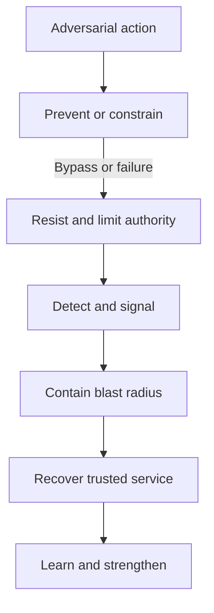

# Defense in Depth

> **One-line definition:** Composing independent preventive, detective, responsive, and recovery controls so that one failure does not become a complete compromise.

## Why This Is a Senior Skill

A basic design may list many controls and call the result defense in depth. A senior security engineer asks whether those controls actually fail independently, protect different stages of the attack path, and provide useful response time. Five controls that depend on the same identity provider, configuration source, or untested assumption may be one control wearing five labels.

Senior judgment also includes the cost of layers. Redundancy can add latency, operational burden, false positives, and conflicting ownership. The goal is not maximum control count. It is a deliberate set of barriers that reduces likelihood or consequence, detects bypass, limits blast radius, and supports recovery when prevention fails.

## Core Frameworks

### 1. Layer coverage map

Map controls to the attack path and to the type of protection they provide.

| Layer | Control question | Example evidence |
|---|---|---|
| Prevent | What blocks the action or narrows authority? | Policy tests, secure defaults, input constraints |
| Resist | What makes bypass or exploitation harder? | Isolation, rate limits, hardened runtime |
| Detect | What reveals attempted or successful abuse? | Decision logs, anomaly signals, integrity checks |
| Contain | What limits spread and authority after compromise? | Segmentation, revocation, blast-radius tests |
| Recover | How is trustworthy service or data restored? | Restore exercise, key replacement, rollback |
| Learn | How does the organization improve the model? | Incident review, control change, regression test |

### 2. Independence test

For every layer, identify its dependency on identity, configuration, network, time, telemetry, staff, and suppliers. A second layer is meaningfully independent only when it does not share every critical assumption with the first layer.

| Test | Weak result | Stronger design question |
|---|---|---|
| Shared identity | Both layers trust the same compromised token | Can a separate signal or boundary validate the action? |
| Shared configuration | One bad policy disables all barriers | Is there protected configuration and change evidence? |
| Shared network | A network bypass defeats every layer | Is there an application or data-level control? |
| Shared telemetry | Detection disappears with the compromised system | Is there an independent audit or control-plane signal? |
| Shared operator | One person can bypass every layer | Is there separation of duties or emergency review? |

### 3. Layered response flow

## Decision Framework

Prioritize an additional layer when it changes the outcome of a credible scenario:

| Question | Add or strengthen a layer when |
|---|---|
| Does it cover a different attack stage? | It blocks, detects, contains, or recovers where existing controls do not |
| Does it reduce a different failure mode? | It is not just another expression of the same assumption |
| Does it reduce blast radius? | A compromise of one component cannot reach all important assets |
| Does it create useful response time? | The signal is timely, actionable, and routed to an owner |
| Can it be operated reliably? | The owner, runbook, test, and maintenance cost are understood |
| Is the layer worth its cost? | The residual risk or recovery improvement justifies complexity |

## In Practice

### Layer review

Start from one high-consequence attack path. Mark each control as preventive, resistant, detective, containment, recovery, or learning. Then remove or bypass each control in turn. Note the first point where the path reaches the asset, whether the next layer detects it, and how much authority or data is exposed.

### Anti-patterns

| Anti-pattern | Why it fails | Better practice |
|---|---|---|
| Control accumulation | Complexity grows without reducing risk | Tie every layer to a scenario and outcome |
| Same-control repetition | Common cause defeats every layer | Add diversity in boundary, signal, or owner |
| Perimeter-only depth | Internal compromise has a clear path | Layer identity, application, data, and recovery controls |
| Prevention-only design | A bypass becomes an unobserved compromise | Include detection, containment, and recovery |
| Untested recovery | The final layer is only a document | Exercise restore, revoke, rollback, and communication |

### Operational accountability

Assign each layer an owner and maintenance signal. A security team may define the pattern, but service and platform owners must operate it. Review whether alerts are actionable, whether exceptions bypass multiple layers, and whether incident evidence confirms the assumed independence.

## Practical Exercise

Select a critical user journey or administrative action.

1. Describe one credible attack path from entry point to important asset.
2. Map the existing preventive, resistance, detection, containment, recovery, and learning controls.
3. For each layer, document owner, dependency assumptions, failure behavior, and evidence.
4. Simulate the failure or bypass of the first control and trace the remaining path.
5. Remove one shared dependency and design an independent check or isolation boundary.
6. Run a tabletop or technical test and record whether the additional layer changed time, scope, or recovery outcome.

**Evidence of completion:** Layer coverage map, independence review, failure result, owner assignment, and one decision record for an improvement.

## Knowledge Connections

- [[01_Security_Principles_and_Quality_Attributes|Security Principles and Quality Attributes]]
- [[03_Zero_Trust_and_Segmentation|Zero Trust and Segmentation]]
- [[06_Resilient_and_Fail_Secure_Design|Resilient and Fail-Secure Design]]
- [[../01_Threat_Modeling_and_Risk/03_Attack_Surface_and_Trust_Boundaries|Attack Surface and Trust Boundaries]]
- [[software-engineering-note/13_Software_Security/Software Security Overview|Software Security Overview]]
- [[body-of-knowledge/SWEBOK/13_Software_Security|SWEBOK Software Security]]
- [[document-template/14_Security/Security-Architecture|Security Architecture Template]]

## Key Takeaways

- Defense in depth is about independent outcomes, not the number of controls.
- Map layers across prevention, resistance, detection, containment, recovery, and learning.
- Challenge shared identity, configuration, network, telemetry, and operator dependencies.
- A good layer reduces attack progress, blast radius, or recovery time in a credible scenario.
- Every layer needs an owner, operational evidence, and a maintenance signal.
- Exercise bypass and failure because untested layers create false assurance.
