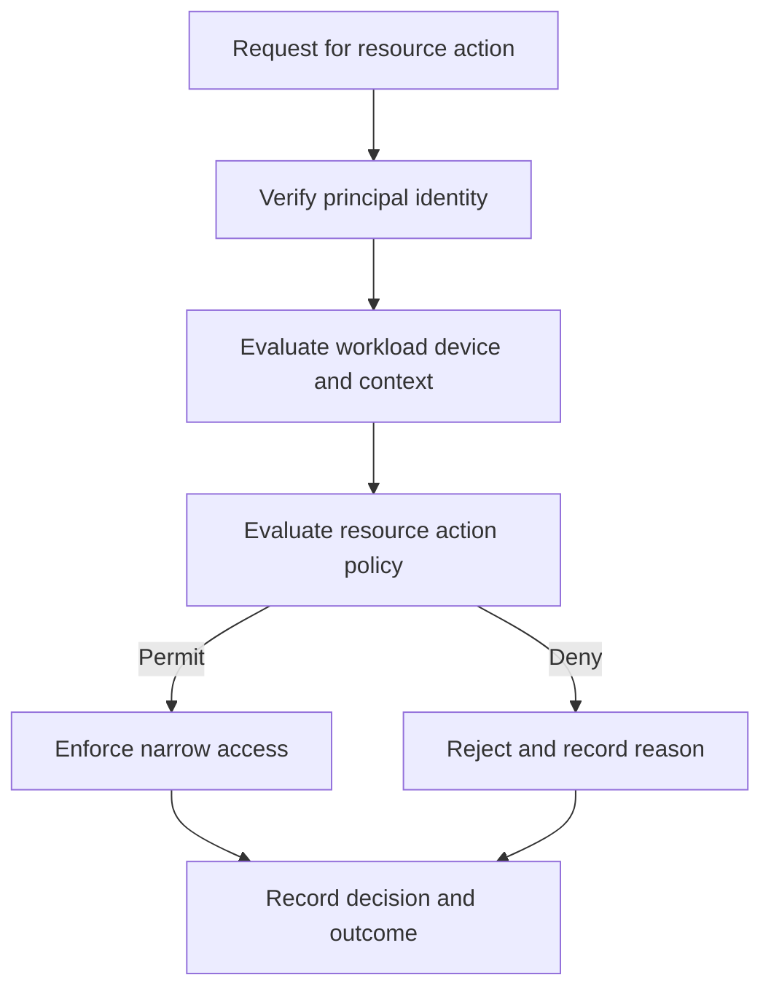

# Zero Trust and Segmentation

> **One-line definition:** Making access decisions from verified identity, device or workload state, resource, action, and context instead of trusting a location or network zone by default.

## Why This Is a Senior Skill

A mid-level implementation may add a product called zero trust or divide a network into subnets. A senior security engineer defines what must be verified for each important action, where the policy decision is made, which component enforces it, how context is refreshed, and what happens when the decision service is unavailable. Segmentation is valuable only when it reduces an attacker's reachable authority or blast radius.

The senior challenge is migration. Existing systems often depend on broad network trust, shared service accounts, or undocumented east-west traffic. The engineer must make flows visible, choose a safe sequence, provide observability and rollback, and avoid creating a policy that is theoretically strong but impossible for teams to operate.

## Core Frameworks

### 1. Request decision model

A request should be evaluated against the resource and action, not only the caller identity.

| Signal | Senior question | Possible evidence |
|---|---|---|
| Principal identity | Who is acting and how was the identity authenticated? | Token claims, workload identity, session record |
| Device or workload | Is the execution environment within required posture? | Attestation, image provenance, endpoint state |
| Resource | What data, service, or authority is requested? | Resource classification and ownership |
| Action | What exact operation is requested? | Method, command, field-level authorization |
| Context | What time, network, risk, or transaction context matters? | Location signal, anomaly state, transaction risk |
| Policy | Which rule permits or denies the action? | Versioned policy and decision log |
| Enforcement | Where is the decision applied and tested? | Gateway, service, database, or workload control |

### 2. Segmentation matrix

| Zone or capability | Allowed relationship | Default stance | Review evidence |
|---|---|---|---|
| Public edge | Inbound to approved entry points | Deny all else | Route inventory and negative tests |
| Application workloads | Explicit service calls | Deny unlisted flows | Policy tests and flow telemetry |
| Data services | Narrow resource actions | No direct user access | Authorization tests and query logs |
| Management plane | Separate operator paths | Strong authentication and dual control | Access review and exercise |
| Build and release plane | Provenance and deployment actions | Isolate from runtime data | Pipeline policy and credential scope |
| Recovery plane | Restore and key replacement actions | Offline or protected when possible | Recovery and compromise exercise |

### 3. Access decision flow

## Decision Framework

When introducing or repairing segmentation, choose the boundary that gives the most risk reduction with manageable change:

| Question | Decision guidance |
|---|---|
| What asset or authority needs isolation? | Start from consequence and blast radius |
| Which flows are legitimate? | Discover actual dependencies and make them explicit |
| What identity and context are required? | Use the narrowest reliable signal for the action |
| Where can enforcement occur? | Prefer a point that is hard to bypass and easy to test |
| What happens during policy or identity failure? | Decide safe behavior, emergency access, and recovery before rollout |
| How will migration be observed? | Use shadow decisions, deny reports, canaries, and rollback |

## In Practice

### Migration sequence

Begin with one sensitive asset or administrative capability. Inventory current flows, observe decisions in shadow mode, classify unknown traffic, and define a narrow policy. Roll out to a small slice, test valid and invalid behavior, monitor denied requests, and document emergency access. Expand only when the owner can explain the remaining exceptions.

### Common anti-patterns

| Anti-pattern | Problem | Better practice |
|---|---|---|
| Trust by subnet | Compromised workload inherits broad access | Authenticate and authorize the action explicitly |
| Product-first zero trust | Tool deployment hides the decision model | Define resource, action, policy, enforcement, and evidence first |
| Deny without migration | Critical flows break and teams bypass the control | Observe, classify, canary, and provide rollback |
| Permanent broad exception | Segmentation becomes an allow-list theater | Make exceptions narrow, owned, time-bound, and monitored |
| Policy point without enforcement | A decision can be bypassed | Test every path and place enforcement at the resource boundary |

### Accountability

Security engineers should define reusable policy patterns and evidence expectations. Service owners own resource policy correctness. Platform owners operate enforcement and telemetry. Business owners decide acceptable disruption during migration. Make that division visible in the architecture decision.

## Practical Exercise

Choose one sensitive data store or privileged control plane.

1. Inventory its callers, actions, identities, devices or workloads, and current network assumptions.
2. Classify each flow as required, unnecessary, unknown, or emergency-only.
3. Write a policy for resource and action, not only source network.
4. Run the policy in observation mode and investigate unexpected flows.
5. Roll out one enforcement boundary to a canary and test allowed, denied, replayed, and dependency-failure cases.
6. Document rollback, emergency access, owner, evidence, and the next expansion condition.

**Evidence of completion:** Flow inventory, policy matrix, canary results, denied-request review, rollback plan, and an owner-approved migration decision.

## Knowledge Connections

- [[02_Defense_in_Depth|Defense in Depth]]
- [[04_Secure_Architecture_Decisions|Secure Architecture Decisions]]
- [[../01_Threat_Modeling_and_Risk/03_Attack_Surface_and_Trust_Boundaries|Attack Surface and Trust Boundaries]]
- [[../01_Threat_Modeling_and_Risk/05_Risk_Rating_and_Treatment|Risk Rating and Treatment]]
- [[software-engineering-note/13_Software_Security/Software Security Overview|Software Security Overview]]
- [[body-of-knowledge/CyBOK/09_Software_Security|CyBOK Software Security]]
- [[document-template/14_Security/Security-Architecture|Security Architecture Template]]

## Key Takeaways

- Zero trust is an access decision model, not a network product or a slogan.
- Evaluate principal, workload or device, resource, action, context, policy, and enforcement.
- Segmentation earns its complexity by reducing authority or blast radius.
- Discover and observe real flows before enforcing a new boundary.
- Define failure behavior, emergency access, rollback, and evidence before migration.
- Make policy, enforcement, resource ownership, and business disruption accountability explicit.
